## Мета: Знайомство з A01:2025 Broken Access Control (Hijack a Session)

### Середовище: Kali Linux, Docker engine, OWASP WebGoat container.

### Передумови
Для кращого розуміння механізмів сесійного управління необхідно пройти попередні уроки у мануалі WebGoat та ознайомитися з принципами роботи протоколу HTTP і перехопленням запитів у Burp Suite.

---

### Концепція вразливості

Розробники прикладного програмного забезпечення, які створюють власні алгоритми генерації ідентифікаторів сесій (Session IDs), часто забувають забезпечити належний рівень складності та рандомізації, необхідний для безпеки. Якщо ідентифікатор сесії користувача є передбачуваним або послідовним, додаток стає надзвичайно вразливим до атак типу **brute force** (перебір) та перехоплення сесій (**Session Hijacking**).

### Цілі лабораторної роботи
Отримати доступ до автентифікованої сесії, що належить іншому користувачу веб-додатка WebGoat, шляхом прогнозування значення cookie-файла `hijack_cookie`.

---

### Основні терміни:
* **Session ID** — унікальний ідентифікатор сесії користувача.
* **Complexity and Randomness** — складність та випадковість при генерації токенів.
* **Brute Force Attacks** — атаки методом грубої сили (перебору значень).
* **Authenticated Session** — автентифікований сеанс взаємодії з сервером.
* **Session Hijacking** — викрадення або підміна сесії легітимного користувача.

---

### Покрокове виконання практичного завдання

#### Крок 1. Перехід до уроку в WebGoat

У лівому бічному меню обираємо розділ **(A1) Broken Access Control** -> **Hijack a session**:

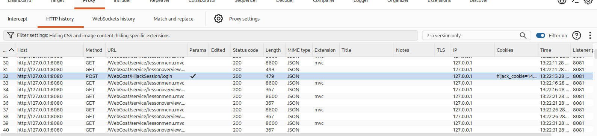

Також переглядаємо стартовий інтерфейс уроку на сторінці веб-додатка:

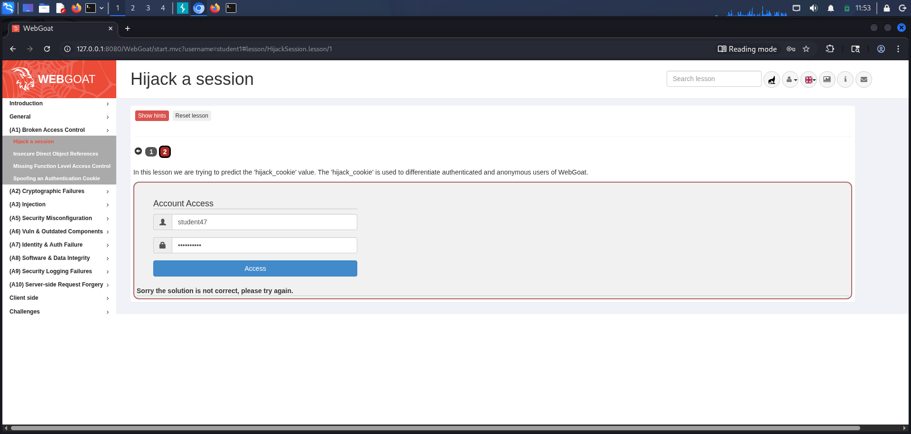

#### Крок 2. Аналіз завдання та первинна відправка форми

Переходимо на другу вкладку уроку (червоний колір індикатора означає практичне завдання, яке потребує виконання та перевірки):

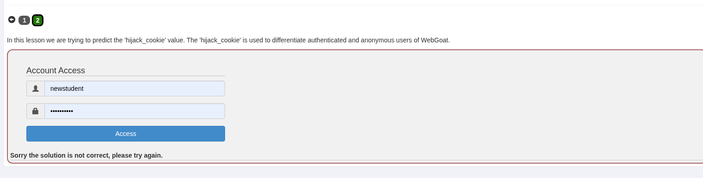

На цій вкладці ми намагаємося передбачити значення cookie-файла `hijack_cookie`. Файл `hijack_cookie` використовується для розрізнення автентифікованих та анонімних користувачів у системі WebGoat.

Вводимо облікові дані в форму **Account Access** (наприклад, `newstudent` або `student47`) та натискаємо кнопку **Access**.

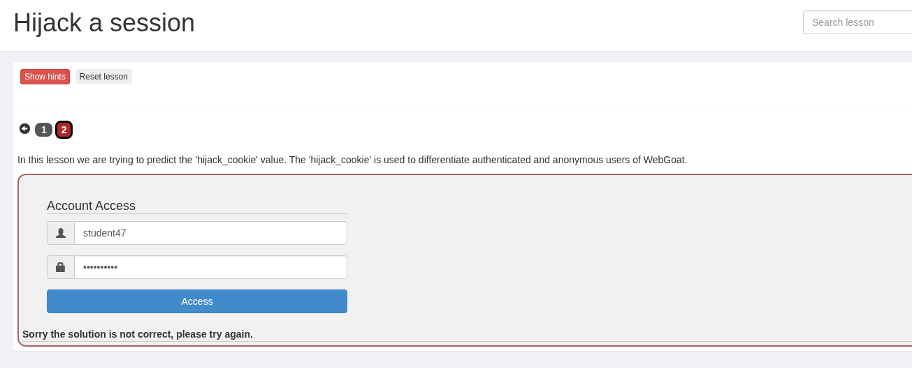

Отримуємо повідомлення: `Sorry the solution is not correct, please try again.`.

---

#### Крок 3. Перехоплення запитів у Burp Suite Proxy

Запускаємо **Burp Suite Community Edition**, відкриваємо вкладку **Proxy** -> **HTTP history** та досліджуємо мережеву активність.

У списку HTTP-запитів знаходимо POST-запит до ендпоінту `/WebGoat/HijackSession/login`:

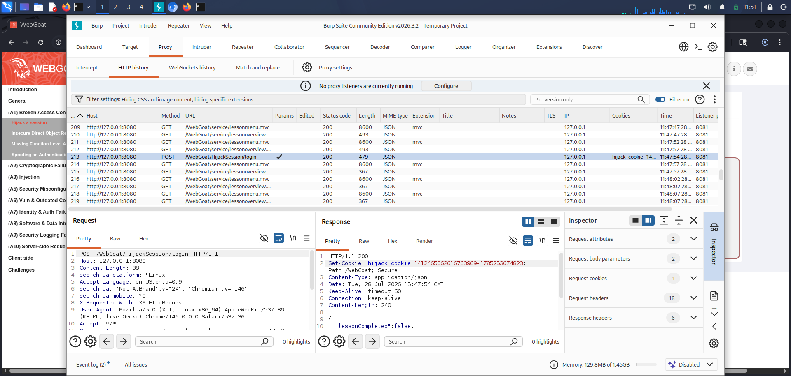

Детальний перегляд HTTP-історії підтверджує генерацію кукі сервером:


Аналізуємо HTTP-відповідь від сервера. У заголовках відповіді бачимо встановлення cookie `hijack_cookie`:

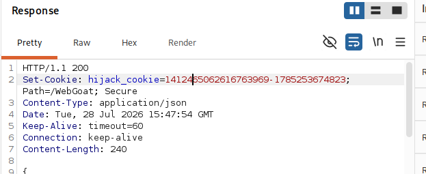

Структура відповіді сервера повертає JSON-об'єкт:
```json
{
  "lessonCompleted": false,
  "feedback": "Sorry the solution is not correct, please try again.",
  "feedbackArgs": null,
  "output": null,
  "outputArgs": null,
  "assignment": "HijackSessionAssignment",
  "attemptWasMade": true
}
```

---

#### Крок 4. Відправка запиту у модуль Burp Repeater

Клацаємо правою кнопкою миші на знайденому `POST /WebGoat/HijackSession/login` запиті та обираємо пункт **Send to Repeater** (гарячі клавіші `Ctrl+R`):

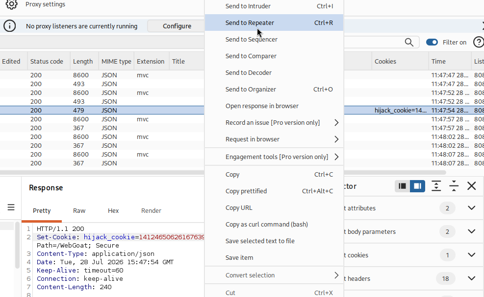

Альтернативний вигляд контекстного меню при пересиланні запиту:

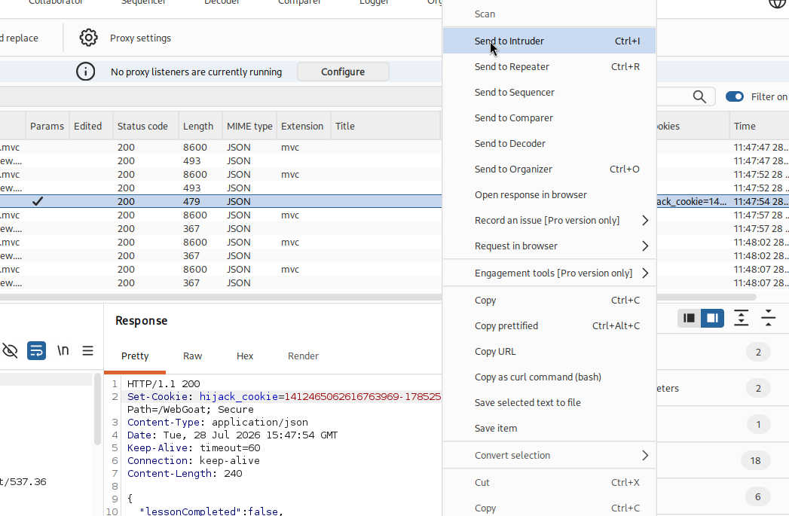

Також можна виконати відправку безпосередньо з вікна перегляду історії:

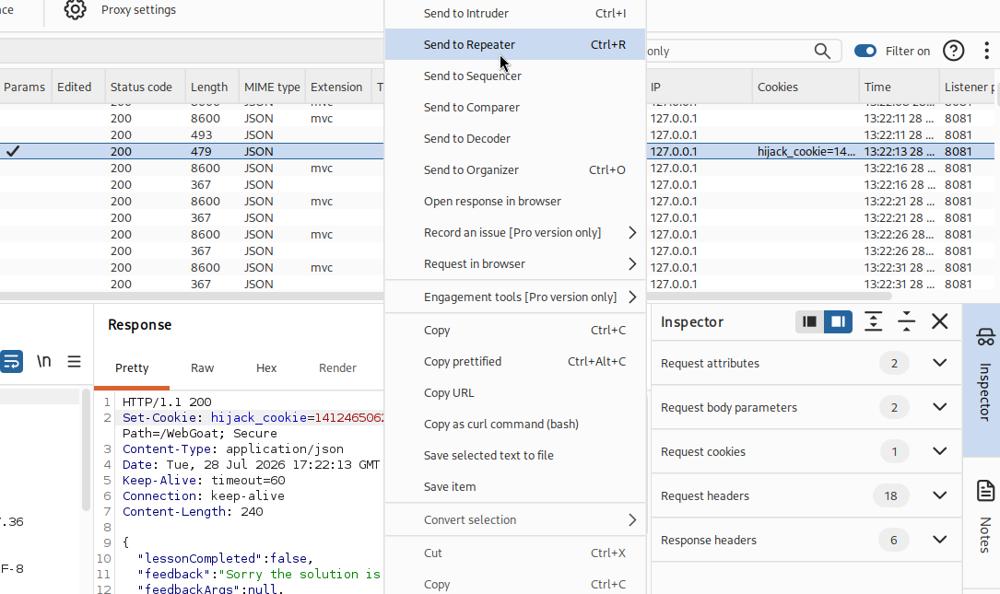

---

#### Крок 5. Генерація серії запитів та аналіз структуроутворення `hijack_cookie`

У модулі **Repeater** виконуємо серію послідовних відправок запиту (натискаємо кнопку **Send** 5-10 разів):

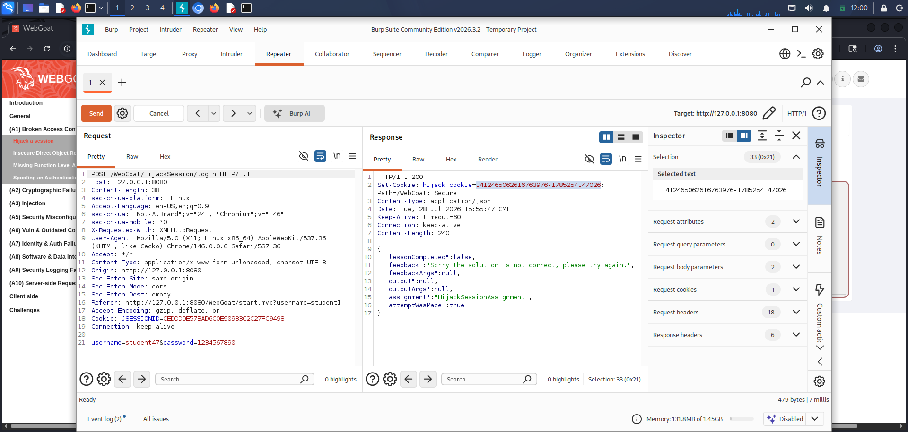

Переглядаємо історію відправок у Repeater та фіксуємо згенеровані значення `hijack_cookie`:

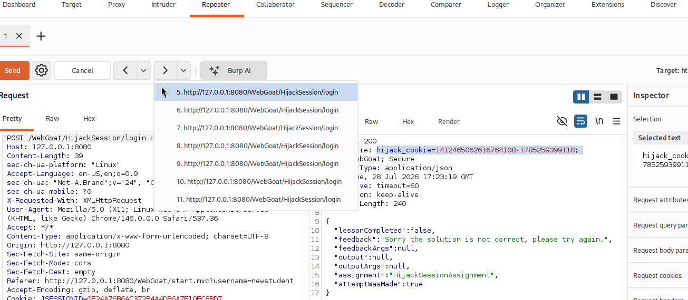

Зберігаємо отримані значення `hijack_cookie` у текстовий редактор **Mousepad** для вивчення паттерну:

```text
1412465062616764105-1785259396004
1412465062616764106-1785259397487
1412465062616764107-1785259398387
1412465062616764108-1785259399118
1412465062616764110-1785259399618
1412465062616764111-1785259399833
1412465062616764113-1785259400135
1412465062616764114-1785259400441
1412465062616764115-1785259400733
1412465062616764116-1785259401032
1412465062616764117-1785259401340
```

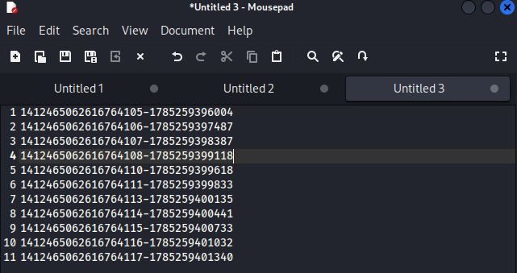

Аналіз ще однієї тестової вибірки значень у текстовому редакторі:

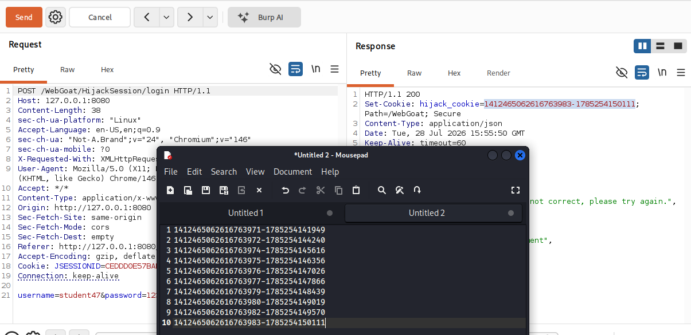

Детальний перегляд окремого токена у панелі Inspector:

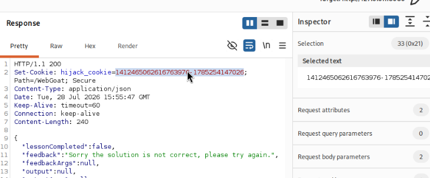

Додатковий журнал перехоплених сесій у Proxy:


Перевірка чергового запиту авторизації:

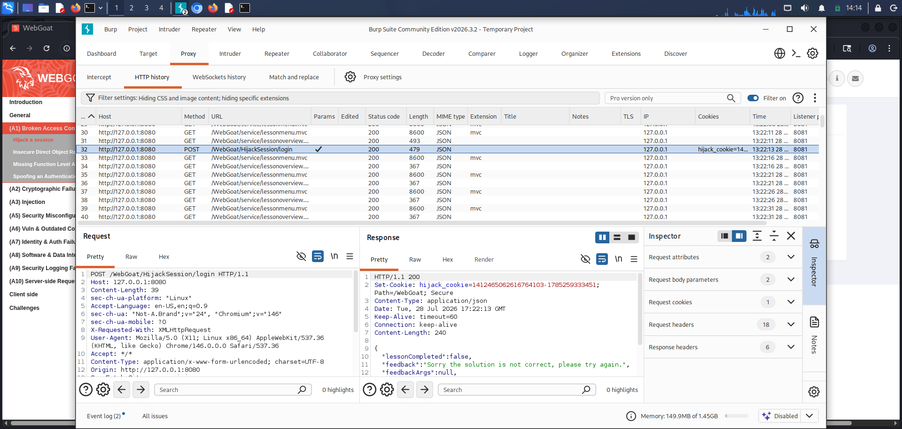

#### Висновок з аналізу структури `hijack_cookie`:
Значення cookie складається з двох частин, розділених дефісом: `<ID_сесії>-<Timestamp>`
1. **Перша частина** (`1412465062616764108`) — це інкрементний лічильник сесій.
2. **Друга частина** (`1785259399118`) — це часова мітка у мілісекундах (UNIX Timestamp).

Під час аналізу послідовності в інспекторі помітно "прогалини" у лічильнику: між `...4108` та `...4110` відсутнє значення `1412465062616764109`. Це свідчить про те, що саме у цей момент була створена автентифікована сесія іншого користувача, яку нам потрібно захопити.

---

#### Крок 6. Налаштування атаки у Burp Intruder

Передаємо запит із модифікованим заголовоком кукі до інструменту **Intruder**. Натискаємо праву кнопку миші та обираємо **Send to Intruder** (або `Ctrl+I`):

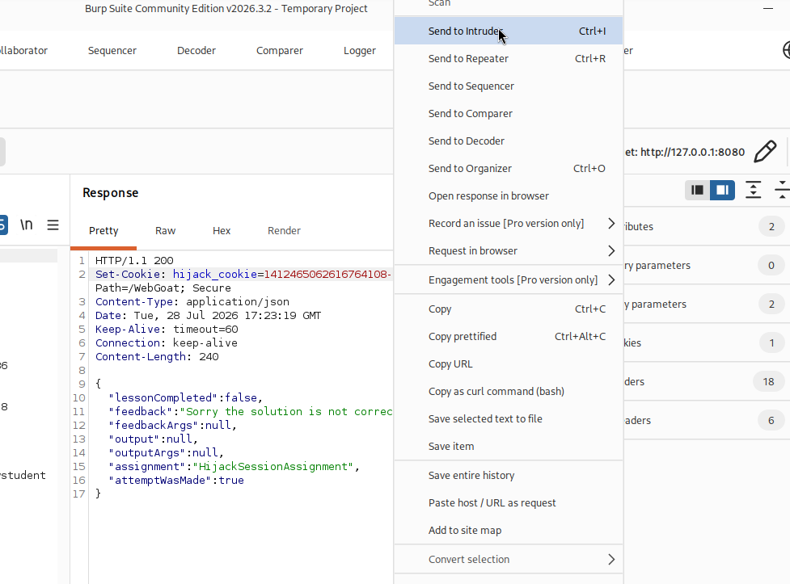

У вкладці **Intruder** налаштовуємо параметри атаки:
1. Встановлюємо тип атаки: **Sniper attack**.
2. Вказуємо позицію для пейлоаду у заголовку `Cookie`:
   ```http
   Cookie: JSESSIONID=0E24A76B6AC372B4A4DB6A7E10EC8BD7; hijack_cookie=1412465062616764109-17852593991§18§
   ```
3. Налаштовуємо конфігурацію генератора пейлоадів **Payloads**:
   - **Payload type**: `Numbers`
   - **Type**: `Sequential`
   - **From**: `18`
   - **To**: `99`
   - **Step**: `1`
   - **Number format**: `Decimal` (Min integer digits: 0, Max integer digits: 2)

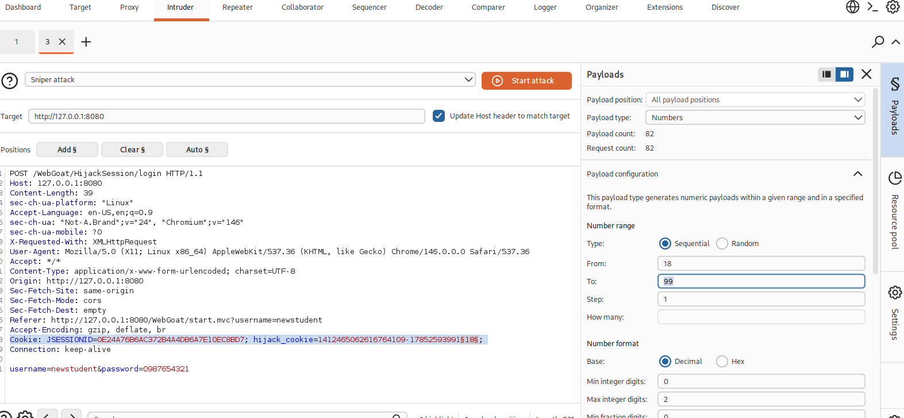

---

#### Крок 7. Запуск перебору та отримання успішної відповіді

Натискаємо кнопку **Start attack**. Інструмент перебирає значення часової мітки для пропущеного ідентифікатора сесії `1412465062616764109`.

Практично одразу один із запитів повертає відмінну довжину відповіді та успішну JSON-відповідь:

```json
{
  "lessonCompleted": true,
  "feedback": "Congratulations. You have successfully completed the assignment.",
  "feedbackArgs": null,
  "output": null,
  "outputArgs": null,
  "assignment": "HijackSessionAssignment",
  "attemptWasMade": true
}
```

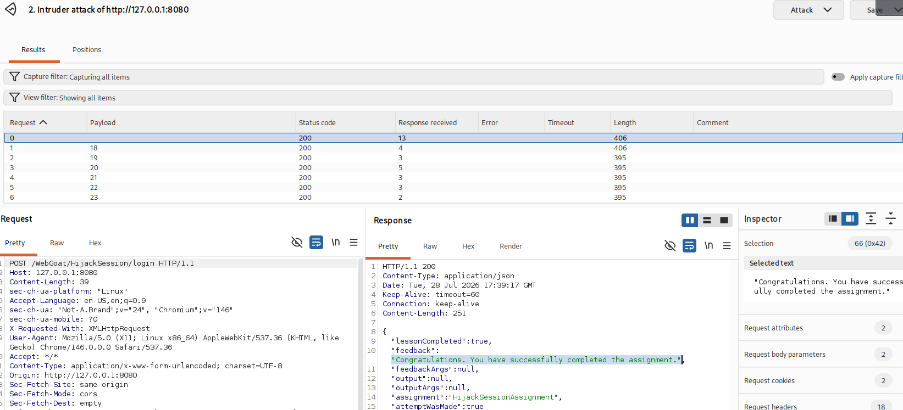

Підтвердження результату перебору в інтерфейсі Intruder:

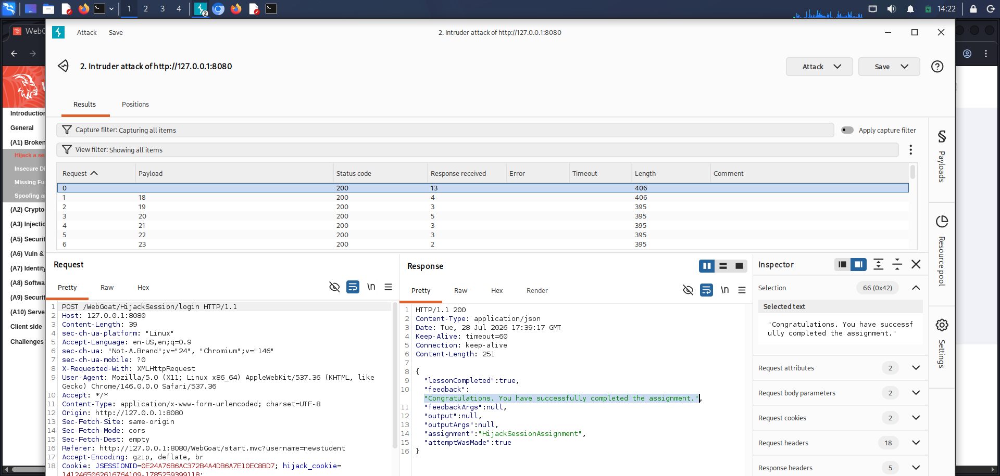

---

#### Крок 8. Фіксація завершення завдання

Після успішного прогнозування токена та захоплення сесії переходимо у веб-інтерфейс WebGoat. Індикатор пункту **Hijack a session** у бічному меню змінює колір з червоного на зелений (з'являється зелена галочка успішного проходження):

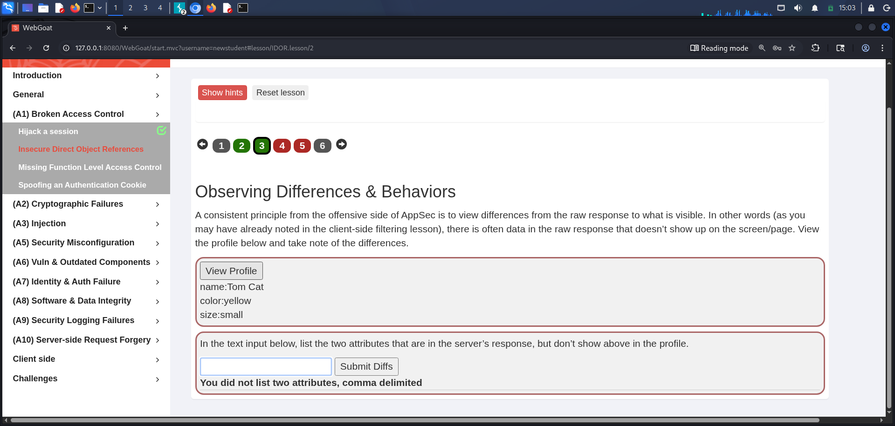

Завдання успішно виконано!

---

### Висновок

Під час виконання даної лабораторної роботи я практично дослідив вразливість класифікації OWASP Top 10 **A01:2025 Broken Access Control**, пов'язану з передбачуваністю ідентифікаторів сесій (Session Hijacking).

У ході лабораторного дослідження я здобув та закріпив такі практичні навички:
1. **Аналіз механізмів сесійного управління**: Перехоплював HTTP-запити та відповіді за допомогою Burp Suite Proxy HTTP history, аналізував заголовки `Set-Cookie` та дослідив алгоритми формування сесійних токенів у веб-додатках.
2. **Статистичний аналіз передбачуваності токенів**: За допомогою модуля Burp Repeater згенерував серію послідовних запитів, експортував значення `hijack_cookie` у текстовий редактор Mousepad та виявив прості паттерни їх генерації (послідовний інкрементний ID сесії + часова мітка у мілісекундах).
3. **Автоматизований перебір за допомогою Burp Intruder**: Визначив прогалини у послідовності генерації ідентифікаторів, налаштував атаки типу Sniper із числовими пейлоадами для перебору часової мітки та успішно згенерував valid-токен чужої сесії, отримавши відповідь `"lessonCompleted": true`.

Я зробив висновок, що для запобігання атак типу Session Hijacking у реальних веб-системах розробники повинні дотримуватися суворих вимог безпеки:
* **Криптографічна стійкість**: Ідентифікатори сесій мають генеруватися виключно за допомогою криптографічно стійких генераторів псевдовипадкових чисел (CSPRNG) із високим рівнем ентропії (щонайменше 128 біт випадковості).
* **Відмова від саморобних алгоритмів**: Заборонено використовувати послідовні лічильники, часові мітки (timestamps) або персональні дані користувачів у якості складових частин сесійного токена.
* **Захист кукі-файлів**: Сесійні cookie обов'язково повинні мати прапорці `HttpOnly` (для захисту від XSS), `Secure` (для передачі виключно через HTTPS) та `SameSite=Strict` або `Lax` (для захисту від CSRF).
* **Прив'язка та інвалідація сесій**: Реалізовувати суворий таймаут неактивності, автоматичне анулювання токенів при виході (logout) та регенерацію Session ID після кожної зміни рівня привілеїв користувача.
