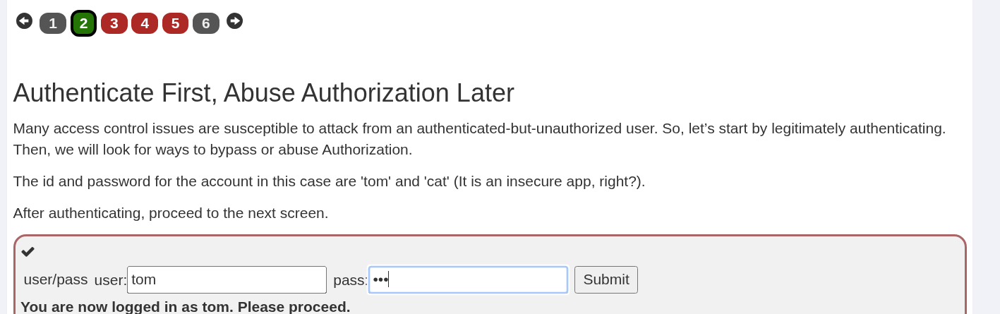
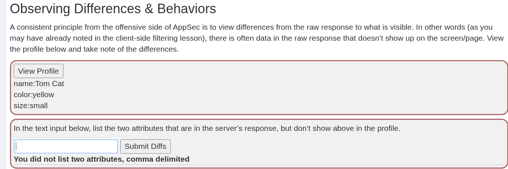
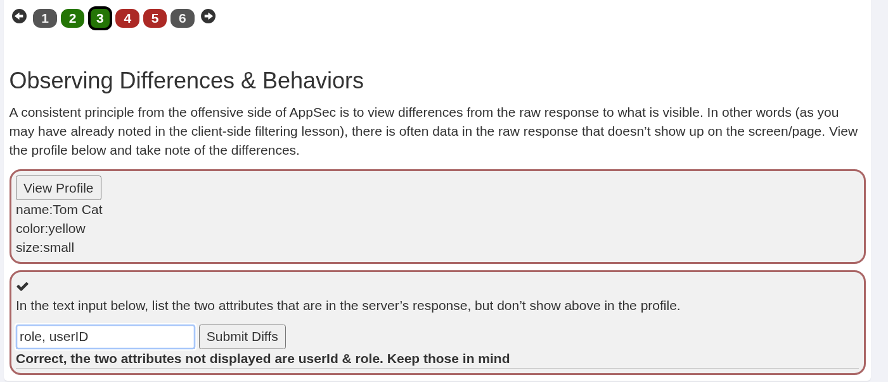
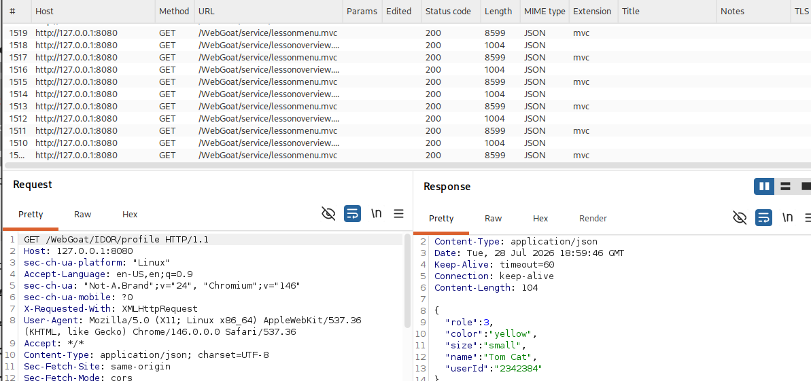
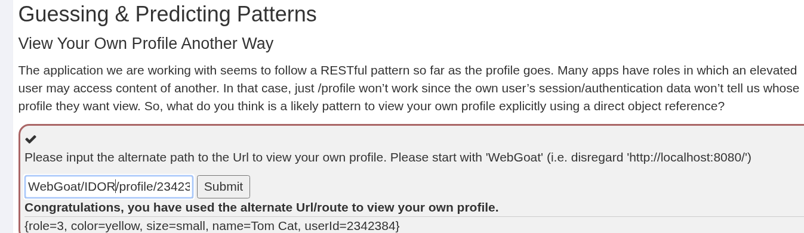
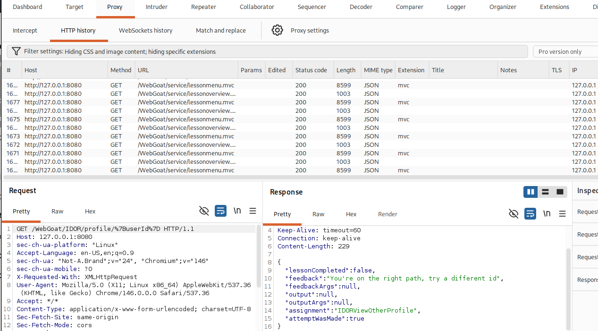
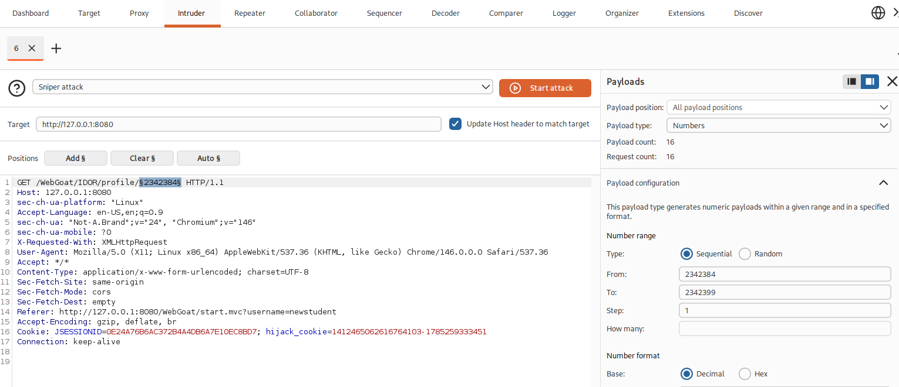
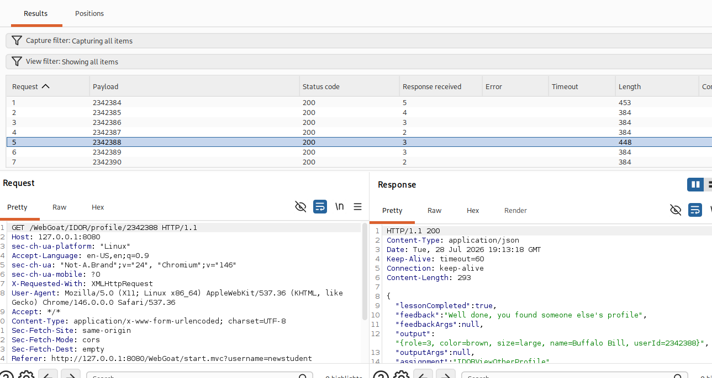
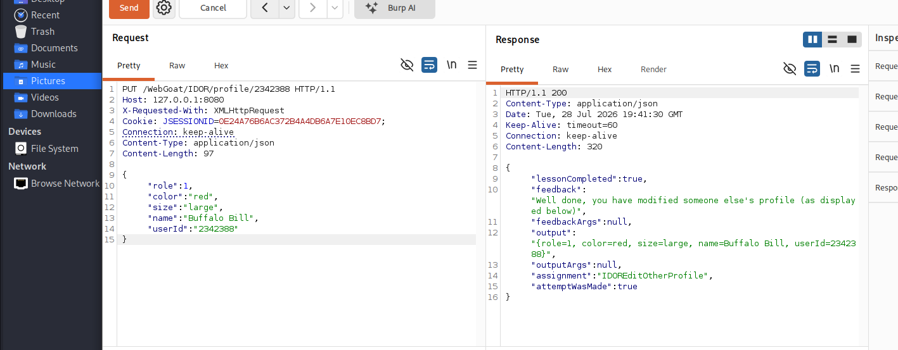
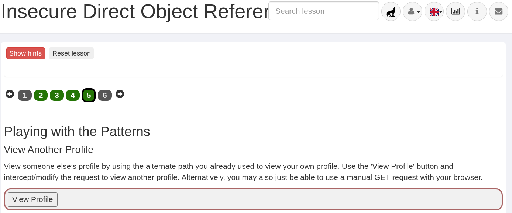

**Прямі посилання на об'єкти** — це ситуація, коли додаток використовує вхідні дані, надані клієнтом, для доступу до даних та об'єктів.

### Приклади
Приклади прямих посилань на об'єкти з використанням методу **GET** можуть виглядати приблизно так:

* `https://some.company.tld/dor?id=12345`
* `https://some.company.tld/images?img=12345`
* `https://some.company.tld/dor/12345`

### Інші методи
Методи **POST, PUT, DELETE** та інші також можуть бути вразливими; вони відрізняються переважно самим методом та структурою корисного навантаження (payload).

---

## Небезпечні прямі посилання на об'єкти (IDOR)
Посилання вважаються небезпечними, якщо вони не обробляються належним чином, що дозволяє **обійти авторизацію** або **розкрити приватні дані**. Це може бути використано для виконання операцій або доступу до даних, до яких користувач не повинен мати доступу.

Припустімо, що ви як користувач відкриваєте свій профіль, і URL-адреса виглядає так:
`https://some.company.tld/app/user/23398`

...і ви бачите там свій профіль. Що станеться, якщо ви перейдете за адресою:
`https://some.company.tld/app/user/23399`

...або використаєте інше число в кінці? Якщо ви можете маніпулювати номером (ID користувача) і переглядати чужий профіль, то таке посилання на об'єкт є **небезпечним**.

Звісно, це можна перевірити або розширити за межі методів GET не лише для перегляду даних, але й для їхньої модифікації.

---

## Корисні матеріали для читання
Перш ніж переходити до практики, ознайомтеся з додатковою інформацією про **Insecure Direct Object References**:

* [OWASP: Testing for IDOR (OTG-AUTHZ-004)](https://www.google.com/search?q=https://www.owasp.org/index.php/Testing_for_Insecure_Direct_Object_References_\(OTG-AUTHZ-004\))
* [OWASP Top 10-2017 A5: Broken Access Control](https://www.owasp.org/index.php/Top_10-2017_A5-Broken_Access_Control)
* [IDOR Prevention Cheat Sheet](https://cheatsheetseries.owasp.org/cheatsheets/Insecure_Direct_Object_Reference_Prevention_Cheat_Sheet.html)
* [OWASP Top 10 2013-A4: Insecure Direct Object References](https://www.owasp.org/index.php/Top_10_2013-A4-Insecure_Direct_Object_References)
* [CWE-639: Access Control Bypass Through User-Controlled Key](http://cwe.mitre.org/data/definitions/639.html)

---

## Спочатку автентифікація, потім — зловживання авторизацією
Багато проблем контролю доступу вразливі до атак з боку автентифікованого, але неавторизованого користувача. Тож почнемо з легітимної автентифікації. Після цього ми шукатимемо способи обійти авторизацію або зловжити нею.

**Логін** та **пароль** для цього облікового запису — `tom` та `cat` (це ж незахищений додаток, чи не так?).

Після проходження автентифікації перейдіть до наступного екрана.

---

## Спостереження відмінностей і поведінки
Послідовний принцип з наступальної сторони AppSec полягає в тому, щоб звертати увагу на відмінності між «сирою» (raw) відповіддю сервера і тим, що фактично відображається користувачу. Іншими словами (як ви, можливо, вже помітили в уроці про фільтрацію на стороні клієнта), у «сирій» відповіді часто містяться дані, які не відображаються на екрані/сторінці. Перегляньте профіль нижче та зверніть увагу на ці відмінності.

Введення прихованих атрибутів:

Після виявлення та відправлення прихованих полів `role, userID`:

Переглядаємо HTTP History у Burp Suite та знаходимо приховані атрибути у відповіді сервера:

Як результат — крок пройдено успішно.

---

## Перегляньте свій профіль іншим способом (Guessing & Predicting Patterns)
Здається, застосунок, з яким ми працюємо, дотримується RESTful-підходу щодо профілів. У багатьох застосунках існують ролі, за яких користувач із підвищеними правами може переглядати контент інших користувачів. У такому випадку просто шлях `/profile` не спрацює, оскільки дані сесії/автентифікації користувача не вказують, чий саме профіль потрібно відобразити.

Отже, який шаблон найімовірніше використовується для явного перегляду власного профілю через пряме посилання на об’єкт (direct object reference)?

Використовуємо альтернативний шлях: `WebGoat/IDOR/profile/2342384`

---

### Перегляд іншого профілю
Перегляньте профіль іншого користувача, скориставшись тим самим альтернативним шляхом, який ви вже використовували для перегляду власного профілю. Скористайтеся кнопкою **"View Profile"** (Переглянути профіль), перехопіть та модифікуйте запит, щоб побачити дані іншої особи. Крім того, ви можете спробувати просто надіслати ручний **GET-запит** через браузер.

Аналізуємо запит у Burp Proxy:

Для пошуку чужого профілю налаштовуємо атаку в **Intruder** (Payload type: Numbers, діапазон ID):

Результат запуску атаки Intruder дозволяє знайти профіль іншого користувача (Buffalo Bill, `userId: 2342388`):

---

### Редагування іншого профілю
Старіші додатки можуть працювати за іншими принципами, але **RESTful-додатки** (як у цьому випадку) часто просто змінюють HTTP-методи (з додаванням тіла запиту або без нього) для виконання різних функцій.

Використовуйте ці знання, щоб взяти той самий базовий запит і змінити його **метод (method)**, **шлях (path)** та **тіло (body/payload)**, щоб відредагувати профіль іншого користувача (Buffalo Bill).
* Змініть роль на нижчу (оскільки ролі та користувачі з вищими привілеями зазвичай мають менші порядкові номери).
* Також змініть колір користувача на **"red"** (червоний).

Для виконання відправляємо перехоплений запит у вкладку **Repeater**:

У **Repeater** змінюємо HTTP-метод на `PUT`, додаємо тіло з `role: 1` та `color: "red"`, після чого отримуємо успішну відповідь `lessonCompleted: true`:

Підсумковий екран проходження уроку IDOR:

---

### Починайте з кінцевою метою в голові
Чи задокументована у вас система контролю доступу? Якщо ні, то як ви можете її впроваджувати? Контроль доступу визначається бізнес-логікою, яка керує додатком, а також законами про конфіденційність та іншими нормативними актами.

### Горизонтальний та вертикальний контроль доступу
Часто ми розглядаємо контроль доступу лише в контексті «ролей» (користувач, досвідчений користувач, адміністратор тощо). Проте, як було помічено в попередніх вправах, користувачі з однаковою «роллю» можуть отримати доступ до даних один одного. Це і є **горизонтальний контроль доступу**. Обидва види (горизонтальний і вертикальний) мають бути впроваджені та дотримуватися.

### Таблиця 1. Приклад матриці контролю доступу
| Кінцева точка (Endpoint) | Метод | Опис | Ролі, правила доступу | Примітки, застереження |
| :--- | :--- | :--- | :--- | :--- |
| `/profile` | GET | Перегляд профілю користувача | Авторизований користувач; може переглядати лише власну роль. | Адмін-ролі мають використовувати інший URL для перегляду чужих профілів (див. нижче). |
| `/profile/{id}` | GET | Перегляд профілю конкретного користувача | Авторизований користувач може бачити свій профіль за `{id}`; адміни також можуть переглядати. | н/д |
| `/profile/{id}` | PUT | Редагування профілю. Об'єкт профілю надсилається клієнтом у запиті. | Авторизований користувач може редагувати свій профіль за `{id}`; адміни також можуть редагувати. | Редагування адміністратором має логуватися. |

### Аудит доступу
Як показано у прикладі вище, ваші правила контролю доступу мають містити положення про те, який саме доступ логується (записується в журнал). Наприклад, якщо суперкористувач або адміністратор може редагувати профілі інших осіб… це обов’язково має бути зафіксовано в логах. Інші приклади включають виявлені порушення або спроби обійти механізми контролю доступу.

### Використання непрямих посилань (Indirect References)
Не багато додатків використовують це, але ви можете застосовувати **непрямі посилання**. У цьому випадку на сервері посилання пропускаються через хешування, кодування або іншу функцію, щоб ID, який бачить клієнт, не був справжнім ідентифікатором, з яким працює сервер. Це дещо знизить продуктивність (поширений компроміс заради безпеки), і такі посилання все одно можна вгадати, підібрати перебором (brute-force) або декомпілювати.

Цей підхід не повинен бути єдиним засобом захисту. Його можна використовувати як додатковий рівень. Ваш сервер повинен реалізувати логіку відображення клієнтських (непрямих) посилань на серверні (прямі).

Часто API або RESTful-сервіси покладаються на «прихованість» (obscurity), статичний «ключ» або відсутність уяви у користувача для контролю доступу. Хорошим варіантом є використання **JSON Web Tokens (JWT)** з цифровим підписом. Це надійний метод аутентифікації та контролю доступу в API, що використовує комбінацію тверджень (claims) та криптографічного підпису для перевірки споживача.

Інші нові стандарти, такі як **Secure Token Binding**, обіцяють «криптографічний стан» (cryptographic state) для вебсервісів у заголовках запитів:
* [https://tools.ietf.org/html/draft-ietf-tokbind-protocol-10](https://tools.ietf.org/html/draft-ietf-tokbind-protocol-10)
* [https://tools.ietf.org/html/draft-ietf-tokbind-negotiation-05](https://tools.ietf.org/html/draft-ietf-tokbind-negotiation-05)
* [https://tools.ietf.org/html/draft-ietf-tokbind-https-06](https://tools.ietf.org/html/draft-ietf-tokbind-https-06)

---

**Зауваження:** Якщо ви зараз на етапі виправлення того запиту з Buffalo Bill, пам'ятайте — зміна кольору на "red" та ролі на "1" якраз демонструє відсутність **горизонтального** (ви як користувач міняєте чужий профіль) та **вертикального** (ви підвищуєте собі привілеї) контролю доступу.

---
