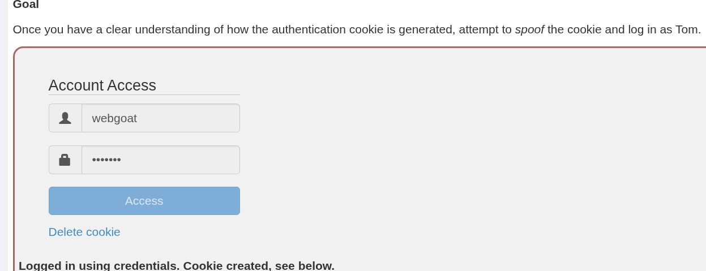
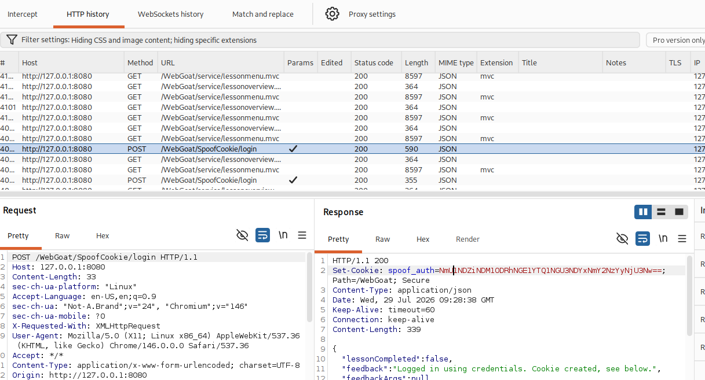
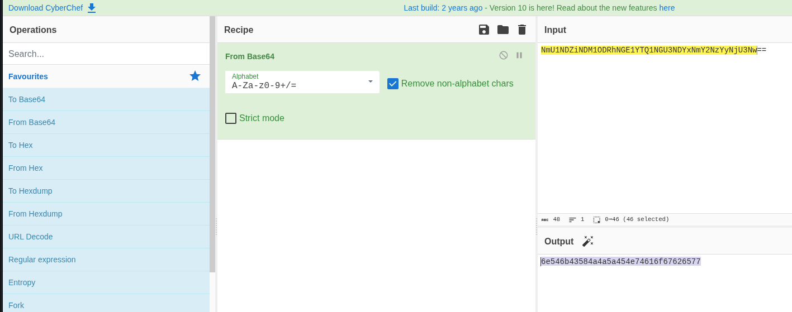
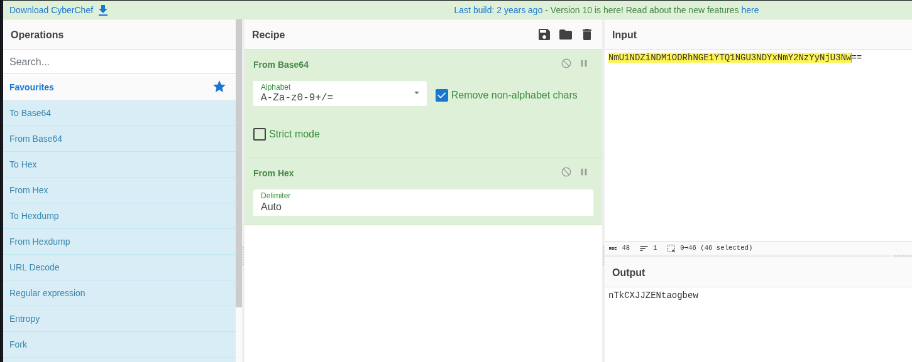
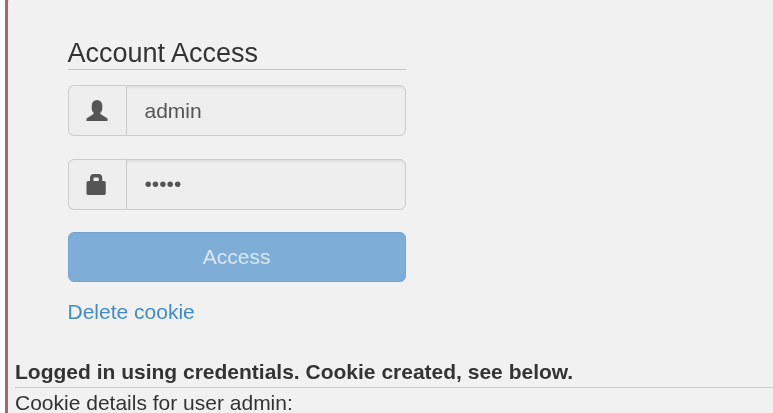
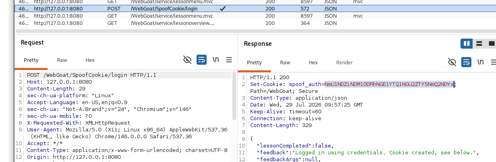
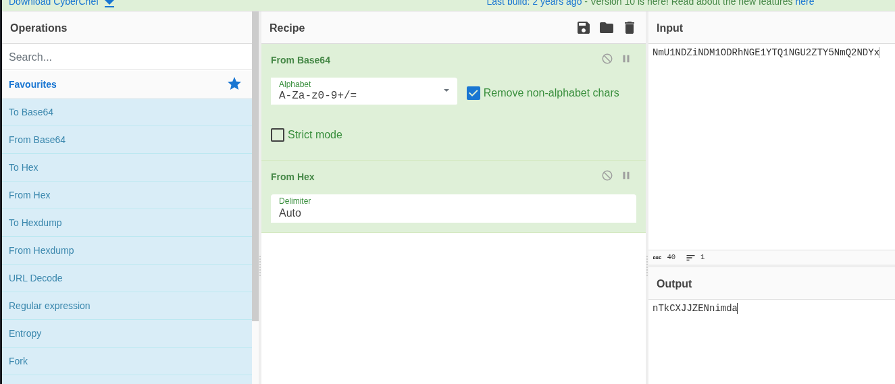
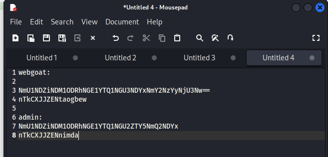
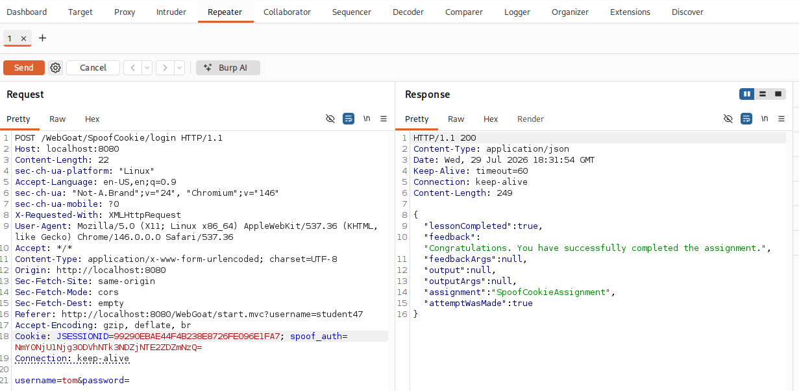

# Звіт з лабораторної роботи: Фальсифікація токена автентифікації (Spoofing an Authentication Cookie / Token)

**Мета роботи:** Дослідити механізм створення куків автентифікації (Authentication Cookies) у вебзастосунку WebGoat, провести реверс-інжиніринг алгоритму їх кодування за допомогою інструментів Burp Suite та CyberChef, підробити cookie-файл для користувача Tom та успішно увійти у систему без знання його пароля.

---

## 1. Теоретичні відомості

У багатьох вебзастосунках для підтримки сесії автентифікованого користувача використовуються куки (`Cookie`). Якщо розробники застосовують власні "приховані" або слабкі алгоритми формування куків (наприклад, кодування Base64, Hex або просту інверсію рядків замість криптографічно стійких підписів JWT/HMAC), зловмисник може:

1. Перехопити куки декількох облікових записів.
2. Проаналізувати та розгадати алгоритм кодування (Reverse Engineering).
3. Згенерувати підроблений кукі-файл (Cookie Spoofing) для будь-якого іншого користувача (включно з адміністратором).
4. Отримати несанкціонований доступ до чужого акаунта, порушуючи горизонтальний та вертикальний контроль доступу.

---

## 2. Покрокове виконання лабораторної роботи

### Крок 1. Первинна автентифікація та аналіз відповіді сервера

На початку роботи виконую вхід у систему під тестовим обліковим записом `webgoat`.



Під час надсилання POST-запиту на `/WebGoat/SpoofCookie/login` перехоплюю HTTP-транзакцію у Burp Suite HTTP History та аналізую заголовок відповіді сервера `Set-Cookie`:



Сервер повернув наступне значення кукі:
* **Назва кукі:** `spoof_auth`
* **Значення:** `NmU1NDZiNDM1ODRhNGE1YTQ1NGU3NDYxNmY2NzYyNjU3Nw==`

---

### Крок 2. Декодування та реверс-інжиніринг алгоритму кодування

Переношу отримане значення кукі в інструмент **CyberChef** для поетапного розшифрування:

1. Застосовую операцію **From Base64**:
   Згенерований результат — це Hex-рядок: `6e546b43584a4a5a454e74616f67626577`.



2. Додаю операцію **From Hex**:
   Отримую відкритий ASCII-рядок: `nTkCXJJZENtaogbew`.



При аналізі рядка `nTkCXJJZENtaogbew` помічаю підказку:
- Префікс `nTkCXJJZEN` є статичним константним значенням.
- Суфікс `taogbew` — це ім'я користувача `webgoat`, записане у зворотному порядку (`w-e-b-g-o-a-t` -> `t-a-o-g-b-e-w`).

---

### Крок 3. Перевірка гіпотези на другому облікового записі (`admin`)

Щоб остаточно переконатися у правильності виявленого алгоритму, виконую аналогічний вхід під користувачем `admin`.



Перехоплюю відповідь у Burp Proxy з новим значенням кукі для `admin`:
`Set-Cookie: spoof_auth=NmU1NDZiNDM1ODRhNGE1YTQ1NGU6ZTY5NmQ2NDYX`



Декодую це значення у CyberChef (`From Base64` -> `From Hex`):
Отримую результат: `nTkCXJJZENnimda`.



Систематизую виявлене правило кодування у текстовому редакторі:



**Остаточна формула формування кукі:**
```text
1. Базовий рядок = "nTkCXJJZEN" + Reverse(username)
2. Проміжний результат = ASCII_to_Hex(Базовий рядок)
3. Кукі spoof_auth = Base64_Encode(Проміжний результат)
```

---

### Крок 4. Генерація підробленого кукі для користувача Tom та успішний вхід

Завдання лабораторної роботи — підробити кукі та увійти під ім'ям `Tom`.

1. Ім'я користувача: `Tom` (або `tom`)
2. Зворотний порядок літер: `mot`
3. Формуємо базовий рядок: `nTkCXJJZENmot`
4. Переводимо в Hex: `6e546b43584a4a5a454e6d6f74`
5. Кодуємо в Base64: `NmYONjU1Njg3ODVhNTk3NTE2ZDZMNzQ=`

Відправляю POST-запит у **Burp Repeater**, підставивши згенерований `spoof_auth` у заголовок `Cookie`:



Сервер повернув успішну відповідь:
```json
{
  "lessonCompleted": true,
  "feedback": "Congratulations. You have successfully completed the assignment."
}
```

---

## 3. Висновок

Під час виконання цієї лабораторної роботи я практично дослідив вразливість, пов'язану з використанням передбачуваних алгоритмів аутентифікації на основі куків. 

Мені вдалося провести реверс-інжиніринг значення заголовка `spoof_auth` за допомогою комбінації інструментів Burp Suite та CyberChef, виявити двохетапну схему кодування (Hex + Base64) та реверсивне розташування імені користувача зі статичним префіксом. На основі виявленої формули я успішно згенерував підроблений токен для користувача Tom та обійшов процедуру автентифікації.

**Практичні рекомендації щодо захисту:**
- Ніколи не використовувати власні кодувальні чи обрати зворотні алгоритми (Base64, Hex, ROT13) для зберігання або перевірки даних сесії.
- Застосовувати криптографічно стійкі токени з цифровим підписом (наприклад, JWT з HMAC-SHA256) або випадково згенеровані криптографічні ідентифікатори сесій (Session IDs).
- Усі критичні перевірки прав доступу виконувати виключно на боці сервера, а не довіряти клієнтським кукам.
