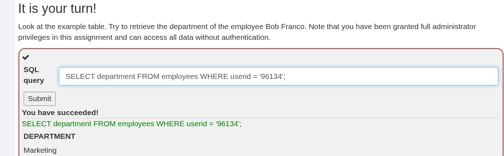
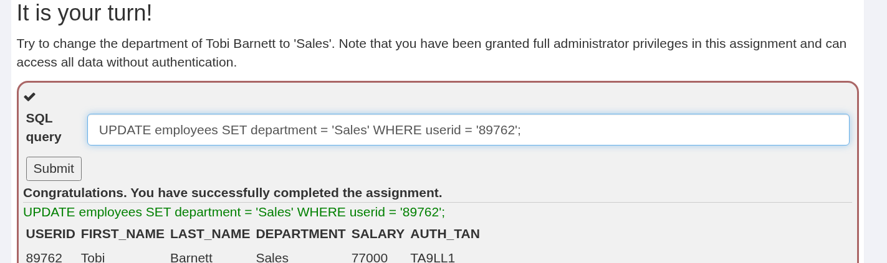
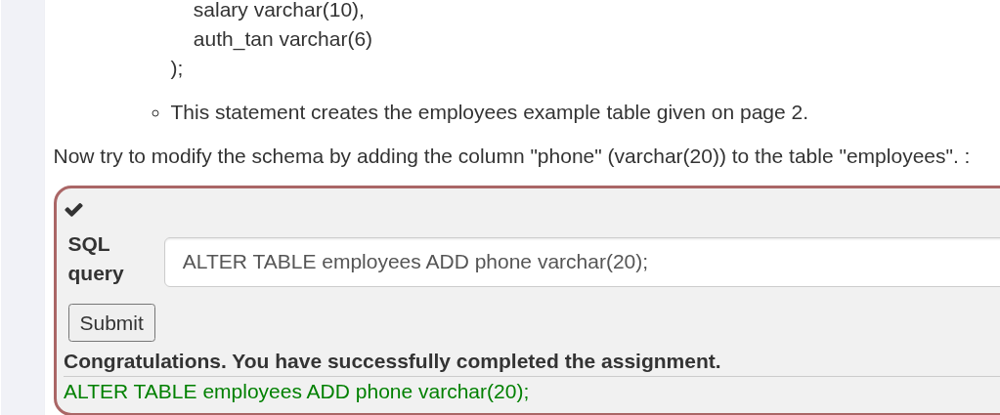
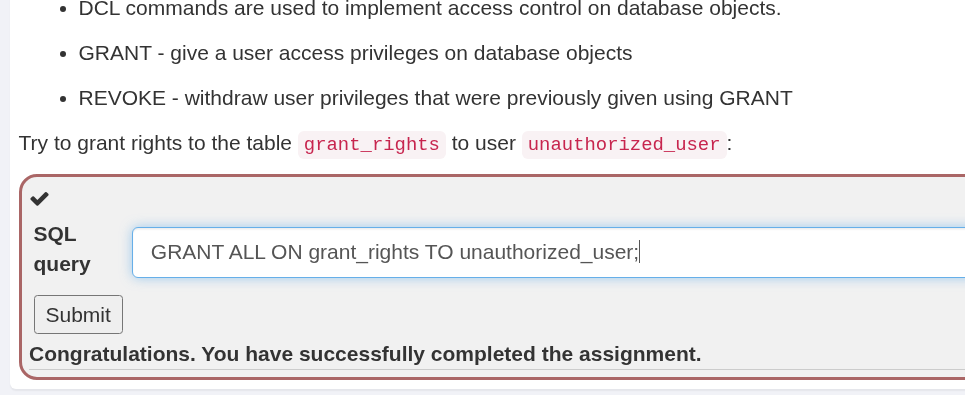
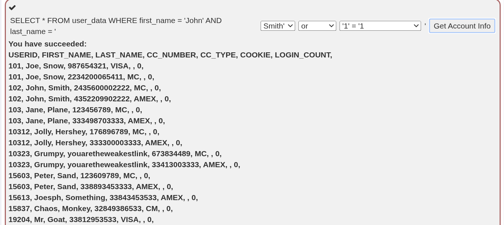
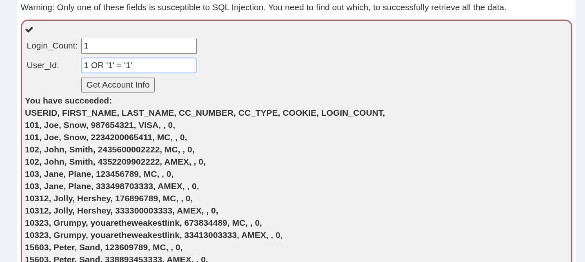
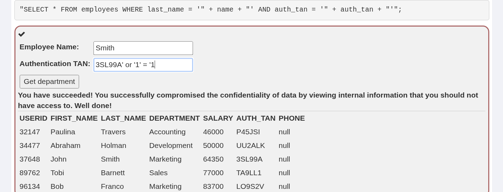
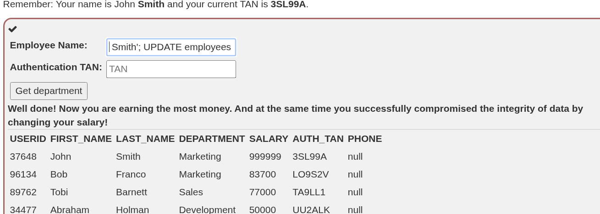
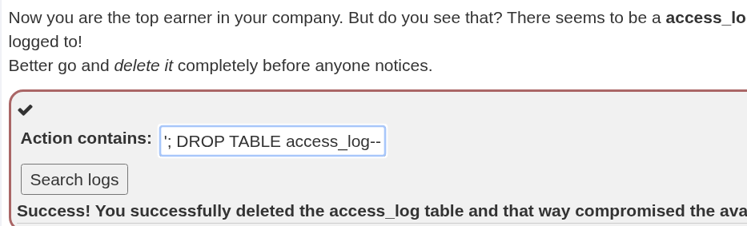

**Концепція**

Інформація цього модуля призначена для розуміння, що таке Structured Query Language (SQL) і як ним можна маніпулювати для виконання завдань, які не були передбачені розробником.

---

**Цілі**

Користувач отримає базове розуміння того:

* як працює SQL
* для чого він використовується

Користувач також отримає базове розуміння:

* що таке SQL-ін’єкція
* як вона працює

Користувач продемонструє знання щодо:

* DML, DDL та DCL
* рядкових SQL-ін’єкцій (String SQL injection)
* числових SQL-ін’єкцій (Numeric SQL injection)
* того, як SQL-ін’єкція порушує тріаду CIA (конфіденційність, цілісність, доступність)

---

### Що таке SQL?
**SQL** — це стандартизована (ANSI у 1986 році, ISO у 1987 році) мова програмування, яка використовується для керування реляційними базами даних та виконання різних операцій із даними в них.

База даних — це сукупність даних. Дані впорядковані у рядки, стовпці та таблиці, а також індексуються, щоб зробити пошук відповідної інформації ефективнішим.

Приклад SQL-таблиці, що містить дані про співробітників; назва таблиці — **«employees»**:

### Таблиця Employees

| userid | first_name | last_name | department | salary | auth_tan |
| :--- | :--- | :--- | :--- | :--- | :--- |
| 32147 | Paulina | Travers | Accounting | $46.000 | P45JSI |
| 89762 | Tobi | Barnett | Development | $77.000 | TA9LL1 |
| 96134 | Bob | Franco | Marketing | $83.700 | LO9S2V |
| 34477 | Abraham | Holman | Development | $50.000 | UU2ALK |
| 37648 | John | Smith | Marketing | $64.350 | 3SL99A |

Компанія зберігає у своїх базах даних наступну інформацію про співробітників: унікальний номер співробітника (**«userid»**), прізвище, ім'я, відділ, зарплату та номер автентифікації транзакції (**«auth_tan»**). Кожна з цих частин інформації зберігається в окремому стовпці, а кожен рядок представляє одного співробітника компанії.

SQL-запити можна використовувати для модифікації таблиці бази даних та її індексних структур, а також для додавання, оновлення та видалення рядків даних.

Існує три основні категорії команд SQL:
1. **Data Manipulation Language (DML)** — мова маніпулювання даними.
2. **Data Definition Language (DDL)** — мова визначення даних.
3. **Data Control Language (DCL)** — мова керування даними.

Кожен із цих типів команд може бути використаний зловмисниками для порушення конфіденційності, цілісності та/або доступності системи. Переходьте до уроку, щоб дізнатися більше про типи команд SQL та їхній зв'язок із цілями захисту.

Більш детально про SQL: [http://www.sqlcourse.com/](http://www.sqlcourse.com/).

---

### Практика (Завдання 1 — SELECT)
Подивись на приклад таблиці. Спробуй отримати назву відділу (**department**) співробітника **Bob Franco**. Зауваж, що в цьому завданні тобі надано повні права адміністратора, і ти можеш отримати доступ до всіх даних без автентифікації.

**Правильний запит для розв'язання завдання:**
```sql
SELECT department FROM employees WHERE userid = '96134';
```



---

### Data Manipulation Language (DML) — Мова маніпулювання даними

Як випливає з назви, мова маніпулювання даними (DML) відповідає за роботу з безпосередніми даними. Більшість найпоширеніших операторів SQL, включаючи **SELECT**, **INSERT**, **UPDATE** та **DELETE**, належать до категорії DML.

Ці оператори використовуються для:
* **SELECT** — запит записів (читання).
* **INSERT** — додавання нових записів.
* **DELETE** — видалення записів.
* **UPDATE** — модифікація вже існуючих записів.

Якщо зловмиснику вдасться «впровадити» (inject) DML-команди в базу даних SQL, він може порушити:
1. **Конфіденційність** (використовуючи `SELECT` для викрадення даних).
2. **Цілісність** (використовуючи `UPDATE` для зміни даних, наприклад, суми зарплати).
3. **Доступність** (використовуючи `DELETE` або `UPDATE` для знищення інформації або блокування доступу).

#### Основні команди DML:
* **SELECT** — витягти дані з бази даних.
* **INSERT** — вставити дані в базу даних.
* **UPDATE** — оновити існуючі дані в базі даних.
* **DELETE** — видалити записи з бази даних.

**Приклад отримання даних:**
```sql
SELECT phone
FROM employees
WHERE userid = 96134;
```
Цей запит знаходить номер телефону співробітника, чий `userid` дорівнює `96134`.

---

### Практика (Завдання 2 — UPDATE)
Спробуй змінити відділ (**department**) для співробітника **Tobi Barnett** на **'Sales'**. Зауваж, що в цьому завданні тобі надано повні права адміністратора, і ти можеш змінювати дані без додаткової автентифікації.

> **Підказка:** Для оновлення даних використовується оператор `UPDATE`. Не забудь використати умову `WHERE`, щоб не змінити відділ усім співробітникам одразу!

**Правильний запит для розв'язання завдання:**
```sql
UPDATE employees SET department = 'Sales' WHERE userid = '89762';
```



---

### Data Definition Language (DDL) — Мова визначення даних

Мова визначення даних (DDL) включає команди для створення та зміни структур даних. Команди DDL зазвичай використовуються для опису **схеми** бази даних. Схема — це загальна структура або організація бази даних, яка в SQL-системах включає такі об'єкти, як таблиці, індекси, представлення (views), зв'язки, тригери тощо.

Якщо зловмиснику вдасться «впровадити» (inject) SQL-команди типу DDL у базу даних, він може порушити:
1. **Цілісність** (використовуючи оператори `ALTER` та `DROP`).
2. **Доступність** (використовуючи оператор `DROP` для повного видалення структур).

Команди DDL призначені для створення, модифікації та видалення структури об'єктів бази даних:
* **CREATE** — створення об'єктів бази даних, таких як таблиці та представлення.
* **ALTER** — зміна структури існуючої бази даних.
* **DROP** — видалення об'єктів із бази даних.

**Приклад створення таблиці:**
```sql
CREATE TABLE employees(
    userid varchar(6) not null primary key,
    first_name varchar(20),
    last_name varchar(20),
    department varchar(20),
    salary varchar(10),
    auth_tan varchar(6)
);
```
Цей оператор створює приклад таблиці `employees`, яку ми розглядали раніше.

---

### Практика (Завдання 3 — ALTER TABLE)
Тепер спробуй змінити схему таблиці, додавши стовпець **"phone"** (тип даних `varchar(20)`) до таблиці **"employees"**.

> **Підказка:** Для зміни структури вже існуючої таблиці використовується комбінація команд `ALTER TABLE` та `ADD`.

**Правильний запит для розв'язання завдання:**
```sql
ALTER TABLE employees ADD phone varchar(20);
```



Це завдання демонструє, як ін'єкція може дозволити хакеру не просто вкрасти дані, а змінити саму архітектуру бази, наприклад, додавши нові поля для збору шкідливої інформації або видаливши критично важливі індекси.

---

### Data Control Language (DCL) — Мова керування даними

Мова керування даними (DCL) використовується для реалізації логіки контролю доступу в базі даних. DCL дозволяє надавати або скасовувати привілеї користувачів на об'єкти бази даних, такі як таблиці, представлення (views) та функції.

Якщо зловмиснику вдасться «впровадити» (inject) SQL-команди типу DCL у базу даних, він може порушити:
1. **Конфіденційність** (використовуючи команди `GRANT` для надання привілеїв неавторизованим користувачам).
2. **Цілісність та Доступність** (використовуючи команди `REVOKE` для позбавлення прав легітимних користувачів).

Команди DCL призначені для контролю доступу:
* **GRANT** — надати користувачу привілеї доступу до об'єктів бази даних.
* **REVOKE** — відкликати привілеї користувача, які були надані раніше за допомогою `GRANT`.

---

### Практика (Завдання 4 — GRANT)
Спробуй надати права на таблицю `grant_rights` користувачу `unauthorized_user`.

**Правильний запит для розв'язання завдання:**
```sql
GRANT ALL ON grant_rights TO unauthorized_user;
```



---

### Рядкові SQL-ін'єкції (String SQL injection)

Рядкова SQL-ін'єкція виникає тоді, коли введені користувачем дані вставляються безпосередньо у рядок SQL-запиту без належної фільтрації або параметризації. Зловмисник може закрити одинарну дужку/лапку (`'`) та додати власні логічні умови (наприклад, `OR '1' = '1`).

---

### Практика (Завдання 5 — String SQL Injection)
Використовуючи поля вибору або поля вводу, спробуйте виконати рядкову SQL-ін'єкцію, щоб отримати інформацію про всіх користувачів.

**Значення для ін'єкції:**
```sql
Smith' or '1' = '1
```



---

### Числові SQL-ін'єкції (Numeric SQL injection)

Числова SQL-ін'єкція відбувається у випадках, коли параметр запиту очікує числове значення, і значення вставляється у SQL-запит без лапок. Зловмиснику не потрібно закривати лапки, достатньо ввести числову умову, таку як `1 OR 1=1`.

---

### Практика (Завдання 6 — Numeric SQL Injection)
Знайдіть поле, вразливе до числової SQL-ін'єкції, та отримайте всі записи з бази даних.

**Вхідні дані для ін'єкції:**
Поле `User_Id`: `1 OR '1' = '1'`



---

### Порушення конфіденційності (Compromising Confidentiality)

SQL-ін'єкція дозволяє зловмиснику обійти автентифікацію та отримати доступ до конфіденційних даних інших співробітників чи користувачів системи.

---

### Практика (Завдання 7 — Compromising Confidentiality)
Отримайте доступ до даних усіх співробітників, використавши ін'єкцію у полі автентифікаційного коду TAN.

**Вхідні дані:**
`Employee Name`: `Smith`
`Authentication TAN`: `3SL99A' or '1' = '1`



---

### Порушення цілісності (Compromising Integrity)

За допомогою розповсюдження SQL-запитів (stacked queries) зловмисник може не лише читати, а й змінювати дані (наприклад, збільшити власний оклад або змінити права).

---

### Практика (Завдання 8 — Compromising Integrity)
Змініть розмір власної зарплати (для співробітника John Smith) на максимальне значення за допомогою додаткового DML-запиту `UPDATE`.

**Вхідні дані:**
`Employee Name`: `Smith'; UPDATE employees SET salary = 999999 WHERE last_name = 'Smith'--`



---

### Порушення доступності (Compromising Availability)

Найбільш руйнівним наслідком SQL-ін'єкції є можливість видалення таблиць або всієї бази даних (за допомогою DDL-команди `DROP TABLE`), що призводить до повної втрати доступності системи.

---

### Практика (Завдання 9 — Compromising Availability)
Видаліть таблицю `access_log`, щоб приховати сліди несанкціонованого доступу.

**Вхідні дані:**
`Action contains`: `'; DROP TABLE access_log--`



---
