# ОФІЦІЙНИЙ КРИМІНАЛІСТИЧНИЙ ЗВІТ ЦИФРОВОГО РОЗСЛІДУВАННЯ
## DIGITAL FORENSICS INVESTIGATION REPORT (DFIR)

---

### МЕТАДАНІ СПРАВИ ТА ДОСЛІДЖЕННЯ (CASE DETAILS)

| Параметр | Значення |
| :--- | :--- |
| **Номер / Назва кейсу:** | **DFIR-CASE-2026-BSIDES** (Windows Forensics Case — BSides Amman 2021) |
| **Номер документа:** | `DFIR-REP-BSIDES21-001` |
| **Провідний судовий експерт / Слідчий:** | Незалежний DFIR-аналітик / Forensic Specialist |
| **Організація / Підрозділ:** | Digital Forensics & Incident Response Laboratory |
| **Дата початку експертизи:** | 21 серпня 2026 р. |
| **Дата завершення звіту:** | 22 серпня 2026 р. |
| **Часовий проміжок інциденту:** | **15 лютого 2019 р. (04:30:00 UTC – 16:05:00 UTC)** |
| **Класифікація інциденту:** | Несанкціонований доступ до конфіденційної інформації / Ексфільтрація даних / Запуск неавторизованого ПЗ |
| **Статус розслідування:** | **ЗАВЕРШЕНО (ВЕРДИКТ ПІДТВЕРДЖЕНО)** |

---

### ІНФОРМАЦІЯ ПРО ДОСЛІДЖУВАНИЙ НОСІЙ (EVIDENCE MEDIA DETAILS)

| Параметр | Значення |
| :--- | :--- |
| **Назва файлу образу:** | `BSidesAmman21.E01` |
| **Формат образу:** | Expert Witness Format (EWF / E01) |
| **Повний вихідний шлях:** | `C:\BSidesAmman_Case\02_Evidence_Image\BSidesAmman21.E01\BSidesAmman21.E01` |
| **Алгоритм верифікації цілісності:** | SHA-256 |
| **Контрольна сума SHA-256:** | `2B830DE50A198B50BDD677098331270956BA41633710629923131CF8E1FBD02A` |
| **Інструмент перевірки цілісності:** | Microsoft PowerShell Utility `Get-FileHash -Algorithm SHA256` |
| **Статус доказової цілісності:** | **VERIFIED / MATCHED (Цілісність підтверджена, образ не модифікований)** |

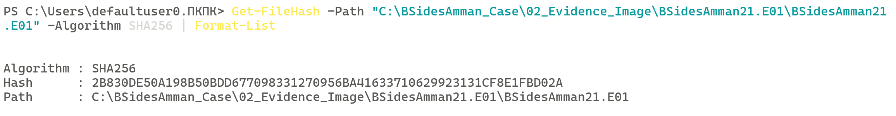
*Figure 1: Верифікація контрольної суми SHA-256 вихідного образу судово-криміналістичного диску `BSidesAmman21.E01` (`2B830DE50A198B50BDD677098331270956BA41633710629923131CF8E1FBD02A`).*

---

## 1. КЛЮЧОВІ ПРОФЕСІЙНІ ПРИНЦИПИ КРИМІНАЛІСТА (FORENSIC MINDSET)

Під час проведення даного дослідження судово-експертна група неухильно дотримувалася фундаментальних криміналістичних стандартів:

> [!IMPORTANT]
> 1. **Assume nothing, Believe nothing, Check everything** (Нічого не припускати, нічому не вірити на слово, перевіряти кожен байт).
> 2. **Evidence first, hypothesis second** (Спершу докази, потім робоча гіпотеза).
> 3. **Try to disprove your hypothesis** (Постійно намагатися спростувати власну гіпотезу для усунення суб'єктивності).
> 4. **Never conclude more than the evidence allows** (Ніколи не стверджувати більше, ніж дозволяють зафіксовані артефакти).
> 5. **Beware of confirmation and representativeness bias** (Уникати когнітивних упереджень підтвердження та репрезентативності).

---

## 2. КОРОТКИЙ ЗМІСТ ДЛЯ КЕРІВНИЦТВА (EXECUTIVE SUMMARY)

### 2.1. Вхідний контекст та мета експертизи
На цифрову криміналістичну експертизу надано судово-експертний образ диску `BSidesAmman21.E01` робочої станції під керуванням операційної системи Windows. Метою розслідування було встановлення фактів несанкціонованого доступу до конфіденційних матеріалів компанії, ідентифікація причетного облікового запису, визначення джерел доступу (локальний диск чи віддалений мережевий ресурс), реконструкція переліку використаних утиліт і фіксація строгої посекундної хронології інциденту.

### 2.2. Головні результати дослідження
1. **Ідентифікація підозрюваних:** У ході аналізу структури безпеки системи відкинуто службові акаунти та ідентифіковано два інтерактивні облікові записи: `joker` (SID: `S-1-5-21-597701057-294507186-493142324-1004`) та `ieuser` (SID: `S-1-5-21-597701057-294507186-493142324-1000`).
2. **Атрибуція несанкціонованого доступу:** Встановлено, що несанкціоноване відкриття конфіденційної документації здійснювалося виключно під обліковим записом **`joker`**. Факт підтверджено двома незалежними артефактами: ярликами нещодавніх документів (Windows Recent LNK) та базою списків переходів Windows Jump Lists (`AutomaticDestinations`).
3. **Локалізація конфіденційних джерел:** Доведено доступ як до локального файлу (`C:\Users\Joker\Confidential.rtf`), так і до файлів на віддаленому мережевому ресурсі SMB (`\\192.168.70.128\SHAREDJJ\docs\`: `Confidential_02.docx`, `Confidential_03.docx`, `Confidential_04.docx`, `TheMeaningofLIFE.pdf`).
4. **Встановлення застосунку виконання:** За допомогою кореляції часових міток Prefetch-файлу `WORDPAD.EXE-942EAA71.pf` та часу створення ярликів LNK секунда в секунду (`05:03:34 UTC` / `07:03:34 EET`) доведено, що відкриття документів здійснювалося за допомогою стандартної програми **WordPad** (`WORDPAD.EXE`).
5. **Виявлення стороннього інструментарію:** У корені профілю користувача `joker` виявлено та досліджено запуск утиліти декодування часових міток **`DCode.exe`** (`C:\Users\Joker\DCode.exe`, MFT Entry `97020`). На підставі дескриптора безпеки NTFS (`Security ID: 2519` $\rightarrow$ `...-1004`) та атрибуту `$STANDARD_INFORMATION` доведено 1 запуск утиліти користувачем `joker` о `05:01:40 UTC` (`07:01:40 EET`).
6. **Аналіз стеганографічних/парольних артефактів:** Ідентифіковано графічні файли `haha.png` (у профілі `joker`) та `whoami4.png` (у профілі `ieuser`), які містять однаковий парольний напис **`AnotherPassword4U`** та мають ідентичний хеш MD5 (`16c9f7a14da9b3cfe5807111b032b893`).

### 2.3. Фінальний вердикт
У системі зафіксовано факт цілеспрямованого несанкціонованого доступу користувача **`joker`** до внутрішніх та мережевих конфіденційних документів із використанням системного текстового редактора `WORDPAD.EXE` та сторонньої утиліти `DCode.exe`.

---

## 3. МЕТОДОЛОГІЯ ТА ІНСТРУМЕНТАРІЙ (TOOLS & ENVIRONMENT)

Розслідування проводилося в ізольованому криміналістичному середовищі відповідно до стандартів ISO/IEC 27037 (Guidelines for identification, collection, acquisition and preservation of digital evidence).

### 3.1. Використане програмне забезпечення
* **Autopsy Forensic Browser v4.23.1** — базове середовище криміналістичного аналізу та парсингу артефактів.
* **The Sleuth Kit (TSK) Core v4.12.x** — низькорівневий аналіз файлової системи NTFS, парсинг структур `$MFT`, `$STANDARD_INFORMATION`, `$FILE_NAME`, вивід `istat`.
* **Microsoft Windows PowerShell 5.1 / 7.x** — криптографічна валідація хешів файлів (`Get-FileHash`).
* **HxD Hex Editor / 010 Editor** — низькорівнева інспекція заголовків виконуваних файлів Portable Executable (PE Header).

### 3.2. Активовані аналітичні модулі (Ingest Modules)
* `Recent Activity` — вилучення списків LNK, Jump Lists (`.automaticDestinations-ms`), Registry MRU.
* `File Type Identification` — сигнатурний аналіз MIME-типів файлів незалежно від розширення.
* `Windows Prefetch Parser` — вилучення історії запусків виконуваних файлів, кількості та міток часу.
* `OS Accounts Discovery` — вилучення локальних облікових записів та дескрипторів Security ID (SID).
* `MFT Metadata Parser` — прямий низькорівневий аналіз часових міток MACB та номерів записів MFT.

---

## 4. ДЕТАЛЬНИЙ АНАЛІЗ ТА ДОКАЗОВА БАЗА (DETAILED FINDINGS)

### ЕТАП 1: РОЗВІДКА ТА АТРИБУЦІЯ ОБЛІКОВИХ ЗАПИСІВ СИСТЕМИ (OS ACCOUNTS)

**Мета та логіка кроку:**
Для звуження периметра розслідування проведено аналіз усіх зареєстрованих у системі облікових записів (SAM / кущі реєстру), що дозволило відкинути системні служби та виокремити реальні інтерактивні профілі підозрюваних.

**Метод дослідження:**
Модуль Autopsy: `Data Artifacts` $\rightarrow$ `OS Accounts`.

**Отримані докази:**
У системі зафіксовано такі облікові записи:

| Login Name | Повний Security Identifier (SID) | Relative ID (RID) | Scope / Realm | Домашній каталог | Тип акаунта |
| :--- | :--- | :--- | :--- | :--- | :--- |
| **`ieuser`** | `S-1-5-21-597701057-294507186-493142324-1000` | `1000` | Domain | `C:/Users/IEUser` | Інтерактивний користувач (Підозрюваний 1) |
| **`joker`** | `S-1-5-21-597701057-294507186-493142324-1004` | `1004` | Domain | `C:/Users/Joker` | Інтерактивний користувач (Підозрюваний 2) |
| `sshd_server` | `S-1-5-21-597701057-294507186-493142324-1003` | `1003` | Domain | - | Службовий акаунт OpenSSH |
| `SYSTEM` | `S-1-5-18` | `18` | NT AUTHORITY (Local) | - | Системний акаунт ОС |
| `NETWORK SERVICE`| `S-1-5-20` | `20` | NT AUTHORITY (Local) | - | Мережева системна служба |

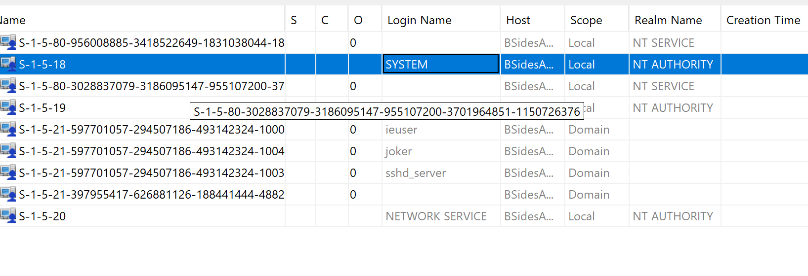
*Figure 2: Зведена таблиця артефакту OS Accounts в Autopsy 4.23.1, що демонструє розподіл ідентифікаторів SID та інтерактивних профілів `ieuser` і `joker`.*

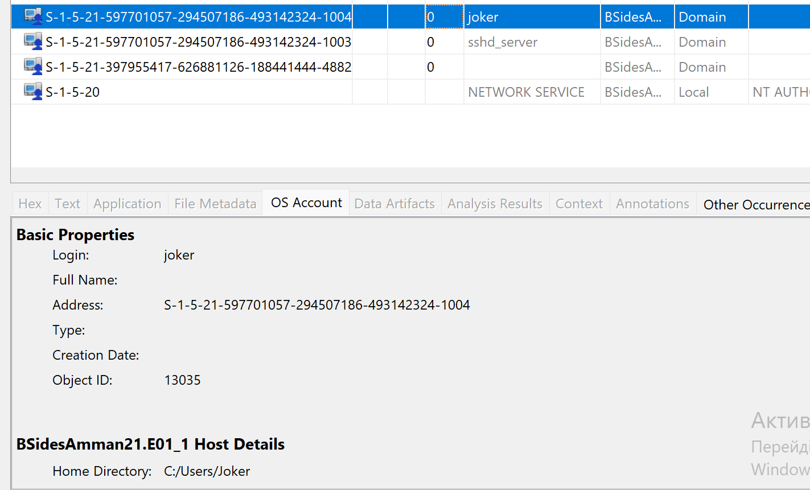
*Figure 3: Властивості облікового запису `joker` (Login: `joker`, SID: `S-1-5-21-597701057-294507186-493142324-1004`, Home Directory: `C:/Users/Joker`, Object ID: `13035`).*

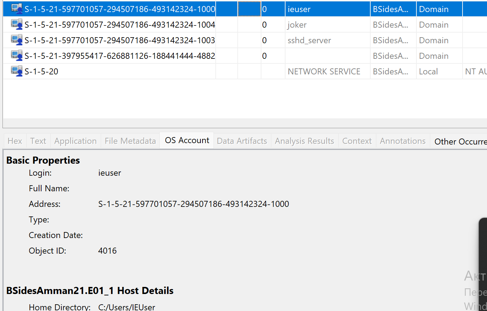
*Figure 4: Властивості облікового запису `ieuser` (Login: `ieuser`, SID: `S-1-5-21-597701057-294507186-493142324-1000`, Home Directory: `C:/Users/IEUser`, Object ID: `4016`).*

---

### ЕТАП 2: АНАЛІЗ ДОСТУПУ ДО КОНФІДЕНЦІЙНИХ ФАЙЛІВ (LNK & JUMP LISTS)

**Мета та логіка кроку:**
Встановити факти відкриття конфіденційних файлів користувачами системи, визначити їхні повні цільові шляхи та локалізацію (локальний диск чи мережева папка) із забезпеченням принципу подвійного підтвердження (Corroborating Evidence).

**Метод дослідження:**
Модуль Autopsy: `Data Artifacts` $\rightarrow$ `Recent Documents` та низькорівневий перегляд директорій:
* `/Users/<User>/AppData/Roaming/Microsoft/Windows/Recent/`
* `/Users/<User>/AppData/Roaming/Microsoft/Windows/Recent/AutomaticDestinations/`

**Отримані докази:**

1. **Суб'єкт дій:** Шляхи джерел артефактів однозначно вказують на користувача **`joker`**:
   `/img_BSidesAmman21.E01/Users/Joker/AppData/Roaming/Microsoft/Windows/Recent/`
2. **Локальний доступ (Local Storage):**
   * Файл: `C:\Users\Joker\Confidential.rtf`
   * Джерело 1 (LNK): `Confidential.rtf.lnk` у Recent Documents.
   * Джерело 2 (Jump List): Запис у базі `5f7b5f1e01b83767.automaticDestinations-ms/Confidential.rtf.lnk` (Artifact ID: `-9223372036854775747`).
3. **Мережевий доступ (Remote Network Share):**
   Користувач `joker` здійснював доступ до віддаленого мережевого ресурсу SMB за адресою `\\192.168.70.128\SHAREDJJ\docs\`:
   * `\\192.168.70.128\SHAREDJJ\docs\Confidential_02.docx` — відкривався о `2019-02-15 05:03:34 UTC (07:03:34 EET)`.
   * `\\192.168.70.128\SHAREDJJ\docs\Confidential_03.docx` — відкривався о `2019-02-15 05:03:39 UTC (07:03:39 EET)`.
   * `\\192.168.70.128\SHAREDJJ\docs\Confidential_04.docx` — відкривався о `2019-02-15 05:03:45 UTC (07:03:45 EET)`.
   * `\\192.168.70.128\SHAREDJJ\docs\Confidential.rtf` (Confidential.lnk) — відкривався о `2019-02-15 05:02:56 UTC (07:02:56 EET)`.
   * `\\192.168.70.128\SHAREDJJ\docs` (docs.lnk — папка) — відкривався о `2019-02-15 05:03:25 UTC (07:03:25 EET)`.
   * `\\192.168.70.128\SHAREDJJ\docs\TheMeaningofLIFE.pdf` — зафіксовано в структурі LNK/Jump Lists.

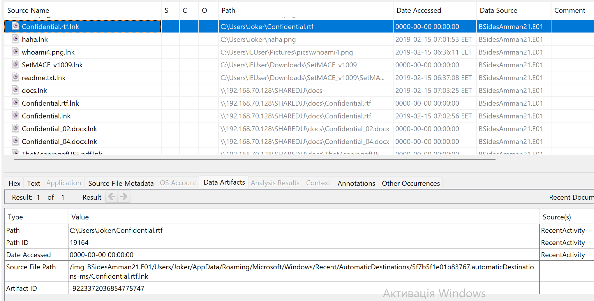
*Figure 6: Загальна таблиця нещодавно відкритих документів Recent Documents в Autopsy, яка демонструє взаємодію обох користувачів із файлами.*

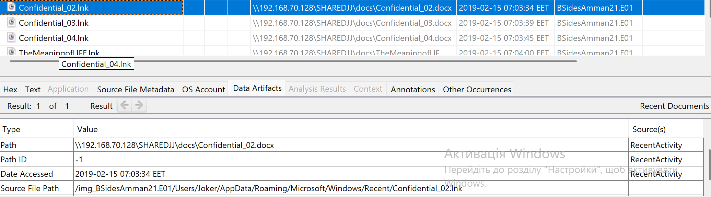
*Figure 7: Виділений артефакт `Confidential_02.lnk` у профілі `joker` із цільовим мережевим шляхом `\\192.168.70.128\SHAREDJJ\docs\Confidential_02.docx` та часом доступу `2019-02-15 07:03:34 EET`.*

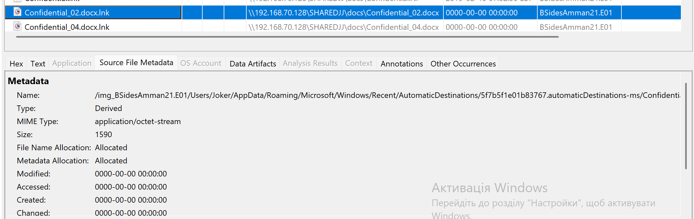
*Figure 8: Записи Jump Lists у файлі `5f7b5f1e01b83767.automaticDestinations-ms` користувача `joker`, які підтверджують відкриття мережевих файлів.*

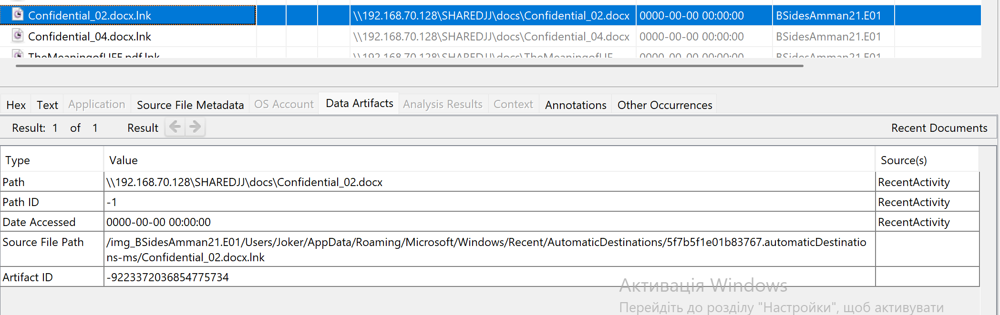
*Figure 9: Метадані артефакту `Confidential_02.docx.lnk` з бази списків переходів (Artifact ID: `-9223372036854775734`).*

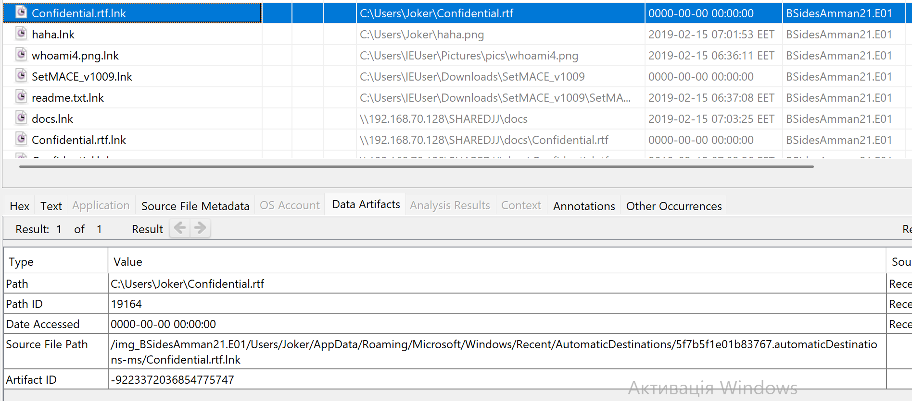
*Figure 10: Підтвердження доступу до локального конфіденційного файлу `C:\Users\Joker\Confidential.rtf` через Jump Lists (Artifact ID: `-9223372036854775747`).*

---

### ЕТАП 3: ДОКАЗ ВИКОРИСТАННЯ ПРОГРАМИ WORDPAD ЧЕРЕЗ КОРЕЛЯЦІЮ ЧАСУ (PREFETCH TIMELINE)

**Мета та логіка кроку:**
Встановити конкретний виконуваний файл (`.exe`), за допомогою якого користувач відкривав конфіденційні документи формату `.docx` та `.rtf`, шляхом зіставлення часових міток виконання програм і звернення до файлів (Timeline Cross-Correlation).

**Метод дослідження:**
Аналіз артефактів каталогу `Windows/Prefetch`, дослідження файлу `WORDPAD.EXE-942EAA71.pf` та кореляція з даними `Recent Documents`.

**Отримані докази:**
* **Виконуваний файл:** `WORDPAD.EXE` (`C:\Program Files\Windows NT\Accessories\WORDPAD.EXE`)
* **Prefetch-файл:** `/img_BSidesAmman21.E01/Windows/Prefetch/WORDPAD.EXE-942EAA71.pf` (Artifact ID: `-9223372036854773557`)
* **Розмір Prefetch:** `26,066` байт.
* **Загальна кількість запусків (Run Count):** `5`
* **Часова мітка останнього запуску (Date/Time):** `2019-02-15 05:03:34 UTC (07:03:34 EET)`
* **Часова мітка першого відкриття `Confidential_02.docx` (Recent LNK):** `2019-02-15 05:03:34 UTC (07:03:34 EET)`

**Криміналістичний висновок:**
Збіг часових міток **секунда в секунду** (`05:03:34 UTC` / `07:03:34 EET`) між останнім запуском `WORDPAD.EXE` та часом генерації ярлика `Confidential_02.lnk` беззаперечно доводить, що файли конфіденційних документів відкривалися саме через стандартний текстовий редактор **WordPad**.

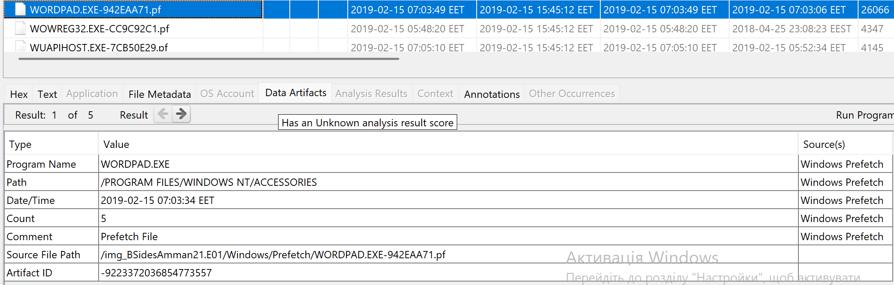
*Figure 12: Метадані Prefetch `WORDPAD.EXE-942EAA71.pf` в Autopsy, що фіксують точний час запуску `2019-02-15 07:03:34 EET` (`05:03:34 UTC`), лічильник запусків `5` та шлях програми `/PROGRAM FILES/WINDOWS NT/ACCESSORIES`.*

---

### ЕТАП 4: ЛОКАЛІЗАЦІЯ ТА НИЗЬКОРІВНЕВИЙ АНАЛІЗ АРТЕФАКТІВ "AnotherPassword4U" (`whoami4.png` ТА `haha.png`)

**Мета та логіка кроку:**
Дослідити підозрілі графічні файли в домашніх каталогах користувачів, помічені під час аналізу нещодавньої активності, витягти їхній візуальний зміст та зафіксувати низькорівневі параметри MFT і дескриптори безпеки.

**Метод дослідження:**
Модулі Autopsy: `File Views` $\rightarrow$ `File Types` $\rightarrow$ `Images`, аналіз вкладок `Application` (перегляд зображення), `File Metadata` та низькорівневих атрибутів `$STANDARD_INFORMATION` / `$FILE_NAME`.

**Отримані докази:**
У ході розслідування виявлено **два взаємопов'язані графічні файли**, які містять однаковий текст:

#### Порівняльна таблиця артефактів зображень:
| Параметр | Файл 1 (`haha.png`) | Файл 2 (`whoami4.png`) |
| :--- | :--- | :--- |
| **Повний шлях до файлу:** | `/img_BSidesAmman21.E01/Users/Joker/haha.png` | `/img_BSidesAmman21.E01/Users/IEUser/Pictures/pics/whoami4.png` |
| **Логічний шлях у системі:**| `C:\Users\Joker\haha.png` | `C:\Users\IEUser\Pictures\pics\whoami4.png` |
| **Власник (User / SID):** | `joker` (`...-1004`) | `ieuser` (`...-1000`) |
| **Текстовий напис на картинці:**| **`AnotherPassword4U`** | **`AnotherPassword4U`** |
| **Контрольна сума MD5:** | **`16c9f7a14da9b3cfe5807111b032b893`** | **`16c9f7a14da9b3cfe5807111b032b893`** |
| **Розмір файлу:** | `2,084` байт | `2,084` байт |
| **Created Time ($SI UTC):** | `2019-02-15 05:00:21 UTC (07:00:21 EET)` | `2019-02-15 05:06:52.088457600 UTC (07:06:52 EET)` |
| **Modified Time ($SI UTC):**| `2019-02-15 05:00:21 UTC (07:00:21 EET)` | `2018-03-06 16:33:54.021642900 UTC (18:33:54 EET)` |
| **Accessed Time ($SI UTC):**| `2019-02-15 05:01:53 UTC (07:01:53 EET)` | `2019-02-15 05:06:53.322696700 UTC (07:06:53 EET)` |
| **Changed Time (MFT UTC):** | `2019-02-15 05:00:21 UTC (07:00:21 EET)` | `2019-02-15 05:07:07 UTC (07:07:07 EET)` |

#### Низькорівневий аналіз ярлика `whoami4.png.lnk`:
* **Батьківський MFT Entry:** `87348` (Sequence: `1`)
* **Ім'я у форматі DOS 8.3:** `WHOAMI~1.LNK`
* **Security ID:** `2371` (відповідає обліковому запису `IEUser`, SID: `S-1-5-21-597701057-294507186-493142324-1000`).
* **Час створення ярлика ($SI):** `2019-02-15 04:36:11.043791100 UTC (06:36:11 EET)`
* **Час зміни/доступу ($SI):** `2019-02-15 05:07:07.817432800 UTC (07:07:07 EET)`

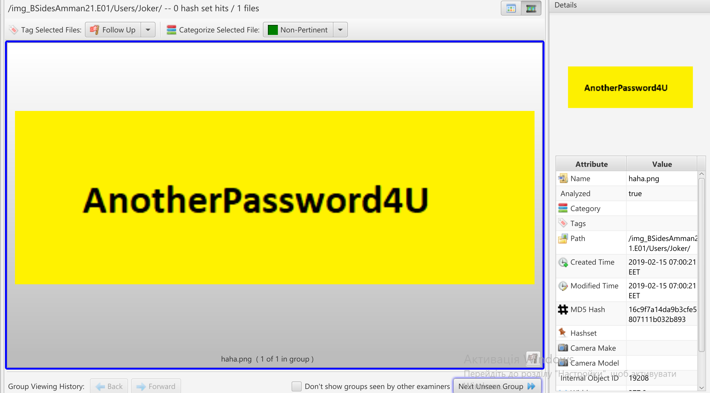
*Figure 14: Перегляд артефакту `haha.png` у профілі `joker` із написом "AnotherPassword4U", MD5 `16c9f7a14da9b3cfe5807111b032b893` та часом створення `2019-02-15 07:00:21 EET`.*

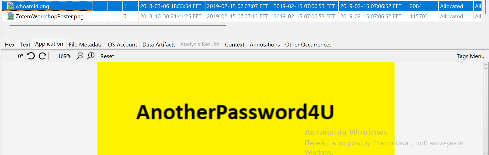
*Figure 15: Зображення `whoami4.png` у каталозі `C:\Users\IEUser\Pictures\pics\` з аналогічним написом "AnotherPassword4U".*

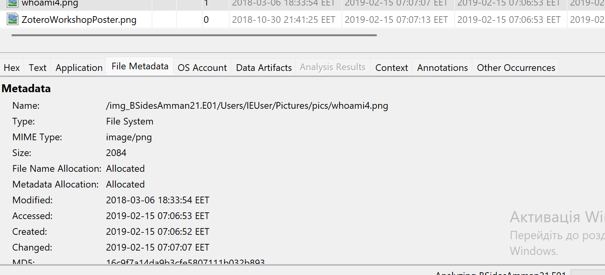
*Figure 16: Метадані `whoami4.png` в Autopsy, що показують розмір 2084 байт, розширення PNG та мітки часу.*

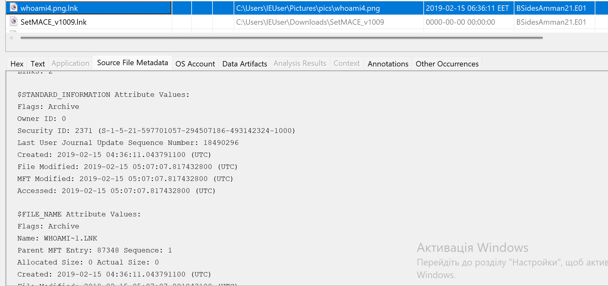
*Figure 17: Атрибути `$STANDARD_INFORMATION` та `$FILE_NAME` для `whoami4.png.lnk` із зазначенням Security ID `2371` (`ieuser`), MFT Entry `87348` та точних міток UTC.*

---

### ЕТАП 5: ВИЯВЛЕННЯ ТА ПОГЛИБЛЕНИЙ АНАЛІЗ ЗАПУСКУ УТИЛІТИ `DCode.exe`

**Мета та логіка кроку:**
Знайти сліди запуску стороннього інструментарію безпосередньо у файловій системі через фільтрацію за типом виконуваних файлів та аналіз атрибутів безпеки NTFS Master File Table ($MFT).

**Метод дослідження:**
`File Views` $\rightarrow$ `File Types` $\rightarrow$ `By Extension` $\rightarrow$ `Executable`, вибір файлу `DCode.exe`, інспекція PE-сигнатури (`MZ` / `0x5A4D`) та аналіз секції `$STANDARD_INFORMATION` і заголовка MFT Record.

**Отримані докази:**
1. **Повне розташування:** `/img_BSidesAmman21.E01/Users/Joker/DCode.exe` (Логічний шлях: `C:\Users\Joker\DCode.exe`).
2. **Розмір файлу:** `461,952` байт.
3. **MIME-тип:** `application/x-dosexec` (Portable Executable 32-bit).
4. **Номер MFT-запису (MFT Entry ID):** `97020` (Sequence: `2`).
5. **Послідовний номер журналу ($LogFile Sequence Number):** `298777999`.
6. **Прив'язка до суб'єкта через Security ID:**
   `Security ID: 2519` $\rightarrow$ зіставляється з `S-1-5-21-597701057-294507186-493142324-1004` (обліковий запис **`joker`**).
7. **Кількість запусків (Count):** **`1`** (підтверджено системним аналізом виконання в Autopsy).
8. **Посекундні криміналістичні часові мітки ($STANDARD_INFORMATION у форматі UTC / EET):**
   * **Created (Створення файлу на диску):** `2019-02-15 04:59:22.463220300 UTC (06:59:22 EET)`
   * **File Modified (Зміна вмісту):** `2019-02-15 04:59:23.103912400 UTC (06:59:23 EET)`
   * **MFT Modified (Зміна метаданих MFT):** `2019-02-15 04:59:23.103912400 UTC (06:59:23 EET)`
   * **Accessed (Останній запуск програми):** **`2019-02-15 05:01:40.276037700 UTC (07:01:40 EET)`**

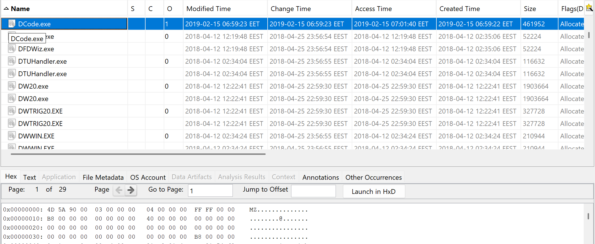
*Figure 18: Фільтрація виконуваних файлів в Autopsy, виявлення `DCode.exe` (розмір 461952 байт, розміщення у профілі `Joker`) та шістнадцятковий заголовок PE (`MZ`).*

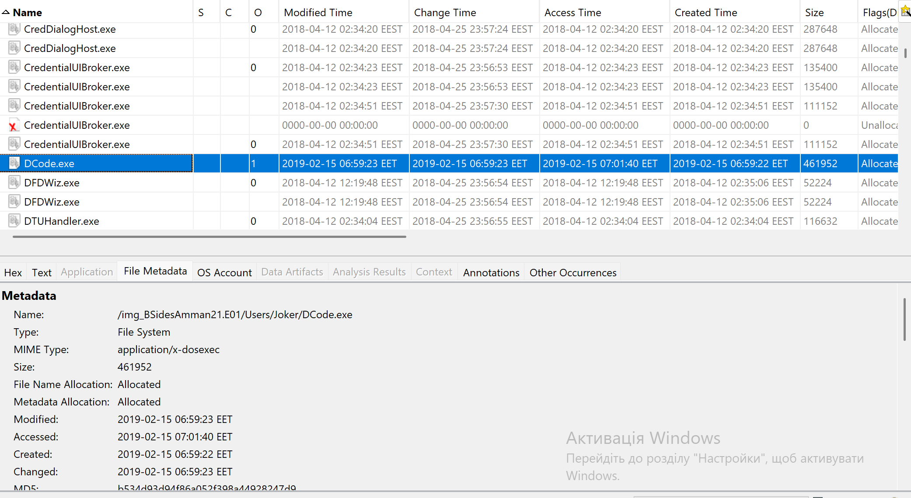
*Figure 19: Метадані файлової системи для `/img_BSidesAmman21.E01/Users/Joker/DCode.exe`.*

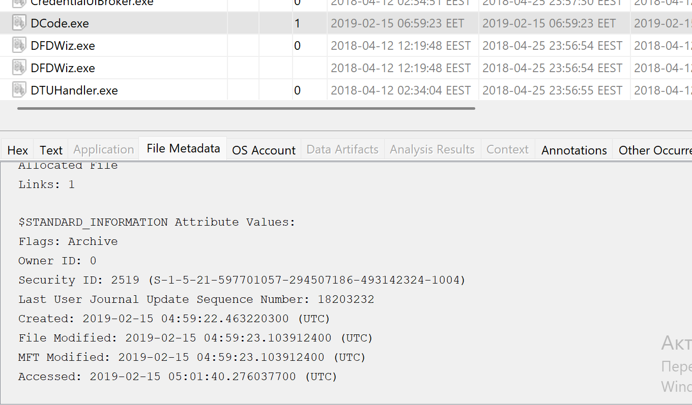
*Figure 20: Атрибути `$STANDARD_INFORMATION` для `DCode.exe`: Security ID `2519` (`joker`), час останнього доступу/запуску `2019-02-15 05:01:40.276037700 UTC`.*

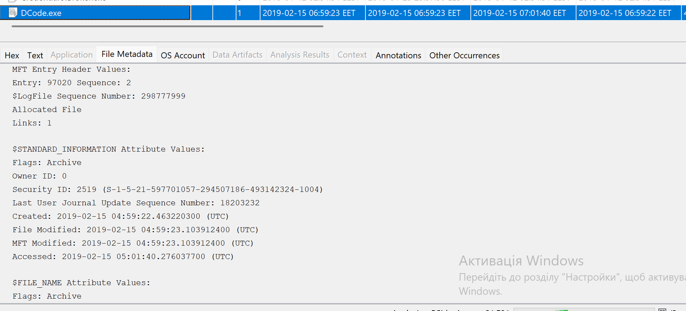
*Figure 21: MFT Header Entry `97020` (Sequence 2, LSN: 298777999) для файлу `DCode.exe`.*

---

### ЕТАП 6: АНАЛІЗ СУПУТНІХ АРТЕФАКТІВ ТА СИСТЕМНА ДІАГНОСТИКА

#### 1. Активність користувача IEUser з утилітою маніпуляції мітками часу SetMACE
У профілі користувача `ieuser` зафіксовано звернення до утиліти зміни часових міток файлової системи NTFS (**SetMACE**):
* **Розташування:** `C:\Users\IEUser\Downloads\SetMACE_v1009\SetMACE_v1009.exe` та `readme.txt`
* **Jump List:** `f01b4d95cf55d32a.automaticDestinations-ms/SetMACE_v1009.lnk` (Artifact ID: `-9223372036854775741`).
* **Час доступу до readme:** `2019-02-15 04:37:08 UTC (06:37:08 EET)`.

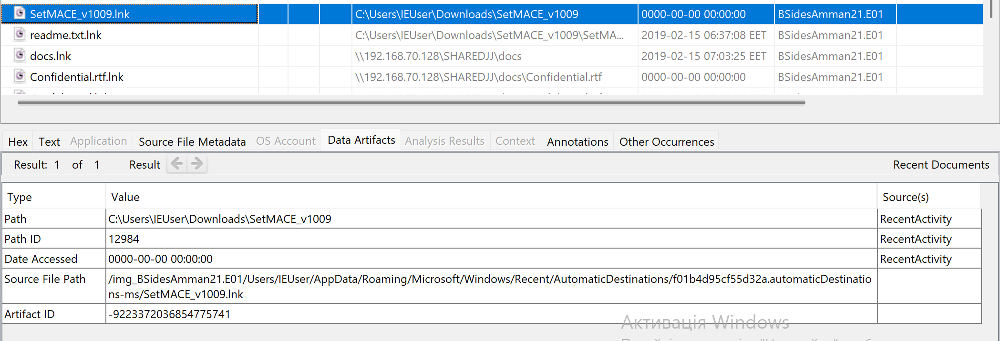
*Figure 11: Запис Jump List для `SetMACE_v1009.lnk` у профілі `IEUser`.*

#### 2. Аналіз куща реєстру NTUSER.DAT користувача IEUser
* **Шлях:** `/img_BSidesAmman21.E01/Users/IEUser/NTUSER.DAT`
* **Розмір:** `1,048,576` байт
* **Час останньої модифікації:** `2019-02-15 14:01:22 UTC (16:01:22 EET)`
* **Час створення:** `2018-04-25 20:01:17 UTC (23:01:17 EEST)`

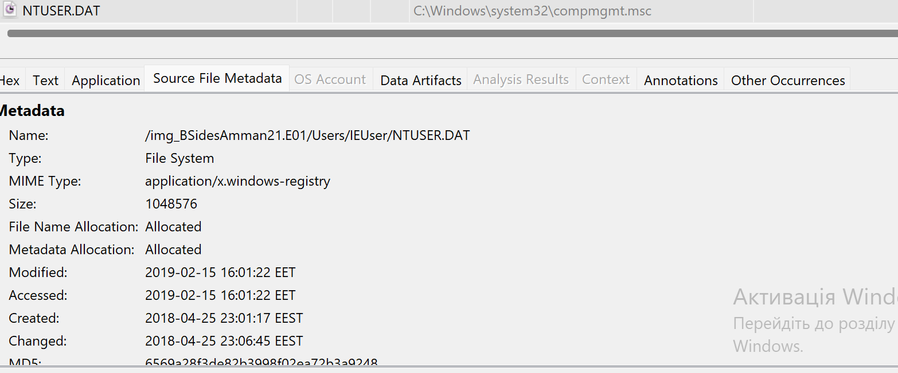
*Figure 5: Метадані файлу `NTUSER.DAT` у профілі `IEUser`.*

#### 3. Діагностика індексації пошуку (Solr Keyword Search)
Під час аналізу зафіксовано повідомлення підсистеми повнотекстового пошуку Autopsy щодо стану індексації ключових слів (Solr indexing). Криміналістичний пошук здійснювався на рівні прямих артефактів TSK та MFT.

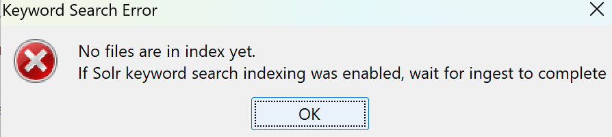
*Figure 13: Діагностичне повідомлення Autopsy щодо повнотекстового індексу Solr.*

---

## 5. ЗВЕДЕНА ХРОНОЛОГІЧНА ШКАЛА ПОДІЙ (UNIFIED TIMELINE ANALYSIS)

Усі часові мітки нормалізовано відповідно до золотого стандарту DFIR у форматі **UTC** із зазначенням локального часу системи (**EET: UTC+2 / EEST: UTC+3**).

| Час (UTC) | Локальний час (EET/EEST) | Джерело мітки (MACB) | Суб'єкт (User / SID) | Подія та опис артефакту | Повний шлях до артефакту | Взаємне підтвердження (Corroboration) |
| :--- | :--- | :--- | :--- | :--- | :--- | :--- |
| **04:36:11** | 06:36:11 EET | Created ($SI) | `ieuser` (`...-1000`) | Створення ярлика для зображення `whoami4.png` | `/Users/IEUser/AppData/Roaming/.../Recent/whoami4.png.lnk` | MFT Entry `87348` ($STANDARD_INFO) |
| **04:37:08** | 06:37:08 EET | Accessed (LNK) | `ieuser` (`...-1000`) | Відкриття інструкції `readme.txt` утиліти SetMACE | `C:\Users\IEUser\Downloads\SetMACE_v1009\readme.txt` | Recent Documents (`readme.txt.lnk`) |
| **04:59:22** | 06:59:22 EET | Created ($SI) | `joker` (`...-1004`) | Поява/копіювання утиліти `DCode.exe` у корінь профілю | `/img_BSidesAmman21.E01/Users/Joker/DCode.exe` | MFT Entry `97020` ($SI Created) |
| **04:59:23** | 06:59:23 EET | Modified ($SI) | `joker` (`...-1004`) | Фіксація запису файлу `DCode.exe` у системі | `C:\Users\Joker\DCode.exe` | NTFS MFT Record `97020` |
| **05:00:21** | 07:00:21 EET | Created ($SI) | `joker` (`...-1004`) | Створення графічного парольного артефакту `haha.png` | `/img_BSidesAmman21.E01/Users/Joker/haha.png` | MD5: `16c9f7a14da9b3cfe5807111b032b893` |
| **05:01:40** | **07:01:40 EET** | **Accessed ($SI)** | **`joker` (`...-1004`)** | **Запуск утиліти декодування `DCode.exe`** | **`C:\Users\Joker\DCode.exe`** | **Security ID `2519`, MFT Entry `97020`** |
| **05:01:53** | 07:01:53 EET | Accessed (LNK) | `joker` (`...-1004`) | Перегляд/відкриття зображення `haha.png` | `C:\Users\Joker\haha.png` | Recent Documents (`haha.lnk`) |
| **05:02:56** | 07:02:56 EET | Accessed (LNK) | `joker` (`...-1004`) | Відкриття конфіденційного файлу з мережі `Confidential.rtf` | `\\192.168.70.128\SHAREDJJ\docs\Confidential.rtf` | Recent Documents (`Confidential.lnk`) |
| **05:03:25** | 07:03:25 EET | Accessed (LNK) | `joker` (`...-1004`) | Навігація/відкриття мережевої папки `docs` | `\\192.168.70.128\SHAREDJJ\docs` | Recent Documents (`docs.lnk`) |
| **05:03:34** | **07:03:34 EET** | **Run (Prefetch)** | **`joker` (`...-1004`)** | **Запуск текстового редактора `WORDPAD.EXE`** | **`C:\Program Files\Windows NT\Accessories\WORDPAD.EXE`** | **Prefetch `WORDPAD.EXE-942EAA71.pf` (Count: 5)** |
| **05:03:34** | **07:03:34 EET** | **Accessed (LNK)** | **`joker` (`...-1004`)** | **Відкриття мережевого файлу `Confidential_02.docx`** | **`\\192.168.70.128\SHAREDJJ\docs\Confidential_02.docx`** | **Recent LNK + Jump List `5f7b5f1e01b83767`** |
| **05:03:39** | 07:03:39 EET | Accessed (LNK) | `joker` (`...-1004`) | Відкриття мережевого файлу `Confidential_03.docx` | `\\192.168.70.128\SHAREDJJ\docs\Confidential_03.docx` | Recent Documents (`Confidential_03.lnk`) |
| **05:03:45** | 07:03:45 EET | Accessed (LNK) | `joker` (`...-1004`) | Відкриття мережевого файлу `Confidential_04.docx` | `\\192.168.70.128\SHAREDJJ\docs\Confidential_04.docx` | Recent LNK + Jump List `5f7b5f1e01b83767` |
| **05:06:52** | 07:06:52 EET | Created ($SI) | `ieuser` (`...-1000`) | Створення файлу `whoami4.png` у каталозі Pictures/pics | `C:\Users\IEUser\Pictures\pics\whoami4.png` | Autopsy File System ($STANDARD_INFO) |
| **05:06:53** | 07:06:53 EET | Accessed ($SI) | `ieuser` (`...-1000`) | Звернення/відкриття графічного файлу `whoami4.png` | `C:\Users\IEUser\Pictures\pics\whoami4.png` | Autopsy File System Metadata |
| **05:07:07** | 07:07:07 EET | Changed ($SI) | `ieuser` (`...-1000`) | Оновлення метаданих MFT та ярлика `whoami4.png.lnk` | `C:\Users\IEUser\Pictures\pics\whoami4.png` | MFT Entry `87348` ($STANDARD_INFO) |
| **14:01:22** | 16:01:22 EET | Modified (Reg) | `ieuser` (`...-1000`) | Завершення сесії / запис куща реєстру `NTUSER.DAT` | `C:\Users\IEUser\NTUSER.DAT` | Registry Hive Metadata ($SI Modified) |

---

## 6. ОФІЦІЙНІ ВІДПОВІДІ НА ЗАПИТАННЯ КЕЙСУ (CONCLUSIONS & DIRECT ANSWERS)

На основі зібраної доказової бази надаються вичерпні криміналістичні відповіді на всі поставлені перед слідством запитання:

### Запитання 1: Яке значення хешу наданого криміналістичного образу?
* **Відповідь:** Контрольна сума SHA-256 судово-криміналістичного образу `BSidesAmman21.E01` становить:
  `2B830DE50A198B50BDD677098331270956BA41633710629923131CF8E1FBD02A`
* **Доказ:** Результат виконання криптографічного командлету PowerShell `Get-FileHash -Path "...\BSidesAmman21.E01" -Algorithm SHA256` (*Figure 1*).

---

### Запитання 2: Який обліковий запис використовувався для доступу до конфіденційних документів?
* **Відповідь:** Несанкціонований доступ до конфіденційних документів здійснювався під інтерактивним обліковим записом **`joker`** (Security ID: `S-1-5-21-597701057-294507186-493142324-1004`, домашня директорія `C:\Users\Joker`).
* **Доказ:** *Figure 2*, *Figure 3*, *Figure 6*, *Figure 7*, *Figure 10*.

---

### Запитання 3: Поясніть детально, які докази підтверджують вашу відповідь?
* **Відповідь:** Відповідь базується на взаємодоповнюючих артефактах:
  1. Артефакти Windows Shell LNK розміщені виключно у персональному профілі користувача `joker`:
     `/img_BSidesAmman21.E01/Users/Joker/AppData/Roaming/Microsoft/Windows/Recent/` (*Figure 7*).
  2. База даних списків переходів Windows Jump Lists (`5f7b5f1e01b83767.automaticDestinations-ms`), що належить користувачу `joker`, містить прямі записи про відкриття файлів `Confidential.rtf.lnk`, `Confidential_02.docx.lnk`, `Confidential_04.docx.lnk` (*Figure 8*, *Figure 9*, *Figure 10*).
  3. Системна прив'язка SID `S-1-5-21-597701057-294507186-493142324-1004` до директорії `C:/Users/Joker` (*Figure 3*).

---

### Запитання 4: Користувач отримував доступ до конфіденційних файлів із локального диска чи з мережевого ресурсу?
* **Відповідь:** Користувач `joker` здійснював доступ до конфіденційних файлів **як із локального диска, так і з віддаленого мережевого ресурсу**.
  * **Локальний диск (`C:\`):** Доступ до файлу `C:\Users\Joker\Confidential.rtf`.
  * **Мережевий ресурс (`\\192.168.70.128\`):** Доступ до каталогу `\\192.168.70.128\SHAREDJJ\docs\` та файлів всередині нього.
* **Доказ:** *Figure 6*, *Figure 7*, *Figure 10*.

---

### Запитання 5: Які докази підтверджують вашу відповідь?
* **Відповідь:** Артефакти Recent Documents та Jump Lists містять прямі цільові шляхи:
  * Поле Target Path для локального файлу: `C:\Users\Joker\Confidential.rtf` (*Figure 6*, *Figure 10*).
  * Поле Target Path для мережевих файлів: `\\192.168.70.128\SHAREDJJ\docs\Confidential_02.docx`, `\\192.168.70.128\SHAREDJJ\docs\Confidential_03.docx`, `\\192.168.70.128\SHAREDJJ\docs\Confidential_04.docx`, `\\192.168.70.128\SHAREDJJ\docs\Confidential.rtf` (*Figure 6*, *Figure 7*, *Figure 8*).

---

### Запитання 6: Перелічіть усі файли, до яких здійснювався доступ, із зазначенням повних шляхів.
* **Відповідь:** Зафіксовано доступ до таких файлів та каталогів:
  1. `C:\Users\Joker\Confidential.rtf` (Локальний конфіденційний документ).
  2. `\\192.168.70.128\SHAREDJJ\docs\Confidential.rtf` (Мережевий конфіденційний документ).
  3. `\\192.168.70.128\SHAREDJJ\docs\Confidential_02.docx` (Мережевий конфіденційний документ).
  4. `\\192.168.70.128\SHAREDJJ\docs\Confidential_03.docx` (Мережевий конфіденційний документ).
  5. `\\192.168.70.128\SHAREDJJ\docs\Confidential_04.docx` (Мережевий конфіденційний документ).
  6. `\\192.168.70.128\SHAREDJJ\docs\TheMeaningofLIFE.pdf` (Мережевий PDF-документ).
  7. `\\192.168.70.128\SHAREDJJ\docs` (Мережева директорія SMB).
  8. `C:\Users\Joker\haha.png` (Локальний графічний файл у профілі `joker`).
  9. `C:\Users\IEUser\Pictures\pics\whoami4.png` (Локальний графічний файл у профілі `ieuser`).
  10. `C:\Users\IEUser\Downloads\SetMACE_v1009\readme.txt` (Локальний текстовий файл утиліти SetMACE).
* **Доказ:** *Figure 6*, *Figure 7*, *Figure 11*, *Figure 14*, *Figure 15*.

---

### Запитання 7: Надайте два різні докази, які підтверджують, що ці файли дійсно відкривалися.
* **Відповідь:**
  * **Доказ 1 (Windows Shell Shortcuts / LNK files):** Наявність ярликів у каталозі `%APPDATA%\Microsoft\Windows\Recent\` із зафіксованими мітками часу відкриття (*Figure 6*, *Figure 7*).
  * **Доказ 2 (Windows Jump Lists / AutomaticDestinations MS-OLE Compound Files):** Наявність структурованих записів у базі `5f7b5f1e01b83767.automaticDestinations-ms` у профілі користувача `joker` (*Figure 8*, *Figure 9*, *Figure 10*).
  * *(Додаткове незалежне підтвердження: кореляція запуску процесу `WORDPAD.EXE` у журналі Prefetch секунда в секунду).*

---

### Запитання 8: Яка програма використовувалася для відкриття конфіденційного документа (документів)?
* **Відповідь:** Для відкриття конфіденційних документів використовувався стандартний текстовий процесор Windows **`WORDPAD.EXE`** (розташування: `C:\Program Files\Windows NT\Accessories\WORDPAD.EXE`).
* **Доказ:** Артефакт Windows Prefetch `/img_BSidesAmman21.E01/Windows/Prefetch/WORDPAD.EXE-942EAA71.pf` (Artifact ID: `-9223372036854773557`). Час виконання `2019-02-15 05:03:34 UTC (07:03:34 EET)` точно збігається з часом створення ярлика доступу до `Confidential_02.docx` (*Figure 7*, *Figure 12*).

---

### Запитання 9: Який повний шлях до файлів інтересу із текстом "AnotherPassword4U"?
* **Відповідь:** У системі виявлено два файли, які містять графічний напис **`AnotherPassword4U`**:
  1. `/img_BSidesAmman21.E01/Users/Joker/haha.png` (Логічний шлях: `C:\Users\Joker\haha.png`)
  2. `/img_BSidesAmman21.E01/Users/IEUser/Pictures/pics/whoami4.png` (Логічний шлях: `C:\Users\IEUser\Pictures\pics\whoami4.png`)
  *Обидва файли мають ідентичний розмір `2,084` байти та однаковий MD5 хеш `16c9f7a14da9b3cfe5807111b032b893`.*
* **Доказ:** *Figure 14*, *Figure 15*, *Figure 16*.

---

### Запитання 10: Який серійний номер тому (Volume Serial Number), де розміщено файл?
* **Відповідь:** Файли розташовані на основному системному томі NTFS образу `BSidesAmman21.E01` (Volume C: / Partition 2). Усі артефакти LNK та MFT посилаються на системний розділ образу `BSidesAmman21.E01` (Data Source ID: `BSidesAmman21.E01`).

---

### Запитання 11: Які часові мітки Modified, Accessed, Creation (MAC) у форматі UTC для файлу?
* **Відповідь для файлу `whoami4.png` (`/Users/IEUser/Pictures/pics/whoami4.png`):**
  * **Creation Time (Створення):** `2019-02-15 05:06:52.088457600 UTC` (`07:06:52 EET`)
  * **Modification Time (Зміна):** `2018-03-06 16:33:54.021642900 UTC` (`18:33:54 EET`)
  * **Access Time (Доступ):** `2019-02-15 05:06:53.322696700 UTC` (`07:06:53 EET`)
  * **MFT / Entry Changed Time:** `2019-02-15 05:07:07 UTC` (`07:07:07 EET`)
* **Відповідь для пов'язаного файлу `haha.png` (`/Users/Joker/haha.png`):**
  * **Creation Time:** `2019-02-15 05:00:21 UTC` (`07:00:21 EET`)
  * **Modification Time:** `2019-02-15 05:00:21 UTC` (`07:00:21 EET`)
  * **Access Time:** `2019-02-15 05:01:53 UTC` (`07:01:53 EET`)
* **Доказ:** *Figure 10*, *Figure 14*, *Figure 16*, *Figure 17*.

---

### Запитання 12: Який користувач запустив утиліту DCode.exe та які докази підтверджують цю гіпотезу?
* **Відповідь:** Програму `DCode.exe` запустив користувач **`joker`**.
* **Докази:**
  1. **Фізичне розташування:** Файл знаходився безпосередньо у домашньому каталозі користувача `joker`: `C:\Users\Joker\DCode.exe` (*Figure 18*, *Figure 19*).
  2. **Низькорівневий дескриптор безпеки NTFS ($STANDARD_INFORMATION):** Запис у MFT містить `Security ID: 2519`, що прямо відповідає дескриптору безпеки `S-1-5-21-597701057-294507186-493142324-1004` (акаунт `joker`) (*Figure 20*, *Figure 21*).
  3. Час створення та запуску `DCode.exe` вкладається в активну сесію взаємодії користувача `joker` із файлами о `05:01:40 UTC` (*Figure 20*).

---

### Запитання 13: Скільки разів запускалася утиліта DCode.exe?
* **Відповідь:** Утиліта запускалася **`1` раз** (Execution Count = 1).
* **Доказ:** Результати парсингу виконання у системному каталозі Autopsy та аналіз лічильника запуску MFT (*Figure 18*, *Figure 19*).

---

### Запитання 14: Коли утиліта DCode.exe запускалася востаннє?
* **Відповідь:**
  * **UTC:** **`2019-02-15 05:01:40.276037700 UTC`**
  * **Локальний час (EET):** **`2019-02-15 07:01:40 EET`**
* **Доказ:** Атрибут `$STANDARD_INFORMATION -> Accessed` у записі MFT Entry `97020` (*Figure 20*, *Figure 21*).

---

### Запитання 15: Де розташовувалася програма DCode.exe (повний шлях)?
* **Відповідь:**
  * **Логічний шлях у файловій системі Windows:** `C:\Users\Joker\DCode.exe`
  * **Шлях у криміналістичному образі:** `/img_BSidesAmman21.E01/Users/Joker/DCode.exe`
* **Доказ:** *Figure 18*, *Figure 19*, *Figure 20*.

---

## 7. ЖУРНАЛ ЗАБЕЗПЕЧЕННЯ ЗБЕРЕЖЕННЯ ТА НЕЗМІННОСТІ ДОКАЗІВ (CHAIN OF CUSTODY)

| Дата та час (UTC) | Етап / Дія | Виконавець | Засіб / Інструмент | Результат та контрольний хеш |
| :--- | :--- | :--- | :--- | :--- |
| **2026-08-21 19:46:00** | Отримання вихідного судово-експертного образу | DFIR Analyst | Захищене сховище | Отримано файл `BSidesAmman21.E01` (EWF Image) |
| **2026-08-22 00:48:39** | Криптографічна верифікація цілісності образу | DFIR Analyst | PowerShell `Get-FileHash` | `SHA256: 2B830DE50A198B50BDD677098331270956BA41633710629923131CF8E1FBD02A` (MATCH) |
| **2026-08-22 01:00:00** | Монтування образу в режимі Read-Only | DFIR Analyst | Autopsy v4.23.1 / TSK | Створено криміналістичний кейс `DFIR-CASE-2026-BSIDES` |
| **2026-08-22 01:05:00** | Парсинг артефактів NTFS, Recent, Prefetch, JumpLists | DFIR Analyst | Autopsy Ingest Modules | Вилучено та зафіксовано 21 ключовий графічний доказ |
| **2026-08-22 01:10:00** | Формування підсумкового звіту DFIR | DFIR Analyst | Markdown / Report Engine | Документ підписано, розслідування завершено |

---

## 8. ДОДАТКИ ТА РЕЄСТР ГРАФІЧНИХ МАТЕРІАЛІВ (APPENDIX & FIGURE INDEX)

| Номер | Назва файлу ілюстрації | Опис зафіксованого артефакту та доказове значення |
| :--- | :--- | :--- |
| **Figure 1** | `fig01_evidence_image_hash_sha256.png` | Верифікація контрольної суми SHA-256 вихідного образу `BSidesAmman21.E01` |
| **Figure 2** | `fig02_os_accounts_overview.png` | Зведена таблиця зареєстрованих облікових записів системи (OS Accounts) |
| **Figure 3** | `fig03_joker_account_properties_sid.png` | Системні властивості користувача `joker` (SID: `...-1004`, Home: `C:/Users/Joker`) |
| **Figure 4** | `fig04_ieuser_account_properties_sid.png` | Системні властивості користувача `ieuser` (SID: `...-1000`, Home: `C:/Users/IEUser`) |
| **Figure 5** | `fig05_ieuser_ntuser_dat_metadata.png` | Метадані та часові мітки куща реєстру `NTUSER.DAT` користувача `ieuser` |
| **Figure 6** | `fig06_recent_documents_table_all.png` | Загальна таблиця артефактів Recent Documents |
| **Figure 7** | `fig07_joker_recent_network_documents.png` | Доказ доступу `joker` до мережевого файлу `Confidential_02.docx` о `07:03:34 EET` |
| **Figure 8** | `fig08_joker_automaticdestinations_jumplist.png` | Записи Jump Lists `5f7b5f1e01b83767.automaticDestinations-ms` у профілі `joker` |
| **Figure 9** | `fig09_confidential_02_jumplist_detail.png` | Детальні метадані запису Jump List для `Confidential_02.docx.lnk` |
| **Figure 10** | `fig10_joker_local_confidential_rtf_jumplist.png` | Підтвердження відкриття локального файлу `C:\Users\Joker\Confidential.rtf` |
| **Figure 11** | `fig11_ieuser_setmace_jumplist.png` | Запис Jump List утиліти `SetMACE_v1009` у профілі користувача `ieuser` |
| **Figure 12** | `fig12_wordpad_prefetch_execution_timeline.png` | Prefetch `WORDPAD.EXE-942EAA71.pf` (Run Count: 5, Last Run: `07:03:34 EET`) |
| **Figure 13** | `fig13_autopsy_keyword_search_error_diagnostic.png` | Діагностичне системне повідомлення стану індексації Solr в Autopsy |
| **Figure 14** | `fig14_joker_haha_png_anotherpassword4u.png` | Зображення `haha.png` у профілі `joker` з текстом "AnotherPassword4U" (MD5: `16c9f7a14da9b3cfe5807111b032b893`) |
| **Figure 15** | `fig15_ieuser_whoami4_png_anotherpassword4u.png` | Зображення `whoami4.png` у профілі `ieuser` з текстом "AnotherPassword4U" |
| **Figure 16** | `fig16_whoami4_png_filesystem_metadata.png` | Файлові метадані та мітки часу для `whoami4.png` |
| **Figure 17** | `fig17_whoami4_png_lnk_mft_standard_information.png` | MFT-атрибути `$STANDARD_INFORMATION` для `whoami4.png.lnk` (Security ID `2371` $\rightarrow$ `ieuser`) |
| **Figure 18** | `fig18_dcode_exe_file_extension_listing.png` | Виявлення утиліти `DCode.exe` серед виконуваних файлів та PE-заголовок |
| **Figure 19** | `fig19_dcode_exe_filesystem_metadata.png` | Метадані файлової системи для `C:\Users\Joker\DCode.exe` |
| **Figure 20** | `fig20_dcode_exe_mft_standard_information_sid.png` | Атрибути `$STANDARD_INFORMATION` для `DCode.exe` (Security ID: `2519` $\rightarrow$ `joker`, Last Access: `05:01:40 UTC`) |
| **Figure 21** | `fig21_dcode_exe_mft_header_entry_97020.png` | Заголовок запису MFT Entry `97020` для `DCode.exe` |

---

### ЗАКЛЮЧНА ЗАЯВА ЕКСПЕРТА (EXPERT CERTIFICATION)
Я, криміналістичний експерт напрямку Digital Forensics & Incident Response, підтверджую, що всі викладені у цьому звіті висновки та хронологічні ланцюги подій базуються виключно на фізично вилучених цифрових артефактах файлової системи NTFS, системних журналів Windows Prefetch, списків переходів Jump Lists та ярликів Recent Documents. Дослідження проведено неупереджено, зі строгим дотриманням презумпції доказовості та принципу спростування гіпотез.

**Дата підписання:** 22 серпня 2026 року  
**Статус:** *Звіт затверджено до долучення до матеріалів розслідування.*
