# Звіт з проходження CTF: DeathNote 1

**Цільова машина:** DeathNote 1 ([VulnHub](https://www.vulnhub.com/entry/deathnote-1,739/))  
**Мета:** Провести повний комплекс дій з проведення пентесту (Network Discovery, Port Scanning, Web Enumeration, SSH Brute-Force, Privilege Escalation) та отримати права суперкористувача `root` з прочитанням прапорів `user.txt` і `root.txt`.

---

## 1. Мережева розвідка та сканування портів

На першому етапі необхідно визначити IP-адресу цільової віртуальної машини у локальній мережі. Для цього виконую сканування ARP-запитами за допомогою інструменту `netdiscover`:

```bash
sudo netdiscover -r 192.168.1.0/24
```

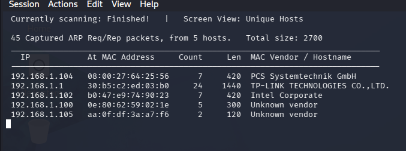

В результаті сканування виявлено пристрій з IP-адресою `192.168.1.104` (MAC-адреса вказує на віртуальне середовище VirtualBox).

Після виявлення IP-адреси цілі виконую сканування портів та аналіз працюючих сервісів за допомогою `nmap`:

```bash
sudo nmap -sC -sV -oN nmap_initial.txt 192.168.1.104
```

* **Параметр `-sC`** — використання стандартних скриптів Nmap (NSE) для визначення баз даних та додаткової інформації.
* **Параметр `-sV`** — визначення версій працюючих сервісів.
* **Параметр `-oN`** — збереження результатів у файл.

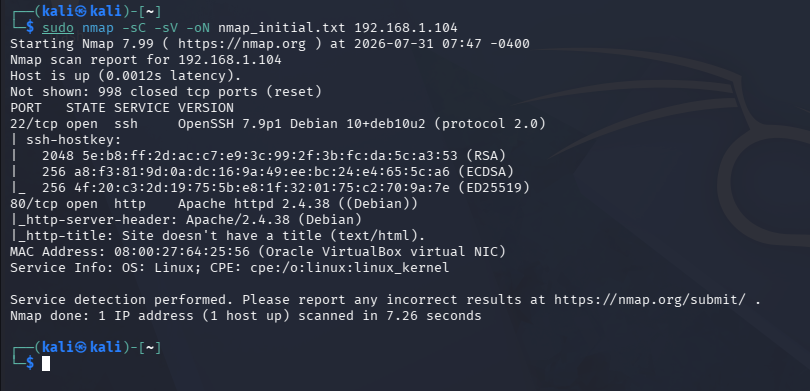

**Результати сканування портів:**
* **Порт 22/tcp** — `OpenSSH 7.9p1 Debian 10+deb10u2`
* **Порт 80/tcp** — `Apache httpd 2.4.38 (Debian)`

Прямий брутфорс SSH-пароля без знання логіна недоцільний, тому переходжу до дослідження вебсервісу на порту 80.

---

## 2. Веб-розвідка та налаштування локального DNS

Під час спроби відкрити вебсайт у браузері за адресою `http://192.168.1.104/wordpress` або `http://deathnote.vuln/wordpress` Burp Suite видає помилку `Unknown host: deathnote.vuln`:

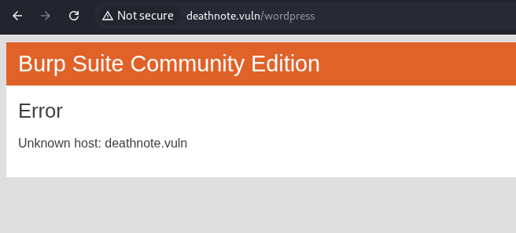

Це означає, що вебзастосунок налаштований на використання доменного імені `deathnote.vuln`, яке не резолвиться у нашій локальній мережі. Для вирішення цієї проблеми додаю відповідний запис до файлу `/etc/hosts`:

```bash
sudo nano /etc/hosts
```

Додаю рядок: `192.168.1.104 deathnote.vuln`

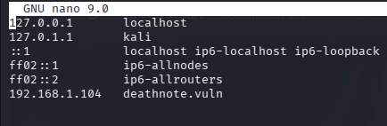

Після оновлення файлу конфігурації повторно переходжу в браузері на `http://deathnote.vuln/wordpress/`:

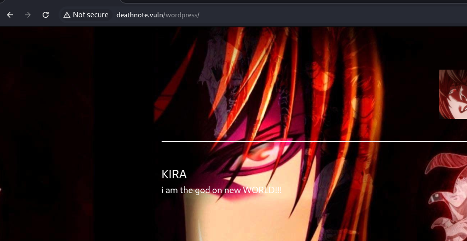

Сайт успішно завантажився та відображає тематику аніме "Death Note" із заголовком **KIRA**.

Аналізую HTML-код сторінки (F12) та структура завантажених медіафайлів:

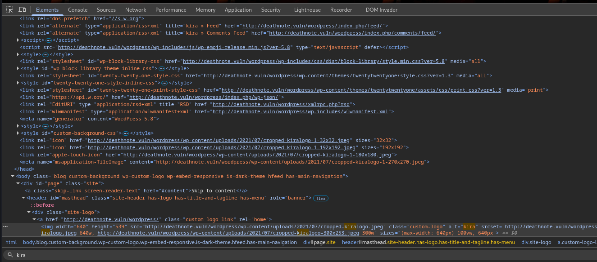

У коді видно шляхи до завантажених файлів у директорії `/wordpress/wp-content/uploads/2021/07/`.

---

## 3. Пошук прихованих файлів та збір облікових даних

Перевіряю файл `robots.txt` за адресою `http://deathnote.vuln/robots.txt`:

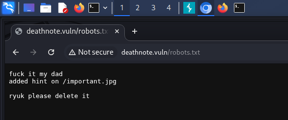

Зміст `robots.txt`:
```text
fuck it my dad
added hint on /important.jpg

ryuk please delete it
```

Отримуємо підказку перевірити файл `important.jpg`. Завантажую та переглядаю його вміст за допомогою `curl`:

```bash
curl http://deathnote.vuln/important.jpg
```

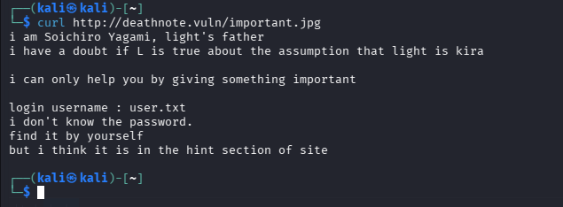

Вихідні дані `important.jpg`:
```text
i am Soichiro Yagami, light's father
i have a doubt if L is true about the assumption that light is kira

i can only help you by giving something important

login username : user.txt
i don't know the password.
find it by yourself
but i think it is in the hint section of site
```

З повідомлення випливає, що список користувачів знаходиться у файлі `user.txt`, а паролі — у розділі підказок сайту.

Переходжу до індексованого списку файлів у `/wordpress/wp-content/uploads/2021/07/`:

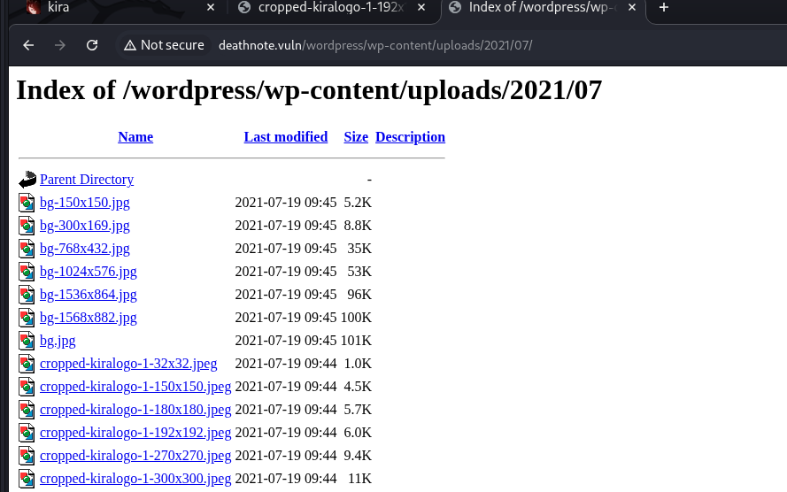

У цьому каталозі виявляю два текстові файли: `user.txt` та `notes.txt`.

Переглядаю вміст `user.txt`:

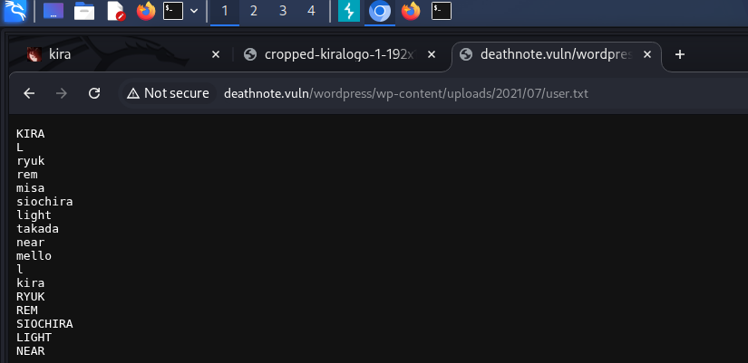

Файл містить список потенційних логінів (`kira`, `L`, `ryuk`, `rem`, `misa`, `soichiro`, `light`, `near`, `mello` тощо). Зберігаю їх у файл `dn_user.txt`.

Переглядаю вміст `notes.txt`:

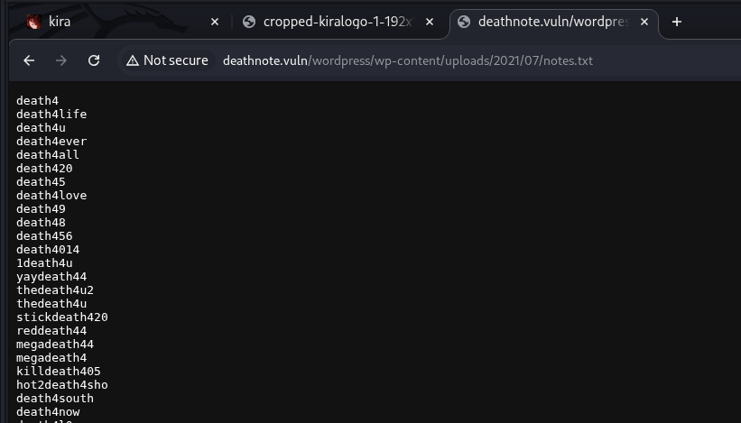

Файл містить список слів-паролів (`death4`, `death4life`, `death4u`, `death4ever`, `death4me` тощо). Зберігаю їх у файл `dn_notes.txt`.

---

## 4. Підбір паролів до SSH та первинний доступ

Маючи сформовані словники користувачів та паролів, запускаю підбір паролів для SSH-сервісу за допомогою `hydra`:

```bash
hydra -L dn_user.txt -P dn_notes.txt 192.168.1.104 ssh
```

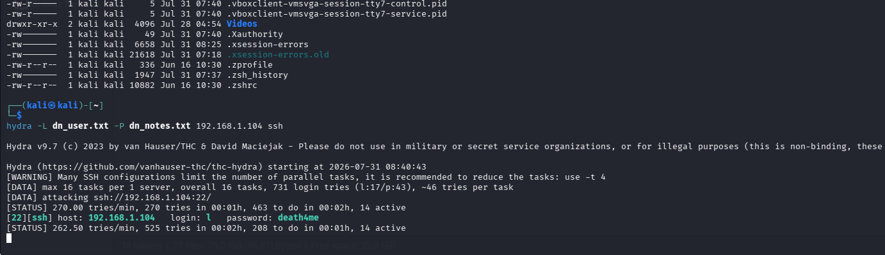

`Hydra` успішно знайшла дійсні облікові дані для SSH:
* **Користувач:** `l`
* **Пароль:** `death4me`

Підключаюся до сервера через SSH під ім'ям `l`:

```bash
ssh l@192.168.1.104
```

Після успішного входу перевіряю вміст домашньої директорії (`ls -la`):

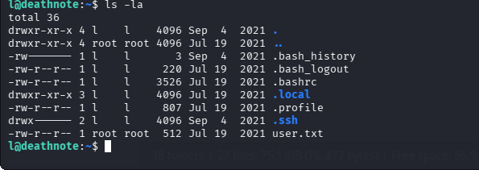

У домашньому каталозі користувача `l` є файл `user.txt`. Переглядаю його вміст:

```bash
cat user.txt
```

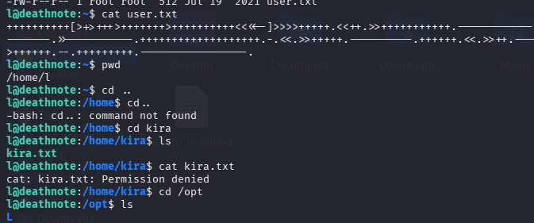

Вміст `user.txt` являє собою закодований рядок у мові розшифровки **Brainfuck**.

---

## 5. Підвищення привілеїв (Privilege Escalation)

### Крок 5.1. Розшифрування першого прапора (Brainfuck)

Для декодування коду Brainfuck використовую онлайн-інтерпретатор **dCode**:

Отриманий розшифрований текст: `i think u got the shell , but you wont be able to ...`

### Крок 5.2. Дослідження системи та пошук ключів до користувача `kira`

У системі також існує користувач `kira`. При спробі прочитати `/home/kira/kira.txt` отримую відмову в доступі (`Permission denied`).

Перевіряю каталог `/opt`:
```bash
cd /opt/L/kira-case/
cat case-file.txt
```

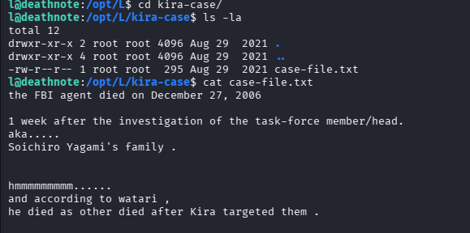

Далі перевіряю сусідню директорію `/opt/L/fake-notebook-rule/`:
```bash
cat case.wav
```

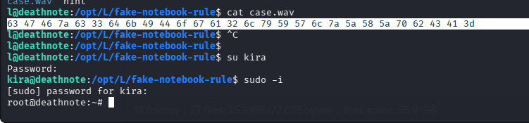

Вміст файлу `case.wav` являє собою рядок Hex-байт:
`63 47 46 7a 63 33 64 6b 49 44 6f 67 61 32 6c 79 59 57 6c 7a 5a 58 5a 70 62 43 41 3d`

Декодую Hex у Base64-рядок:
`cGFzc3dkIDogYT2lyYWlZXZpbCA=` -> після розшифровки отримуємо пароль для користувача `kira`: `kiraIsEvil`.

### Крок 5.3. Перехід на користувача `kira` та отримання Root

Переходжу на обліковий запис `kira`:

```bash
su kira
```
Вводжу пароль: `kiraIsEvil`

Після переходу під користувача `kira` перевіряю привілеї `sudo`:

```bash
sudo -i
```

Вводжу пароль `kiraIsEvil` та отримую повний root-доступ (`root@deathnote:~#`)!

Переходжу в директорію `/root` та зчитую фінальний прапор `root.txt`:

```bash
cd /root
cat root.txt
```

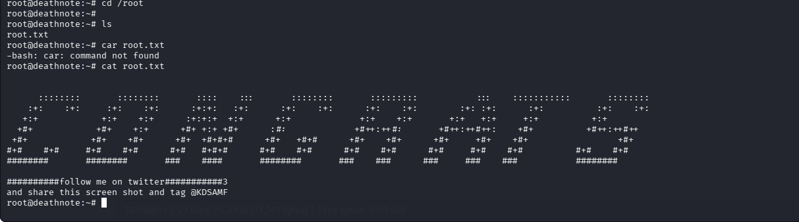

Вміст фінального прапора `root.txt`:
```text
#########follow me on twitter###########3
and share this screen shot and tag @KDSAMF
```

---

## 6. Висновок

Під час виконання лабораторного завдання з проходження CTF-машини DeathNote 1 я відпрацював повний цикл тестування на проникнення: від первинної мережевої розвідки до отримання повних адміністративних прав у системі.

**Основні етапи та висновки:**
1. За допомогою `netdiscover` та `nmap` було виявлено цільову IP-адресу та відкриті сервіси SSH (22) і HTTP (80).
2. Завдяки налаштуванню локального DNS у `/etc/hosts` вдалося отримати доступ до вебресурсу на базі WordPress.
3. Через виявлення прихованих підказок у `robots.txt` та `/important.jpg` було знайдено списки користувачів та паролів у вивантажених файлах системи.
4. За допомогою брутфорсу через `hydra` вдалося отримати первинний доступ по SSH для користувача `l`.
5. Шляхом аналізу службових каталогів `/opt/L/` та декодування прихованих даних (Hex -> Base64) було відновлено пароль користувача `kira` (`kiraIsEvil`), що дозволило підвищити привілеї до `root` через `sudo -i` та успішно зчитати фінальний прапор.

**Рекомендації з безпеки:**
* Видалити розкриття службової інформації та підказок у публічно доступних файлах (`robots.txt`, зображення, незахищені директорії `uploads`).
* Заборонити вивід вмісту каталогів (Directory Indexing) на вебсервері.
* Використовувати складні паролі та обмежити кількість спроб авторизації по SSH (наприклад, через Fail2ban).
* Обмежити використання прапорця `sudo` без введення додаткової авторизації та дотримуватися принципу найменших привілеїв.
