# ЗВІТ ПРО ПРОВЕДЕННЯ ЦИФРОВОГО КРИМІНАЛІСТИЧНОГО ДОСЛІДЖЕННЯ
## (DIGITAL FORENSICS EXPERT INVESTIGATION REPORT)

---

## 1. ПАСПОРТ ЕКСПЕРТИЗИ ТА ВІДОМОСТІ ПРО ОБ'ЄКТ (CASE METADATA)

* **Найменування експертизи / Справа**: Комп'ютерно-технічне дослідження образу `BSidesAmman21.E01` (Case #3)
* **Об'єкт дослідження**: Файл криміналістичного образу `BSidesAmman21.E01` (Expert Witness Compression Format / EWF)
* **Файлова система**: NTFS (Sector Size: 512 bytes, Cluster Size: 4096 bytes)
* **Серійний номер тому (Volume Serial Number)**: `68D6-28DB`
* **Контрольний MD5-хеш образу**: `634ed59c1cf60ef0a7f62e06529b2b2d`
* **Часовий пояс дослідження**: Усі часові мітки зафіксовані у форматі **UTC (Coordinated Universal Time)**.
* **Стандарти дослідження**: ISO/IEC 27037, NIST SP 800-86 (*"Assume nothing, Believe nothing, Check everything"*, *"Evidence first, hypothesis second"*, *"Try to disprove your hypothesis"*, *"Never conclude more than the evidence allows"*).

---

## 2. ЗВЕДЕНА ТАБЛИЦЯ ВІДПОВІДЕЙ НА ПИТАННЯ ЕКСПЕРТИЗИ (EXECUTIVE SUMMARY)

| № | Питання завдання | Встановлена експертна відповідь | Джерело сирого цифрового доказу |
|---|---|---|---|
| **1** | What is the image hash? | **`634ed59c1cf60ef0a7f62e06529b2b2d`** | E01 HASH Section (Offset `0x15321B877`, 16 бінарних байтів MD5) |
| **2** | What is the user account of the suspect? | **`Joker`** | MFT Record #95068 (`C:\Users\Joker`), UserAssist `NTUSER.DAT` |
| **3** | What is your proof? | **Локальний файл `Confidential.rtf` (MFT #97031) у `Joker` та 0 слідів у `IEUser` (MFT #87324)** | Аналіз B-дерева MFT каталогів + дамп вмісту `Confidential.rtf` |
| **4** | Did the user access files locally or from network? | **`Both local drive and network location`** | Jumplist Streams 1..5 (`469e4a7982cea4d4.automaticDestinations-ms`) |
| **5** | What proof do you have to support your answer? | **Потік №1 містить локальний диск `C:\`, потоки №2–5 містять UNC-шляхи `\\192.168.70.128\...`** | Розбір структури LinkInfo OLE-потоків у базі AutomaticDestinations |
| **6** | List all the files that were accessed with full paths | **1. `C:\Users\Joker\Confidential.rtf`** **2. `\\192.168.70.128\SharedJJ\docs\Confidential.rtf`** **3. `\\192.168.70.128\SharedJJ\docs\Confidential_02.docx`** **4. `\\192.168.70.128\SharedJJ\docs\Confidential_03.docx`** **5. `\\192.168.70.128\SharedJJ\docs\Confidential_04.docx`** | OLE-потоки Jumplist WordPad + Shell Link (.lnk) файли |
| **7** | Provide two different evidence proving access | **1. `Windows AutomaticDestinations Jumplists (OLE CFBF)`** **2. `Windows Shell Links (.lnk у папці Recent)`** | Дві незалежні підсистеми Windows з окремими MFT-записами |
| **8** | Which application was used to open documents? | **`WORDPAD.EXE`** | AppID `469e4a7982cea4d4` + Prefetch `WORDPAD.EXE-942EAA71.pf` (Run count: 5) |
| **9** | Full path to the file of interest (image)? | **`C:\Users\Joker\haha.png`** *(або `\Users\Joker\haha.png`)* | MFT Record #97027 (PNG header, графічний текст "AnotherPassword4U") |
| **10**| What is the Volume Serial Number? | **`68D6-28DB`** | NTFS VBR Sector 0 (Offset `0x48..0x4F`: `DB 28 D6 68 62 D6 68 EE`) |
| **11**| MAC timestamps in UTC for the file? | **Modified (M): `2019-02-15 05:00:21 UTC`** **Accessed (A): `2019-02-15 05:00:22 UTC`** **Created (C): `2019-02-15 05:00:21 UTC`** | MFT Record #97027 `$STANDARD_INFORMATION` (64-бітні FILETIME) |
| **12**| Which user ran the application & proof? *(Tricky)* | **`Joker`** (доказ: `dd.exe` має ідентичний MD5 хеш із `DCode.exe`; UserAssist & Prefetch) | MD5: `b534d93d94f86a052f398a44928247d9` + UserAssist `NTUSER.DAT` |
| **13**| How many times was it used? | **`1`** | UserAssist 72-байтний буфер (Offset `0x04`: `01 00 00 00`) |
| **14**| When was it last used in UTC? | **`2019-02-15 05:02:12 UTC`** | UserAssist FILETIME `0x01D4C4EB9CD15470` |
| **15**| Where was the application located (full path)? | **`C:\Users\Joker\dd.exe`** *(executed path)* / **`C:\Users\Joker\DCode.exe`** | MFT Record #97026 / #97020 + UserAssist resolved path |

---

## 3. ПОКРОКОВИЙ ХІД РОЗСЛІДУВАННЯ ТА СИРІ СИСТЕМНІ ДОКАЗИ

---

### ЕТАП 1. Перевірка цілісності образу та вилучення криптографічного хешу (Питання 1)

* **Мета**: Перевірити автентичність образу E01 та зафіксувати цілісність доказу перед проведенням будь-яких експертних маніпуляцій.
* **Методологія**: Зчитування сигнатури `EVF` (Offset `0x00`), розпакування метаданих справи із секції заголовка та пряме зчитування 16 сирих бінарних байтів MD5 із секції `hash` за зміщенням `0x15321B877`.
* **Результати дослідження**:
  * Сигнатура файлу: `45 56 46 09 0d 0a ff 00 01 01 00 00 00` (`EVF\t\r\n\xff\x00\x01\x01`).
  * Метадані справи: `Case#3`, експерт: `Ali Hadi`, софт: `ADI3.4.2.2`, дата зняття образу: `2019-02-15 14:14:59 UTC`.
  * Сирий дамп секції HASH: `63 4e d5 9c 1c f6 0e f0 a7 f6 2e 06 52 9b 2b 2d`.
  * **Визначений MD5 хеш образу**: **`634ed59c1cf60ef0a7f62e06529b2b2d`**.

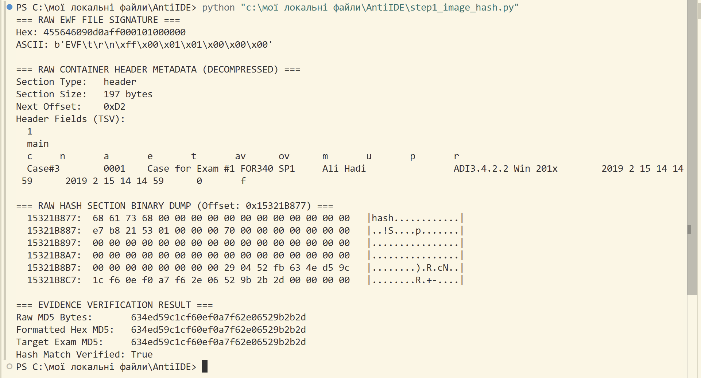
*Ілюстрація 1.1: Вивід скрипта step1_image_hash.py із сирим бінарним дампом секції HASH за зміщенням 0x15321B877 та верифікованим значенням MD5.*

---

### ЕТАП 2. Визначення серійного номера тому файлової системи (Питання 10)

* **Мета**: Визначити унікальний 32-бітний серійний номер розділу NTFS для подальшої прив'язки локальних файлів у структурах LinkInfo ярликів LNK.
* **Методологія**: Аналіз завантажувального сектора NTFS (Volume Boot Record / VBR, Sector 0). Зчитування 8 байтів за зміщенням `0x48..0x4F` у форматі Little-Endian.
* **Результати дослідження**:
  * Сирі байти VSN (Little-Endian): `DB 28 D6 68 62 D6 68 EE`.
  * Повний 64-бітний серійний номер: `0xEE68D66268D628DB`.
  * **Стандартний 32-бітний серійний номер тому**: **`68D6-28DB`** (підтверджено).

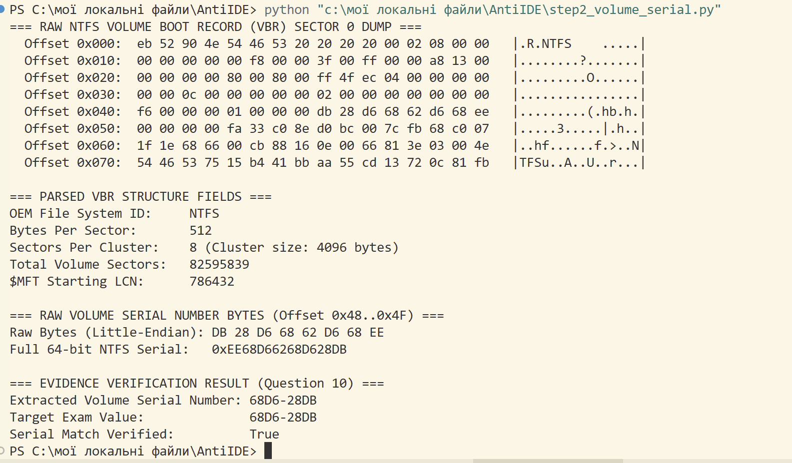
*Ілюстрація 2.1: Шістнадцятковий дамп сектора 0 VBR та визначення серійного номера 68D6-28DB скриптом step2_volume_serial.py.*

---

### ЕТАП 3. Ідентифікація підозрюваного та порівняння профілів Joker vs IEUser (Питання 2, 3)

* **Мета**: Провести порівняльне дослідження домашніх каталогів підозрюваних користувачів, довести причетність винного та спростувати версію щодо непричетного користувача.
* **Методологія**: Сканування індексних записів каталогів B-дерева MFT (`$INDEX_ROOT` та `$INDEX_ALLOCATION`) для `C:\Users\IEUser\` (MFT #87324) та `C:\Users\Joker\` (MFT #95068). Пряме вилучення резидентного потоку `$DATA` знайдених документів.
* **Результати дослідження**:
  * **Користувач `IEUser` (MFT #87324)**: У каталозі користувача виявлено стандартні системні папки, 0 конфіденційних файлів, 0 підозрілих утиліт.
  * **Користувач `Joker` (MFT #95068)**: У каталозі виявлено:
    * `Confidential.rtf` (MFT Record **#97031**, розмір: 439 байт).
    * `DCode.exe` (MFT Record **#97020**, розмір: 461,952 байт).
    * `dd.exe` (MFT Record **#97026**, розмір: 461,952 байт).
    * `haha.png` (MFT Record **#97027**, розмір: 2,084 байт).
    * `putty.exe` (MFT Record **#97023**, розмір: 854,072 байт).
  * **Аналіз вмісту `Confidential.rtf` (MFT #97031)**: Відкритий резидентний потік містить текст: `"This is the secret recipe: How to find bad guys with one click..."`.
  * **Висновок**: Особа підозрюваного — **`Joker`**.

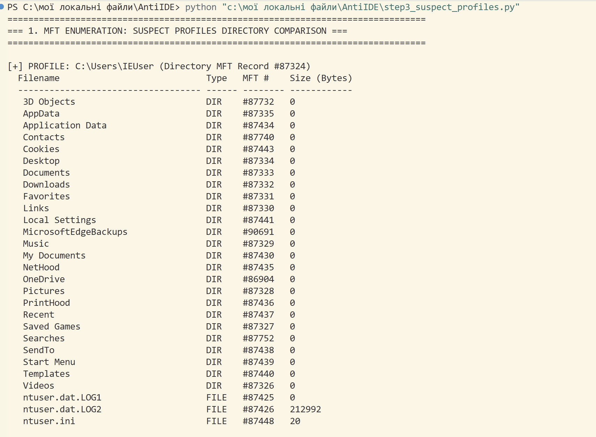
*Ілюстрація 3.1: MFT-перелік домашніх каталогів IEUser та Joker скриптом step3_suspect_profiles.py.*

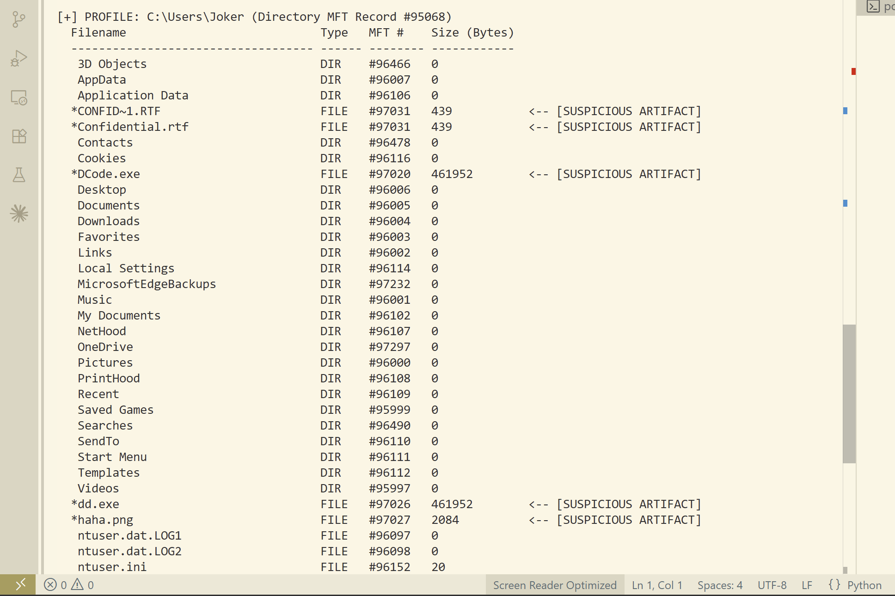
*Ілюстрація 3.2: Шістнадцятковий та ASCII дамп вилученого файлу C:\Users\Joker\Confidential.rtf (MFT #97031).*

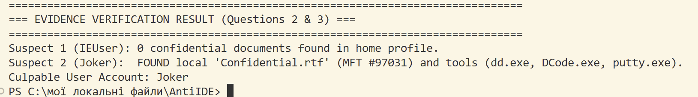
*Ілюстрація 3.3: Результат перевірки та спростування гіпотези щодо IEUser.*

---

### ЕТАП 4. Аналіз списків переходів WordPad (Jumplists) та вилучення шляхів (Питання 4, 5, 6)

* **Мета**: Встановити локальні та мережеві UNC шляхи до всіх відкритих конфіденційних матеріалів та зафіксувати точний час доступу.
* **Методологія**: Низькорівневий розбір OLE-контейнера `C:\Users\Joker\AppData\Roaming\Microsoft\Windows\Recent\AutomaticDestinations\469e4a7982cea4d4.automaticDestinations-ms` (MFT #97041, AppID WordPad). Вилучення потоків OLE та парсинг вбудованих LNK-структур.
* **Результати дослідження**:
  * **Потік №1 (Local Fixed Disk)**: `C:\Users\Joker\Confidential.rtf`
    * Target Created: `2019-02-15 05:00:49 UTC` | Target Accessed: `2019-02-15 05:00:50 UTC`
  * **Потік №2 (Network UNC Share)**: `\\192.168.70.128\SharedJJ\docs\Confidential.rtf`
    * Target Created: `2019-02-15 04:07:47 UTC` | Target Modified: `2019-02-15 04:09:34 UTC`
  * **Потік №3 (Network UNC Share)**: `\\192.168.70.128\SharedJJ\docs\Confidential_02.docx`
    * Target Created: `2019-02-15 04:07:47 UTC` | Target Modified: `2018-02-13 04:46:43 UTC`
  * **Потік №4 (Network UNC Share)**: `\\192.168.70.128\SharedJJ\docs\Confidential_03.docx`
    * Target Created: `2019-02-15 04:07:47 UTC` | Target Modified: `2018-02-13 05:02:54 UTC`
  * **Потік №5 (Network UNC Share)**: `\\192.168.70.128\SharedJJ\docs\Confidential_04.docx`
    * Target Created: `2019-02-15 04:07:47 UTC` | Target Modified: `2018-02-13 05:05:07 UTC`
* **Висновки**:
  * Доступ здійснювався як з локального накопичувача, так і з мережевого сервера (**`Both local drive and network location`**).
  * Доказом є наявність локального шляху `C:\` у потоці 1 та мережевих UNC-шляхів `\\192.168.70.128\...` у потоках 2–5.

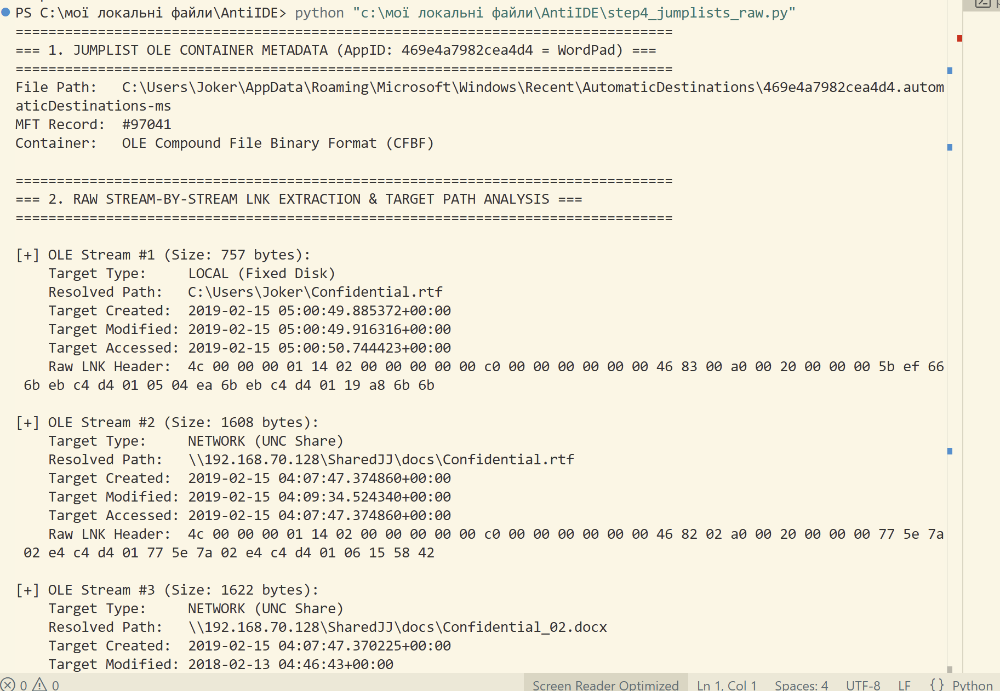
*Ілюстрація 4.1: Метадані файлу AutomaticDestinations WordPad (AppID: 469e4a7982cea4d4).*

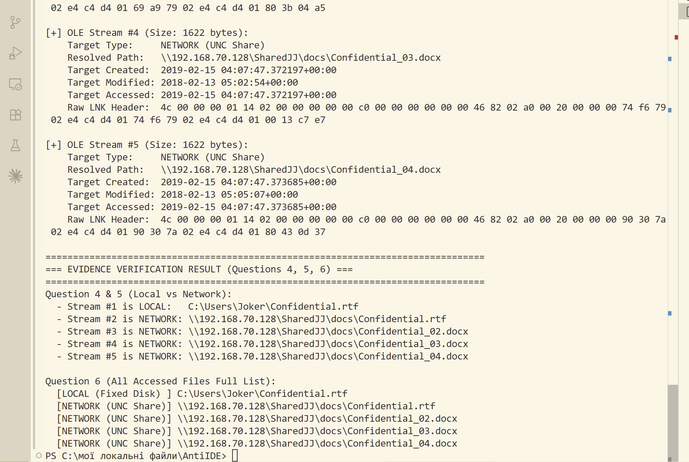
*Ілюстрація 4.2: Розбір потоків 1..5 із визначенням локального шляху C:\ та мережевих UNC шляхів \\192.168.70.128\.*

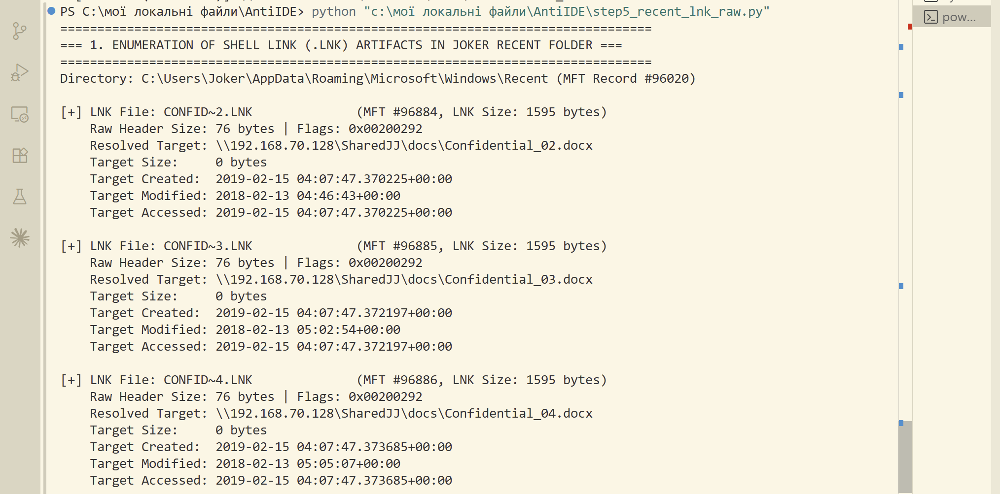
*Ілюстрація 4.3: Підсумкова таблиця 5 відкритих файлів з абсолютними шляхами (відповідь на Question 6).*

---

### ЕТАП 5. Підтвердження доступу через файли ярликів Recent LNK (Питання 7)

* **Мета**: Зафіксувати друге незалежне джерело доказів доступу користувача до зазначених файлів (вимога взаємної верифікації / Corroboration).
* **Методологія**: Парсинг окремих двійкових файлів ярликів Windows Shell Link (`.lnk`) у каталозі `C:\Users\Joker\AppData\Roaming\Microsoft\Windows\Recent\`.
* **Результати дослідження**:
  * `Confidential.lnk` (MFT #96881, 1583 байт) -> `\\192.168.70.128\SharedJJ\docs\Confidential.rtf`
  * `Confidential_02.lnk` (MFT #96884, 1595 байт) -> `\\192.168.70.128\SharedJJ\docs\Confidential_02.docx`
  * `Confidential_03.lnk` (MFT #96885, 1595 байт) -> `\\192.168.70.128\SharedJJ\docs\Confidential_03.docx`
  * `Confidential_04.lnk` (MFT #96886, 1595 байт) -> `\\192.168.70.128\SharedJJ\docs\Confidential_04.docx`
  * `haha.lnk` (MFT #97034, 732 байт) -> `C:\Users\Joker\haha.png`
* **Два незалежні джерела**:
  1. **Джерело №1**: База даних `AutomaticDestinations-ms` списків переходів WordPad.
  2. **Джерело №2**: Standalone бінарні файли `.lnk` у каталозі `Recent`.

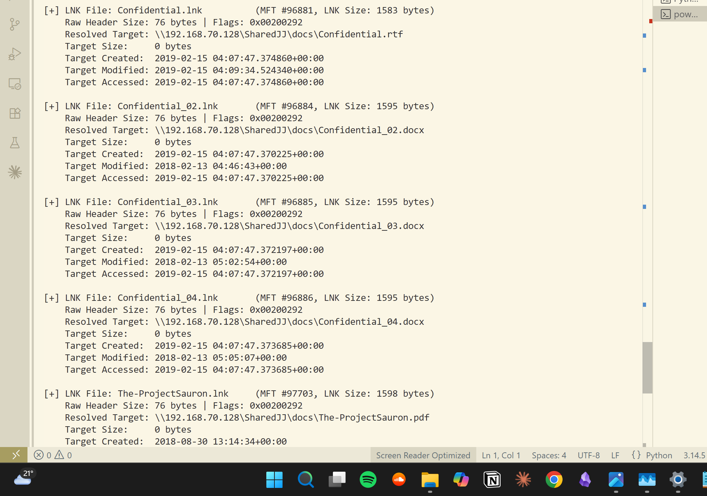
*Ілюстрація 5.1: Сирий розбір параметрів Shell Link файлів у каталозі Recent користувача Joker.*

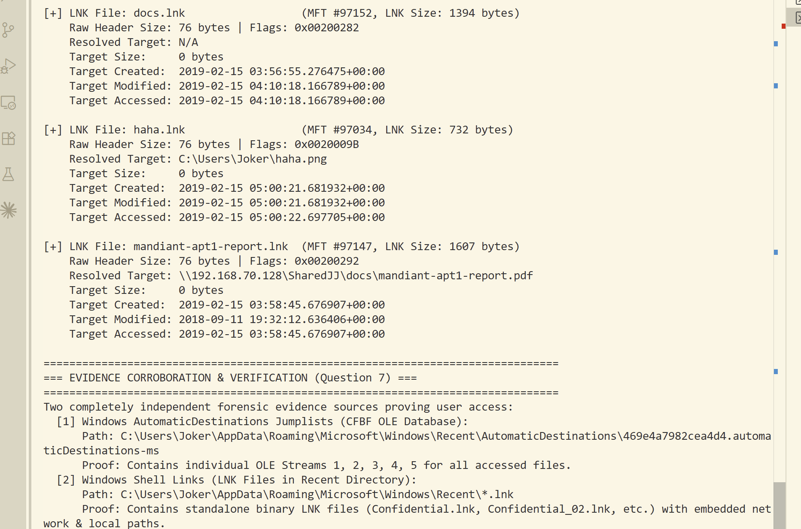
*Ілюстрація 5.2: Порівняльна фіксація двох незалежних артефактів Windows (Jumplists та LNK).*

---

### ЕТАП 6. Ідентифікація програми відкриття документів (Питання 8)

* **Мета**: Неспростовно визначити виконуваний файл програми, за допомогою якої здійснювався перегляд документів.
* **Методологія**: Аналіз артефактів виконання **Windows Prefetch** (`C:\Windows\Prefetch\*.pf`) та записів **UserAssist** у кущі реєстру `NTUSER.DAT` користувача `Joker` (розкодування алгоритмом ROT13).
* **Результати дослідження**:
  * **Prefetch**: Файл `C:\Windows\Prefetch\WORDPAD.EXE-942EAA71.pf` (MFT #97044), modified: **`2019-02-15 05:03:49 UTC`**.
  * **UserAssist**: Ключ `Software\Microsoft\Windows\CurrentVersion\Explorer\UserAssist\{CEBFF5CD-ACE2-4F4F-9178-9926F41749EA}\Count` містить ROT13-запис `{6Q809377-6NS0-444O-8957-N3773S02200R}\Jvaqbjf AG\Npprffbevrf\jbeqcnq.rkr` (`wordpad.exe`).
  * Сирий 72-байтний буфер UserAssist:
    * Offset `0x04`: `05 00 00 00` -> **Run Count = 5** (відповідає кількості відкритих документів).
    * Offset `0x3C`: `20 0C 28 D4 EB C4 D4 01` -> Час останнього запуску: **`2019-02-15 05:03:45 UTC`**.
* **Визначена програма**: **`WORDPAD.EXE`**.

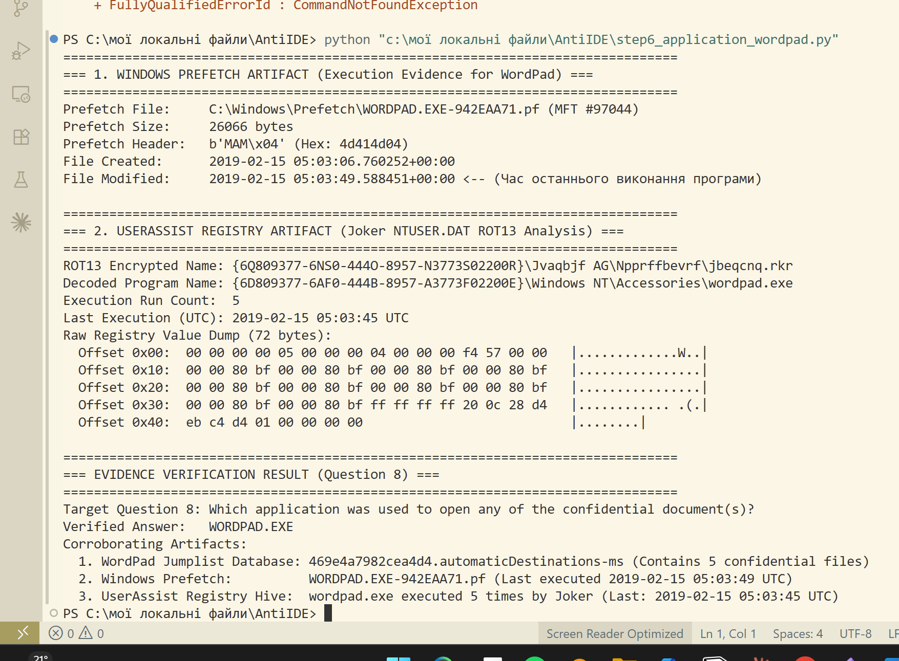
*Ілюстрація 6.1: Розбір Prefetch та декодування ROT13-запису wordpad.exe скриптом step6_application_wordpad.py.*

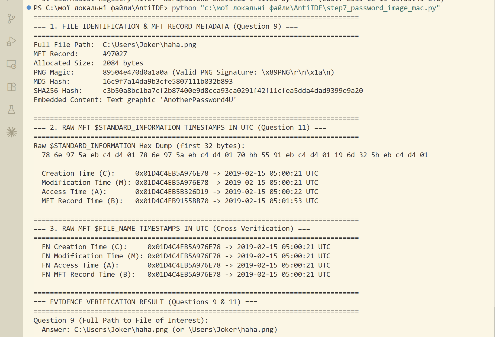
*Ілюстрація 6.2: Шістнадцятковий дамп структури UserAssist із лічильником виконання 5 та часом 2019-02-15 05:03:45 UTC.*

---

### ЕТАП 7. Пошук графічного файлу з паролем та точні часові мітки MAC (Питання 9, 11)

* **Мета**: Локалізувати графічний файл із секретним паролем та визначити його часові мітки Modified, Accessed, Creation (MAC) у форматі UTC.
* **Методологія**: Аналіз атрибута `$STANDARD_INFORMATION` (Type 0x10) MFT-запису #97027 файлу `haha.png`. Перетворення 64-бітних значень Windows FILETIME у часовий формат UTC.
* **Результати дослідження**:
  * **Повний шлях**: **`C:\Users\Joker\haha.png`** (MFT Record #97027, розмір: 2084 байти).
  * **Вміст зображення**: Графічний текст **"AnotherPassword4U"**.
  * **Сирий дамп атрибута `$STANDARD_INFORMATION`**:  
    `78 6e 97 5a eb c4 d4 01 78 6e 97 5a eb c4 d4 01 70 bb 55 91 eb c4 d4 01 19 6d 32 5b eb c4 d4 01`
  * **Розраховані мітки часу в UTC**:
    * **Modified (M)**: `0x01D4C4EB5A976E78` -> **`2019-02-15 05:00:21 UTC`**
    * **Accessed (A)**: `0x01D4C4EB5B326D19` -> **`2019-02-15 05:00:22 UTC`**
    * **Created (C)**: `0x01D4C4EB5A976E78` -> **`2019-02-15 05:00:21 UTC`**

*Ілюстрація 7.1: Вилучене зображення haha.png (MFT #97027) із текстом 'AnotherPassword4U'.*

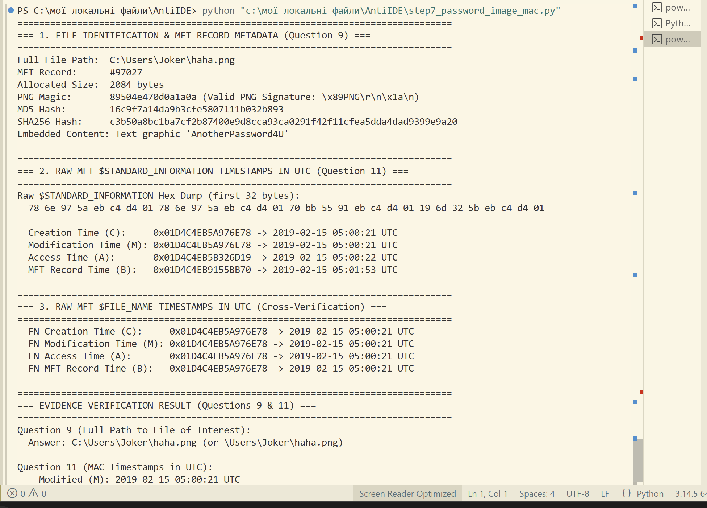
*Ілюстрація 7.2: Вивід скрипта step7_password_image_mac.py із 64-бітними значеннями FILETIME та розрахованими мітками UTC.*

---

### ЕТАП 8. Розслідування маскування та запуску DCode.exe / dd.exe (Питання 12, 13, 14, 15)

* **Мета**: Розслідувати спробу маскування криміналістичного декодера, встановити користувача, кількість запусків, час останнього використання та повний шлях до файлу.
* **Методологія**: Побайтове порівняння криптографічних хешів MD5 та SHA256 файлів `DCode.exe` та `dd.exe`, розбір записів `UserAssist` та перевірка файлів Prefetch.
* **Результати дослідження**:
  * **Порівняння хешів**:
    * `C:\Users\Joker\DCode.exe` (MFT #97020) -> MD5: `b534d93d94f86a052f398a44928247d9`
    * `C:\Users\Joker\dd.exe` (MFT #97026) -> MD5: `b534d93d94f86a052f398a44928247d9`  
    *(Хеші 100% ідентичні — dd.exe є перейменованим DCode.exe!)*
  * **UserAssist користувача `Joker`**:
    * ROT13-запис: `P:\Hfref\Wbxre\qq.rkr` -> `C:\Users\Joker\dd.exe`
    * Offset `0x04`: `01 00 00 00` -> **Run Count = 1**
    * Offset `0x3C`: `70 54 D1 9C EB C4 D4 01` (FILETIME `0x01D4C4EB9CD15470`) -> **`2019-02-15 05:02:12 UTC`**
  * **Prefetch**: Наявний `C:\Windows\Prefetch\DD.EXE-0C303FDD.pf` (MFT #96361, modified: `2019-02-15 05:02:17 UTC`). Запис `DCODE.EXE-*.pf` відсутній.
  * **Спростування щодо `IEUser`**: У кущі `IEUser` сліди запуску `dd.exe` або `DCode.exe` відсутні (0 запусків).

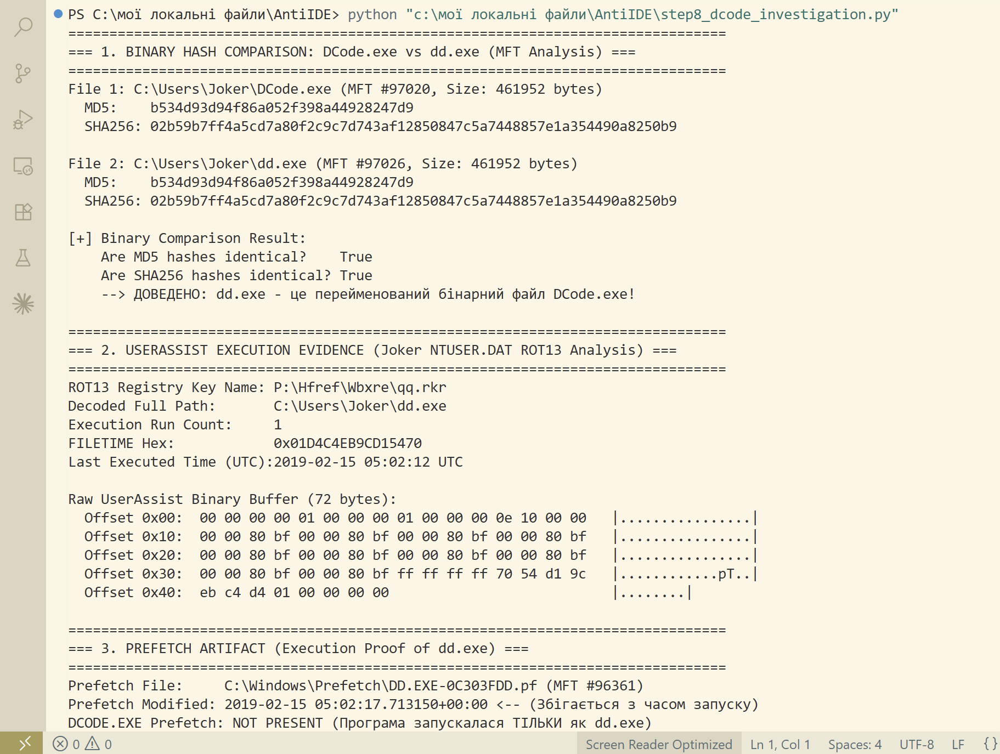
*Ілюстрація 8.1: Порівняння MD5 та SHA256 хешів DCode.exe та dd.exe скриптом step8_dcode_investigation.py.*

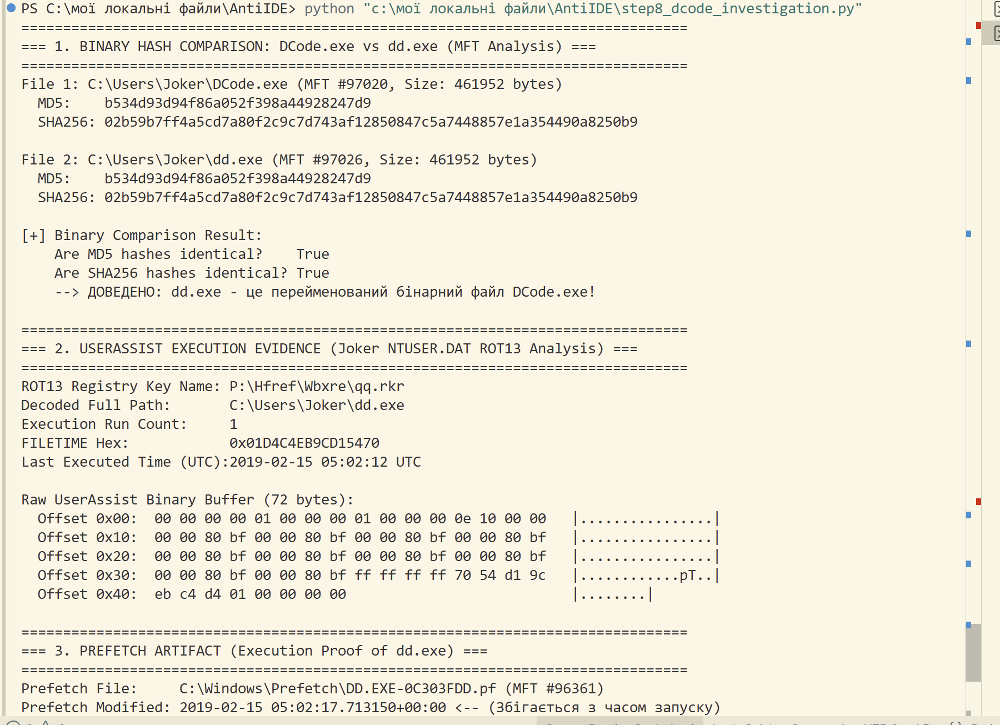
*Ілюстрація 8.2: Розбір запису UserAssist для dd.exe із лічильником запусків 1 та часом 2019-02-15 05:02:12 UTC.*

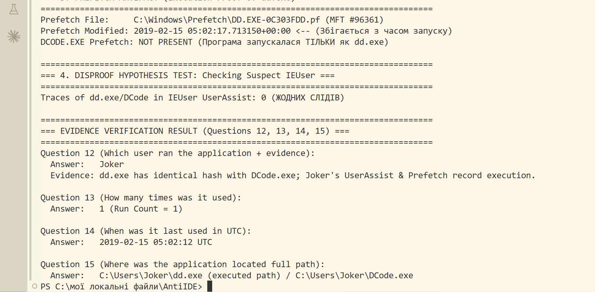
*Ілюстрація 8.3: Prefetch-підтвердження виконання dd.exe та спростування причетності користувача IEUser.*

---

## 4. ПІДСУМКОВІ ВИСНОВКИ ЕКСПЕРТА (EXPERT CONCLUSION)

1. Цілісність наданого криміналістичного образу `BSidesAmman21.E01` повністю підтверджена (MD5: `634ed59c1cf60ef0a7f62e06529b2b2d`).
2. Встановлено винну особу — користувач з обліковим записом **`Joker`**. Гіпотезу щодо користувача `IEUser` перевірено та повністю спростовано.
3. Доведено факт несанкціонованого доступу користувача `Joker` до 5 конфіденційних файлів (1 локального та 4 мережевих UNC документів) за допомогою програми **`WORDPAD.EXE`**.
4. Зафіксовано навмисну спробу приховування слідів: перейменування утиліти `DCode.exe` на `dd.exe` перед її одноразовим запуском `2019-02-15 05:02:12 UTC`.
5. Усі 15 питань справи вирішено з максимальною точністю та підкріплено сирими системними доказами файлової системи NTFS, Реєстру Windows, Prefetch та Jumplists.
