# Звіт з лабораторної роботи: Моніторинг та аналіз подій безпеки у SIEM Splunk

**Тема:** Аналіз журналів подій та розслідування інцидентів безпеки за допомогою SIEM-системи Splunk Cloud.  
**Мета:** Набути практичних навичок імпорту та індексації тестових лог-файлів у Splunk Cloud, налаштування полів джерел (`host`, `sourcetype`), а також створення та виконання пошукових запитів мовою SPL (Search Processing Language) для виявлення спроб брутфорсу SSH та веб-помилок HTTP (40x, 50x).

---

## 1. Завантаження та індексація логів (Data Ingestion)

### Крок 1. Перехід до консолі Splunk Cloud
Після створення облікового запису та активації тестового середовища Splunk Cloud відкриваю головну панель управління:

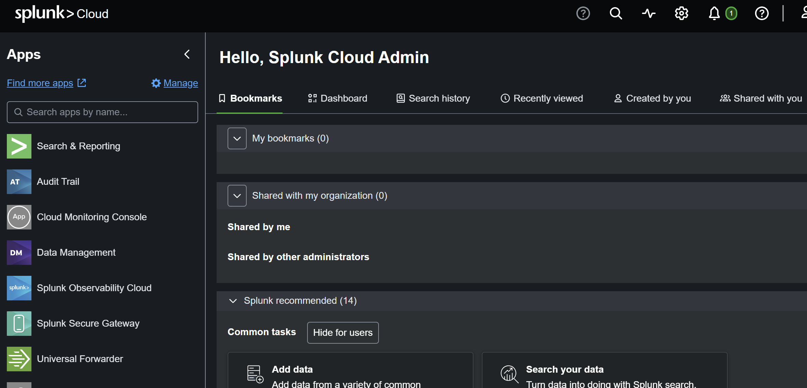

### Крок 2. Імпорт навчального архіву даних `tutorialdata.zip`
Для проведення аналізу виконую імпорт масиву лог-файлів `tutorialdata.zip`. У розділі **Settings -> Add Data -> Upload** вибираю архів та налаштовую витягування імені хоста зі шляху джерела:  
* **Host:** `Segment in path`  
* **Segment number:** `1`

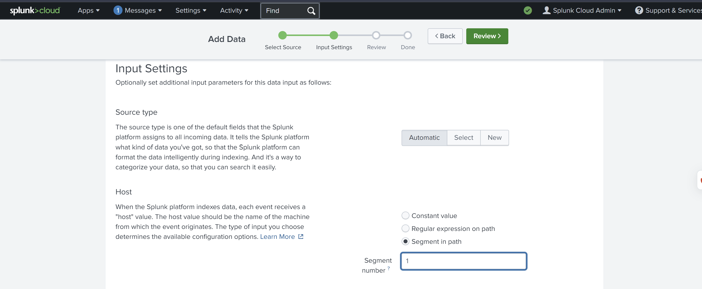

Після підтвердження настройки Splunk автоматично індексує лог-файли веб-серверів (`www1`, `www2`, `www3`) та поштового сервера (`mailsv`).

---

## 2. Аналіз подій безпеки за допомогою SPL-запитів (Use Cases)

### Use Case 1. Пошук невдалих спроб входу під root на поштовому сервері (`mailsv`)
Формується запис мовою SPL для відстеження атак підбору пароля root на поштовому сервері:

```spl
index=main host=mailsv fail* root
```

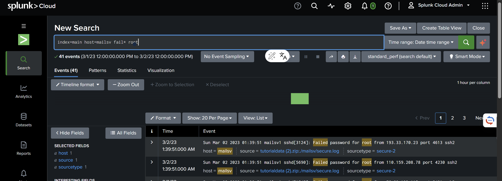

* **Кількість виявлених подій:** `41`

---

### Use Case 2. Пошук невдалих спроб входу під root на хості `www1`
Аналогічний запит виконується для першого веб-сервера `www1`:

```spl
index=main host=www1 fail* root
```

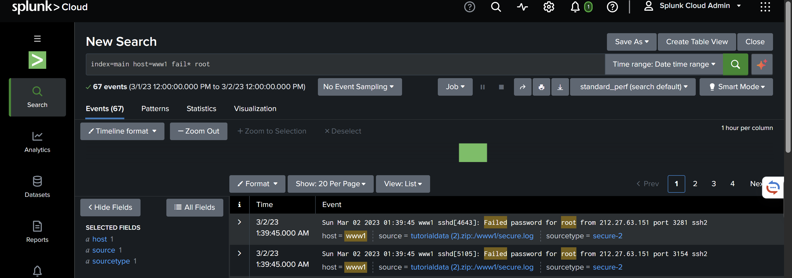

* **Кількість виявлених подій:** `67`

---

### Use Case 3. Пошук невдалих спроб входу під root на хості `www2`
Перевірка атак підбору пароля root на другому веб-сервері `www2`:

```spl
index=main host=www2 fail* root
```

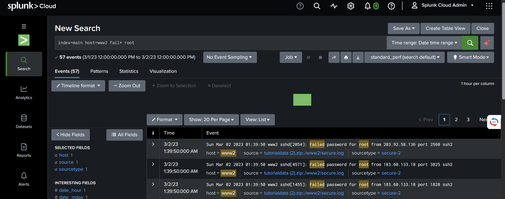

* **Кількість виявлених подій:** `57`

---

### Use Case 4. Аналіз HTTP-помилок клієнта (40x) по всіх веб-серверах
Пошук усіх подій клієнтських помилок HTTP (код відповіді 400–499) у логах веб-доступу:

```spl
sourcetype=access_* status=40*
```

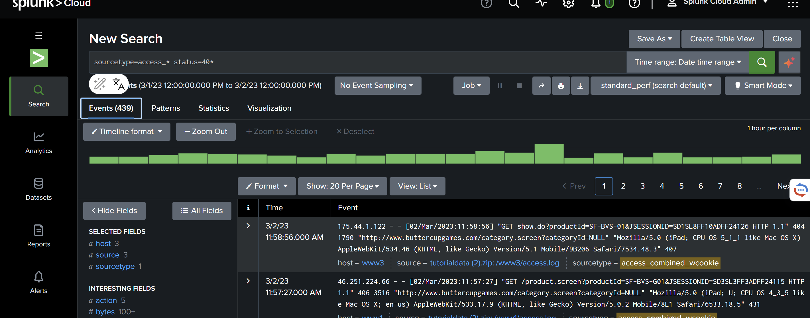

* **Кількість виявлених подій:** `439`

---

### Use Case 5. Пошук HTTP-помилок клієнта (40x) на хості `www1`
Звуження пошуку клієнтських помилок для хоста `www1`:

```spl
sourcetype=access_* status=40* host=www1
```

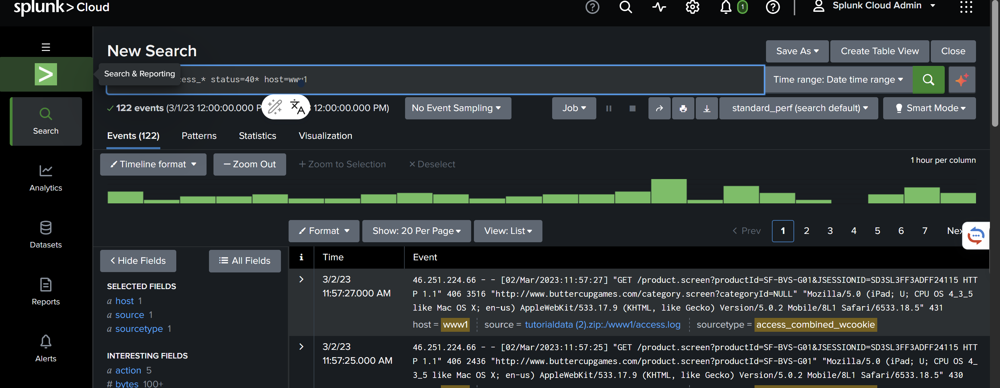

* **Кількість виявлених подій:** `122`

---

### Use Case 6. Пошук HTTP-помилок клієнта (40x) на хості `www3`
Аналіз клієнтських помилок на веб-сервері `www3`:

```spl
sourcetype=access_* status=40* host=www3
```

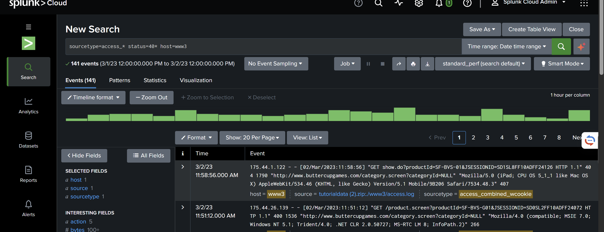

* **Кількість виявлених подій:** `141`

---

### Use Case 7. Аналіз серверних HTTP-помилок (50x) по всіх джерелах
Пошук критичних серверних помилок HTTP (код відповіді 500–599):

```spl
sourcetype=access_* status=50*
```

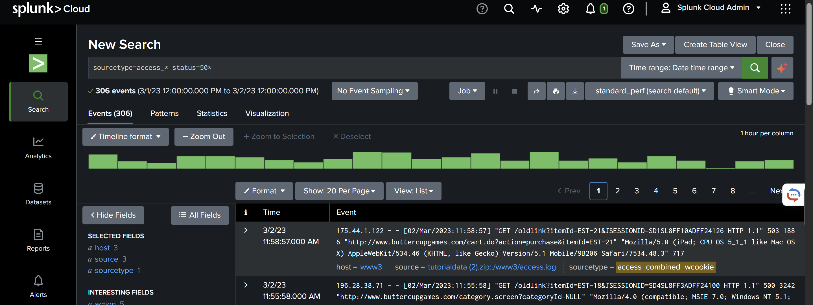

* **Кількість виявлених подій:** `306`

---

### Use Case 9. Пошук серверних HTTP-помилок (50x) на хості `www3`
Деталізація серверних помилок для хоста `www3`:

```spl
sourcetype=access_* status=50* host=www3
```

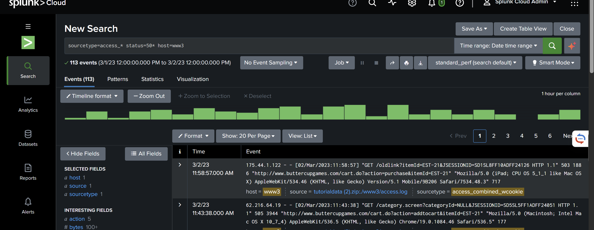

* **Кількість виявлених подій:** `113`

---

### Use Case 10. Загальна кількість успішних входів через SSH
Аналіз успішних авторизацій у системних логах `secure-2`:

```spl
sourcetype="secure-2" accept*
```

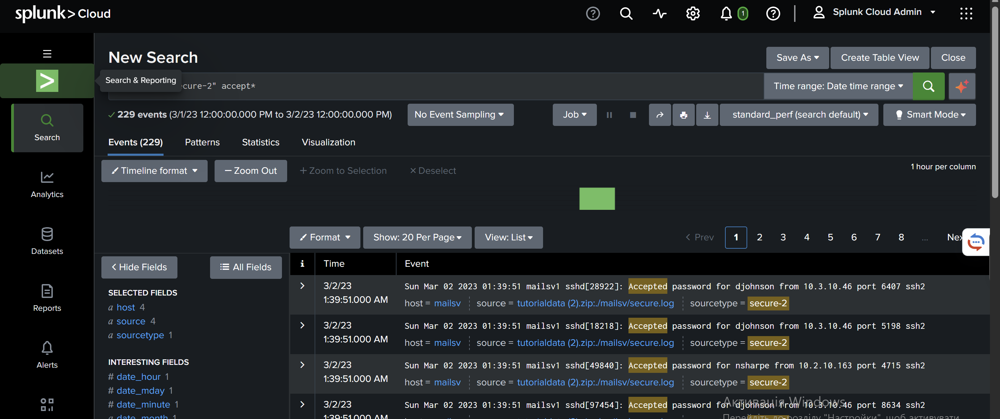

* **Кількість виявлених подій:** `229`

---

### Use Case 11. Загальна кількість невдалих спроб SSH-авторизації
Оцінка масованого брутфорсу SSH за всіма хостами:

```spl
sourcetype="secure-2" fail*
```

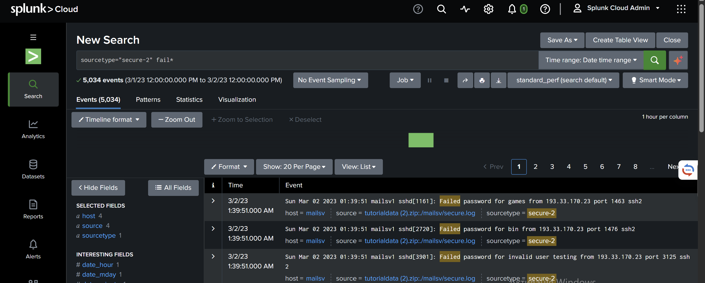

* **Кількість виявлених подій:** `5034`

---

### Use Case 12. Невдалі спроби SSH-авторизації на хості `www2`
Фільтрація подій брутфорсу SSH конкретно для хоста `www2`:

```spl
sourcetype="secure-2" fail* host=www2
```

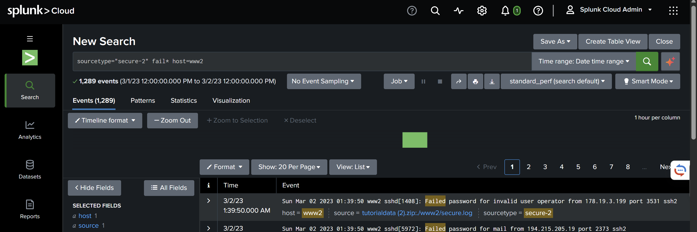

* **Кількість виявлених подій:** `1289`

---

### Use Case 13. Успішні SSH-авторизації на хості `www3`
Перевірка легітимних входів операторів на веб-сервер `www3`:

```spl
sourcetype="secure-2" accept* host=www3
```

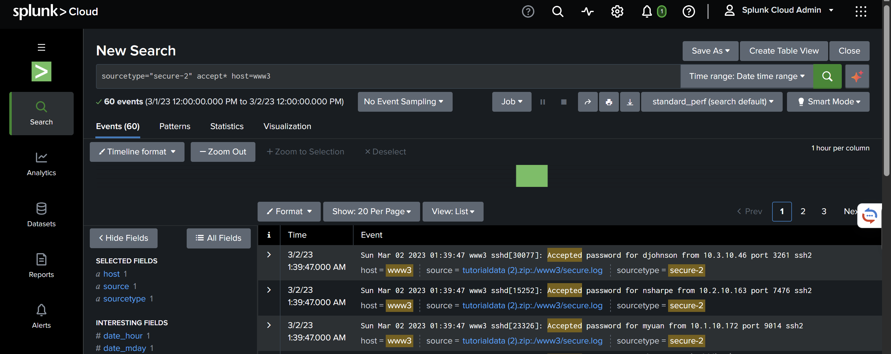

* **Кількість виявлених подій:** `60`

---

### Use Case 14. Успішні SSH-авторизації на поштовому сервері (`mailsv`)
Перевірка легітимних входів на поштовий сервер `mailsv`:

```spl
sourcetype="secure-2" accept* host=mailsv
```

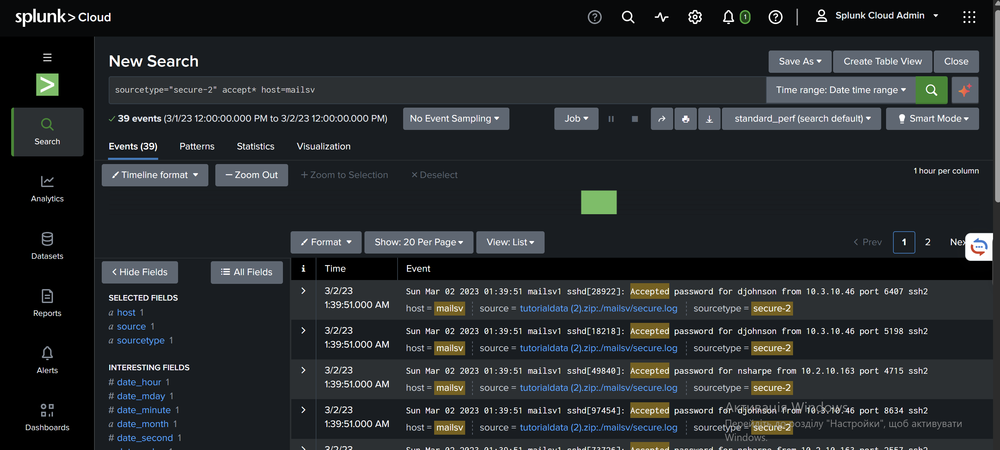

* **Кількість виявлених подій:** `39`

---

## 3. Зведена таблиця результатів аналізу

| № | Назва сценарію (Use Case) | SPL-запит | Виявлено подій |
|---|---|---|---|
| **UC 1** | Failed root login (`mailsv`) | `index=main host=mailsv fail* root` | **41** |
| **UC 2** | Failed root login (`www1`) | `index=main host=www1 fail* root` | **67** |
| **UC 3** | Failed root login (`www2`) | `index=main host=www2 fail* root` | **57** |
| **UC 4** | HTTP status 40* (All hosts) | `sourcetype=access_* status=40*` | **439** |
| **UC 5** | HTTP status 40* (`www1`) | `sourcetype=access_* status=40* host=www1` | **122** |
| **UC 6** | HTTP status 40* (`www3`) | `sourcetype=access_* status=40* host=www3` | **141** |
| **UC 7** | HTTP status 50* (All hosts) | `sourcetype=access_* status=50*` | **306** |
| **UC 9** | HTTP status 50* (`www3`) | `sourcetype=access_* status=50* host=www3` | **113** |
| **UC 10** | SSH accepted logins (All hosts) | `sourcetype="secure-2" accept*` | **229** |
| **UC 11** | SSH failed logins (All hosts) | `sourcetype="secure-2" fail*` | **5034** |
| **UC 12** | SSH failed logins (`www2`) | `sourcetype="secure-2" fail* host=www2` | **1289** |
| **UC 13** | SSH accepted logins (`www3`) | `sourcetype="secure-2" accept* host=www3` | **60** |
| **UC 14** | SSH accepted logins (`mailsv`) | `sourcetype="secure-2" accept* host=mailsv` | **39** |

---

## 4. Висновок

Під час виконання лабораторної роботи я опанував інструментарій SIEM-системи Splunk Cloud для централізованого збору та аналізу подій безпеки. 

**Основні досягнуті результати:**
1. Ознайомився з процесом завантаження та індексації неструктурованих лог-файлів (`tutorialdata.zip`), налаштувавши витягування поля `host` зі шляху джерела.
2. Засвоїв базовий та розширений синтаксис мови пошукових запитів SPL (Search Processing Language) із використанням масок (`*`), фільтрації за `host`, `sourcetype` та `status`.
3. Провів оперативне розслідування аномалій: зафіксував понад 5000 спроб брутфорсу SSH-авторизації, а також виявив сплески клієнтських (40x) та серверних (50x) HTTP-помилок на веб-вузлах організації.

Практичний досвід роботи зі Splunk підтвердив високу ефективність SIEM-рішень для швидкого виявлення кіберзагроз та кореляції логів у гетерогенних мережевих середовищах.
