# Звіт з лабораторної роботи: Розгортання, конфігурація та тестування системи виявлення та запобігання вторгненням (IDS/IPS) Suricata

**Тема:** Розгортання та первинне налаштування Suricata IDS/IPS, робота з правилами, аналіз форматів логування (fast.log, EVE JSON + jq) та створення власних сигнатур.  
**Мета:** Набути практичних навичок встановлення, базового налаштування конфігураційного файлу `suricata.yaml`, оновлення баз сигнатур за допомогою `suricata-update`, аналізу вихідних логів у форматах Text (fast.log) та JSON (eve.json + jq), а також розробки і перевірки власних правил безпеки (`local.rules`).

---

## 1. Теоретичні відомості

### 1.1. Визначення та принципи роботи IDS/IPS
Системи виявлення вторгнень (**IDS — Intrusion Detection System**) та системи запобігання вторгненням (**IPS — Intrusion Prevention System**) є основними засобами моніторингу мережевого трафіку для виявлення та нейтралізації аномальної або шкідливої активності.

* **IDS (Intrusion Detection System):** Пасивно аналізує копію мережевого трафіку, виявляє ознаки комп'ютерних атак, сканування портів чи експлойтів та генерує сповіщення (Alerts) для адміністратора безпеки.
* **IPS (Intrusion Prevention System):** Працює "в розрив" (in-line) мережевого потоку, що дозволяє не лише виявляти, але й блокувати аномальні або шкідливі пакети в режимі реального часу (Drop, Reject).

### 1.2. Класифікація систем IDS/IPS
1. **За місцем розгортання:**
   * **NIDS (Network-based IDS):** Моніторить трафік усього мережевого сегмента шляхом дзеркалювання портів на комутаторах/маршрутизаторах (Port Mirroring/SPAN).
   * **HIDS (Host-based IDS):** Встановлюється безпосередньо на кінцевий хост (сервер, робочу станцію) та аналізує локальні системні логи, цілісність файлів та мережеві з'єднання конкретного пристрою.
2. **За методом виявлення:**
   * **Сигнатурний аналіз (Signature-based / Knowledge-based):** Зіставляє мережевий трафік із попередньо створеними шаблонами (сигнатурами) відомих атак.
   * **Аномальний аналіз (Anomaly-based / Behavior-based):** Визначає відхилення від базового нормального рівня активності мережі (Baseline).

### 1.3. Огляд Suricata IDS/IPS
**Suricata** — це сучасний відкритий високопродуктивний мережевий двигун виявлення та запобігання вторгненням із підтримкою багатопоточності (multithreading), моніторингу безпеки мережі (NSM) та розбору протоколів прикладного рівня.

---

## 2. Первинна конфігурація Suricata (`suricata.yaml`)

### Крок 1. Налаштування мережевого інтерфейсу захоплення трафіку
Для коректної роботи Suricata у режимі аналізу мережевих пакетів відкриваю головний конфігураційний файл `/etc/suricata/suricata.yaml` та вказую назву активного мережевого інтерфейсу системи (`enp0s3`) у блоці `af-packet:`:

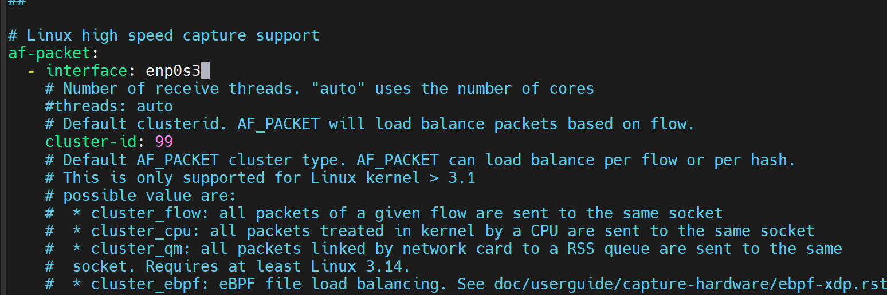

```yaml
af-packet:
  - interface: enp0s3
```

### Крок 2. Конфігурація параметрів домашньої мережі (`HOME_NET`)
У розділі `vars: address-groups:` визначаю діапазон IP-адрес внутрішньої захищуваної мережі `HOME_NET`. Це необхідно для точного визначення напрямку трафіку в правилах (`$HOME_NET -> $EXTERNAL_NET`):

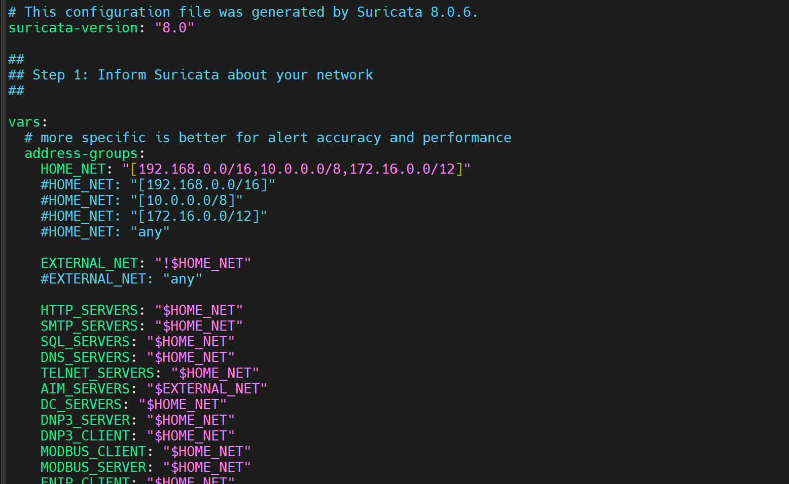

```yaml
vars:
  address-groups:
    HOME_NET: "[192.168.0.0/16,10.0.0.0/8,172.16.0.0/12]"
    EXTERNAL_NET: "!$HOME_NET"
```

---

## 3. Завантаження сигнатур та запуск сервісу Suricata

### Крок 3. Завантаження та оновлення правил через `suricata-update`
Використовую утиліту `suricata-update` для автоматичного завантаження актуальних сигнатур з репозиторію **Emerging Threats (ET) Open**:

```bash
sudo suricata-update
```

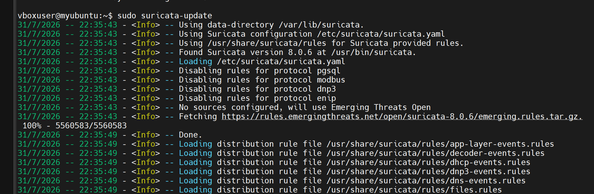

Утиліта завантажує архів `emerging.rules.tar.gz`, після чого виконує об'єднання та верифікацію правил:

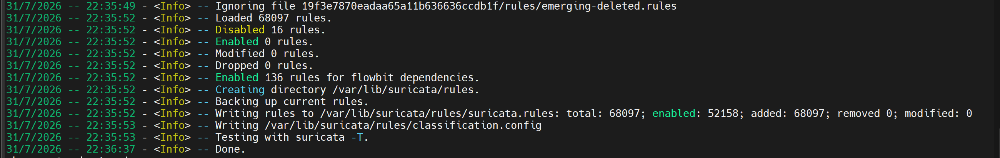

* **Завантажено сигнатур:** 68097
* **Активовано сигнатур:** 52158
* **Збережено у файл:** `/var/lib/suricata/rules/suricata.rules`

### Крок 4. Перезапуск сервісу Suricata та перевірка логу запуску
Виконую перезапуск системної служби Suricata та аналізую її системний журнал `/var/log/suricata/suricata.log`:

```bash
sudo systemctl restart suricata
sudo tail /var/log/suricata/suricata.log
```

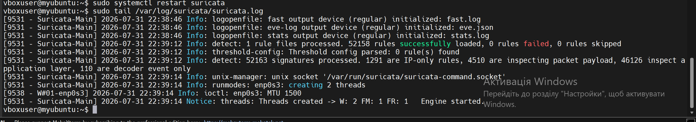

З логу видно, що двигун успішно ініціалізував пристрої виводу (`fast.log`, `eve.json`, `stats.log`), успішно завантажив 52158 сигнатур та створив потік обробки пакетів на інтерфейсі `enp0s3` (`Engine started`).

Перевіряю активний статус служби за допомогою `systemctl status`:

```bash
sudo systemctl status suricata
```

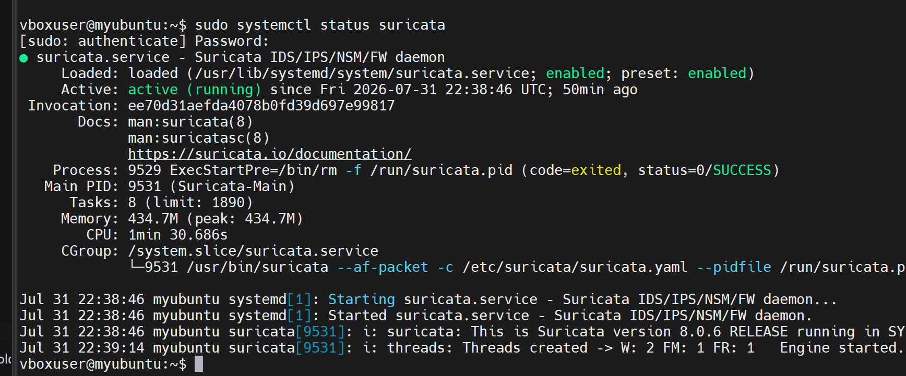

Служба перебуває у стані `active (running)`.

### Крок 5. Моніторинг системної статистики у реальному часі
Переглядаю лог статистики використання ресурсів та обробки пакетів:

```bash
sudo tail -f /var/log/suricata/stats.log
```

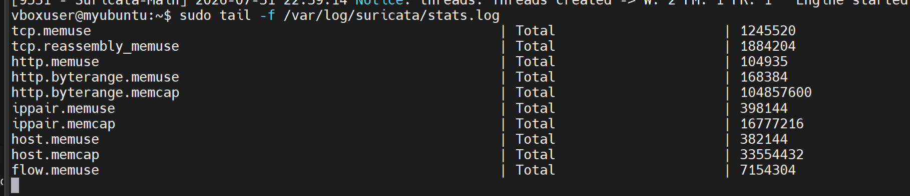

---

## 4. Аналіз логів Suricata та тестування вбудованих сигнатур

### Крок 6. Моніторинг логу текстових сповіщень (`fast.log`)
Запускаю відстеження логу `fast.log` у реальному часі для виявлення поточних подій безпеки:

```bash
sudo tail -f /var/log/suricata/fast.log
```

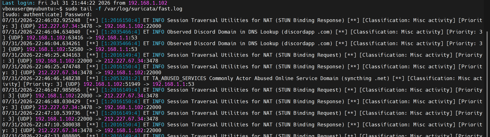

У лозі фіксуються системні події проходження фонового мережевого трафіку (STUN Binding Requests, DNS Lookup для Discord/Syncthing).

### Крок 7. Тестування сигнатур за допомогою тестового HTTP-запиту
Для перевірки функціонування виявлення атак виконую HTTP-запит до спеціального тестового ресурсу `testmynids.org`:

```bash
curl http://testmynids.org/uid/index.html
```

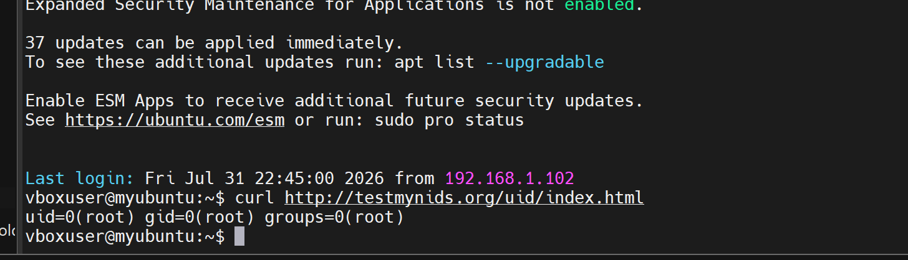

Тестовий сервер повертає рядковий відповідник виконаної команди `id`: `uid=0(root) gid=0(root) groups=0(root)`.

Перевіряю вміст `fast.log` після надсилання запиту:

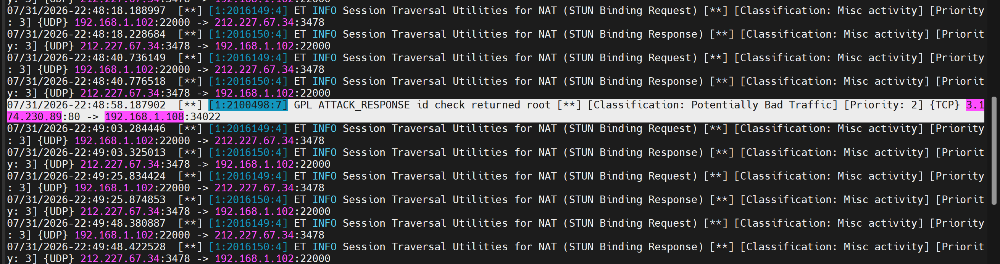

**Фіксація спрацювання сигнатури:**
```text
07/31/2026-22:48:58.187902 [**] [1:2100498:7] GPL ATTACK_RESPONSE id check returned root [**] [Classification: Potentially Bad Traffic] [Priority: 2] {TCP} 3.174.230.89:80 -> 192.168.1.108:34022
```
Система Suricata успішно розпізнала сигнатуру `GPL ATTACK_RESPONSE id check returned root` (SID: 2100498) та згенерувала сповіщення другого пріоритету.

### Крок 8. Аналіз логів у форматі EVE JSON за допомогою утиліти `jq`
Лог `eve.json` містить деталізовану інформацію про кожну подію у форматі JSON. Для фільтрації та структурування даних використовується інструмент `jq`.

1. **Фільтрація подій статистики (`event_type == "stats"`):**

```bash
sudo tail -f /var/log/suricata/eve.json | jq 'select(.event_type=="stats")'
```

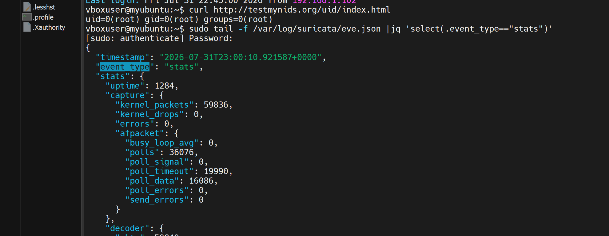

2. **Фільтрація подій сповіщень (`event_type == "alert"`):**

```bash
sudo tail -f /var/log/suricata/eve.json | jq 'select(.event_type=="alert")'
```

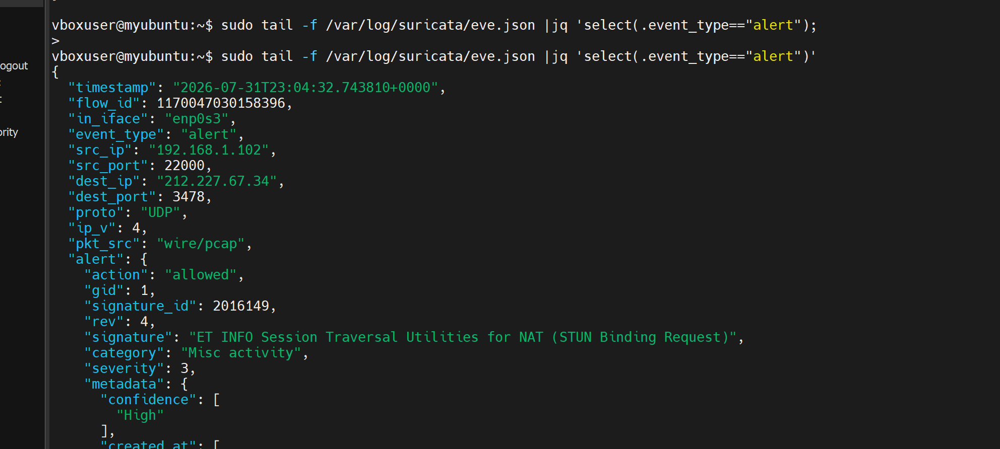

Вивід у форматі JSON містить точні метадані: часову мітку, `flow_id`, вхідний інтерфейс, IP-адреси/порти джерела й призначення, пріоритет, категорію та SID сигнатури.

---

## 5. Створення та випробування власних правил Suricata (`local.rules`)

### Крок 9. Конфігурація підключення локальних правил у `suricata.yaml`
Для додавання власних правил відкриваю файл `/etc/suricata/suricata.yaml` та перевіряю підключення списку `local.rules` у секції `rule-files:`:

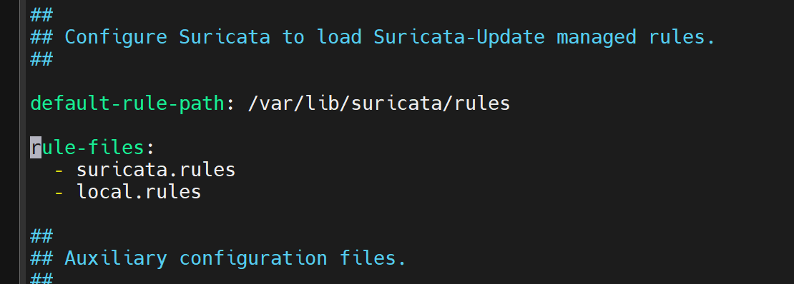

```yaml
default-rule-path: /var/lib/suricata/rules
rule-files:
  - suricata.rules
  - local.rules
```

Далі створюю та редагую файл `/var/lib/suricata/rules/local.rules`:

```bash
sudo nano /var/lib/suricata/rules/local.rules
```

**Додані власні правила:**
```suricata
alert http any any -> any any (msg: "[LAB TEST] HTTP Response Received - Potential Policy Violation"; flow: to_client, established; classtype: policy-violation; sid: 10001; rev: 1;)
alert icmp any any -> any any (msg: "[LAB TEST] ICMP Traffic Detected on Network Interface"; sid: 10002; rev: 1;)
```

**Аналіз синтаксису правил:**
* **`alert`** — дія при спрацюванні (згенерувати сповіщення).
* **`http` / `icmp`** — мережевий протокол.
* **`any any -> any any`** — будь-яка IP-адреса та порт джерела і призначення.
* **`msg`** — текстовий опис алерта.
* **`flow: to_client, established`** — аналіз встановленого TCP-з'єднання у напрямку до клієнта.
* **`sid`** — унікальний ідентифікатор сигнатури (для локальних правил використовуються SID від 10000).
* **`rev`** — версія ревізії правила.

### Крок 10. Перевірка синтаксису конфігурації (`suricata -T`)
Перед перезапуском перевіряю правильність синтаксису конфігураційного файлу та нових правил:

```bash
sudo suricata -T -c /etc/suricata/suricata.yaml
```

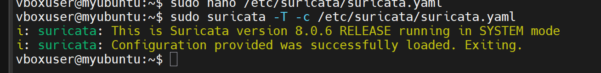

Результат перевірки: `Configuration provided was successfully loaded. Exiting.` — конфігурація валідна.

### Крок 11. Тестування локального ICMP-правила (SID 10002)
Генерую локальний ICMP-трафік за допомогою команди `ping`:

```bash
ping -c 2 127.0.0.1
```

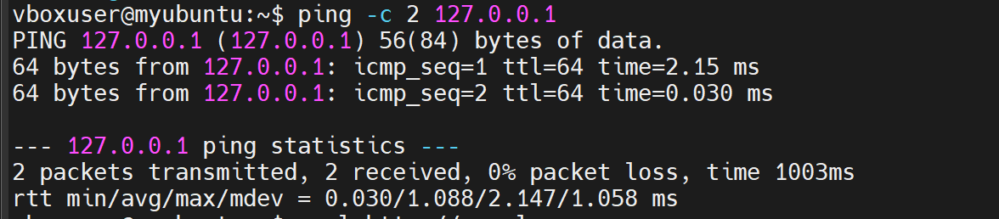

Перевіряю лог `fast.log`:

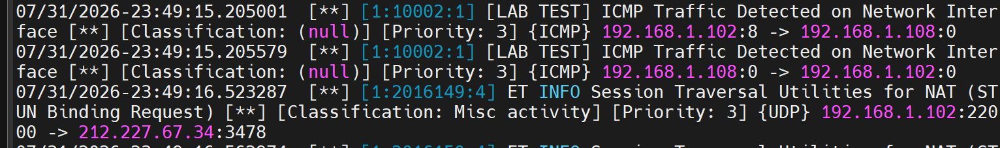

Лог зафіксував спрацювання власного правила з SID 10002:
```text
07/31/2026-23:49:15.205001 [**] [1:10002:1] [LAB TEST] ICMP Traffic Detected on Network Interface [**] [Classification: (null)] [Priority: 3] {ICMP} 192.168.1.102:8 -> 192.168.1.108:0
```

### Крок 12. Тестування локального HTTP-правила (SID 10001)
Виконую HTTP GET-запит до зовнішнього сайту через `curl`:

```bash
curl http://google.com
```

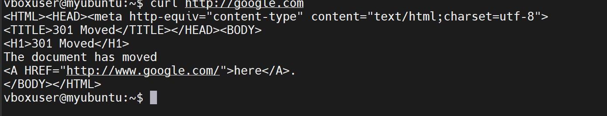

Перевіряю запис у `fast.log`:

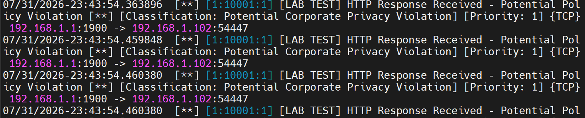

Лог підтверджує успішну генерацію сповіщення для власного HTTP-правила:
```text
07/31/2026-23:43:54.363896 [**] [1:10001:1] [LAB TEST] HTTP Response Received - Potential Policy Violation [**] [Classification: Potential Corporate Privacy Violation] [Priority: 1] {TCP} 192.168.1.1:1900 -> 192.168.1.102:54447
```

### Крок 13. Тестування ICMP-трафіку із зовнішньої станції Windows
Для перевірки реагування Suricata на зовнішній трафік надсилаю ICMP-пакети з робочої станції Windows на IP-адресу Linux-сервера (`192.168.1.108`):

```cmd
ping 192.168.1.108
```

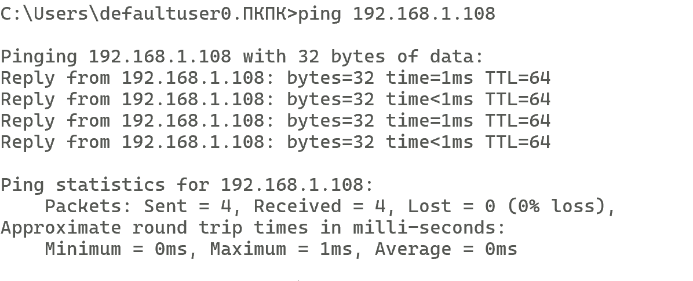

Пакети успішно доставлені, а Suricata зафіксувала всі зовнішні ICMP-запити в журнал сповіщень.

---

## 6. Висновок

Під час виконання цієї лабораторної роботи я практично засвоїв принципи функціонування та налаштування мережевої системи виявлення та запобігання вторгненням (IDS/IPS) Suricata.

**Основні результати:**
1. Ознайомився з теоретичними засадами побудови NIDS/HIDS систем, відмінностями між сигнатурним та аномальним аналізом.
2. Провів повне налаштування файлу `suricata.yaml` (мережевий інтерфейс `enp0s3`, діапазон `HOME_NET`) та оновив базовий набір сигнатур Emerging Threats Open через `suricata-update` (понад 52 тисячі активних правил).
3. Дослідил структуру та особливості логування Suricata у форматах `fast.log` (текстовий) та `eve.json` (деталізований JSON-формат), опанувавши утиліту `jq` для точкової фільтрації подій.
4. Провів випробування вбудованих сигнатур атак за допомогою тесту `testmynids.org`, отримавши сповіщення про виявлення некоректних відповідей сервера зі згадкою root-привілей.
5. Розробив, підключив та успішно випробував власні локальні правила в `local.rules` для моніторингу ICMP та HTTP трафіку.

**Практичне значення:**
Отриманий досвід дозволяє ефективно впроваджувати засоби моніторингу безпеки мережі (NSM), швидко розгортати IDS-двигуни для виявлення загрози у реальному часі та формувати кастомні сигнатури під специфічні потреби організації.
